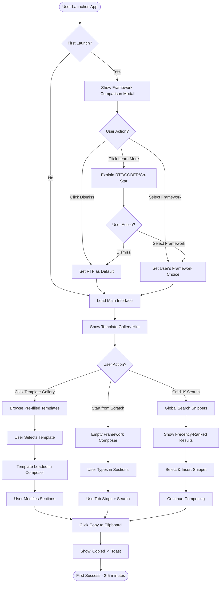
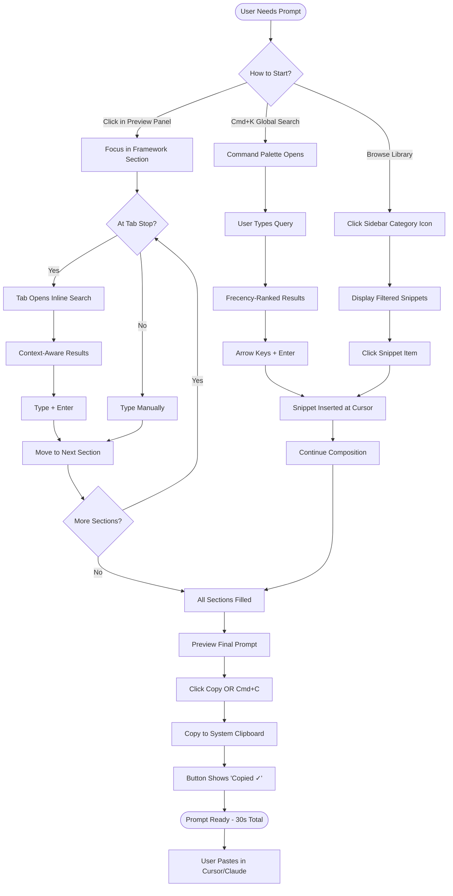
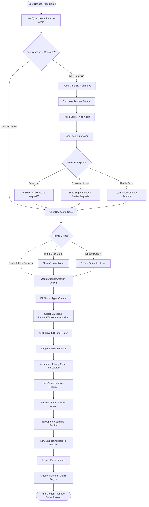

```mermaid
flowchart TD
    Start([Need Prompt - User Thinks Task]) --> InstantAction[Cmd+K Without Thinking]
    InstantAction --> PartialQuery[Types 3-4 Letters]
    
    PartialQuery --> AutoFilter[Results Filter Instantly]
    AutoFilter --> TopResult[First Result is Target]
    TopResult --> PressEnter[Enter Key - No Looking]
    PressEnter --> SnippetInserted[Snippet in Role Section]
    
    SnippetInserted --> AutoTab[Auto-Focus to Task Section]
    AutoTab --> TypeObjective[Types Custom Task]
    TypeObjective --> Tab[Presses Tab]
    Tab --> InlineSearch2[Search Opens - Context Aware]
    
    InlineSearch2 --> TypeFew[Types 2-3 Letters]
    TypeFew --> FirstMatch[First Result Matches]
    FirstMatch --> Enter2[Enter - Constraint Inserted]
    Enter2 --> AutoFocus[Auto-Focus to Format]
    
    AutoFocus --> TypeFormat[Types Brief Format Note]
    TypeFormat --> PromptComplete[All Sections Filled]
    PromptComplete --> CmdC[Cmd+C - Copy Instantly]
    CmdC --> ClipboardReady[Clipboard Has Prompt]
    ClipboardReady --> Success([8 Seconds Total - Flow State])
    
    Success --> SwitchApp[Cmd+Tab to Cursor]
    SwitchApp --> CmdV[Cmd+V - Paste]
    CmdV --> LLMResponse[Cursor/Claude Processes]
    LLMResponse --> BackToWork[User Continues Coding]
```

# UX Design Specification prompt-alchemist

**Author:** Timothygoshinski
**Date:** 2025-12-28

---

<!-- UX design content will be appended sequentially through collaborative workflow steps -->

## Executive Summary

### Project Vision

**Prompt Alchemist** is a cross-platform desktop application (React + Tauri) that transforms how developers create LLM prompts. Rather than retyping the same personas, constraints, and guardrails across every Cursor/Claude/ChatGPT session, users compose prompts in under 30 seconds by combining reusable atomic snippets within proven frameworks (RTF, CODER, Co-Star).

The tool serves dual purposes: **immediate productivity gains** (2+ hours saved per week) and **passive skill development** (users learn prompt engineering through usage, not documentation). By combining keyboard-first power-user workflows with gentle educational scaffolding, Prompt Alchemist meets users wherever they are—complete beginner, casual experimenter, or framework expert.

### Target Users

**Primary:** Developers using LLMs for code generation (Cursor, Claude Desktop, ChatGPT)
- Currently no existing snippet/template tool usage
- Keyboard-first power users expecting VSCode interaction patterns
- Low framework familiarity (single-digit % know Co-Star/CODER)
- Tolerance for 5-10 minute learning curve, max 20 minutes for complete beginners

**Secondary:** Technical writers, DevRel professionals, product managers creating content prompts

**Tertiary:** Anyone wanting to improve prompt quality and build reusable libraries

**Three User Personas Guide Design:**
1. **Complete Beginner** - Never used LLMs effectively, needs examples and guided workflows
2. **Casual User** - Uses ChatGPT with freeform prompts, knows better methods exist but doesn't know how
3. **Power User** - Understands prompt engineering, wants speed and zero friction (30-second composition)

### Key Design Challenges

**Challenge 1: Zero-to-Value in 5-10 Minutes**
Users have no existing mental models for snippet tools or atomic composition. Must teach frameworks, snippets, AND keyboard shortcuts while delivering immediate time savings. Risk: overwhelming beginners vs boring experts. Solution: Progressive onboarding with template gallery as primary teacher.

**Challenge 2: Framework Selection Without Paralysis**
Single-digit % framework familiarity means education is required upfront. Three choices (RTF, CODER, Co-Star) + Freeform could cause decision paralysis. Solution: Framework Comparison on first launch (easily dismissed) with RTF as smart default.

**Challenge 3: Atomic Composition Discovery**
"Senior Developer" + "C#" + "IDesign" = persona is powerful but conceptually new. Users need to understand WHY before investing time building libraries. Solution: Show combinatorial power through pre-filled examples and starter library, not explanations.

**Challenge 4: Keyboard-First Without Alienating Mouse Users**
Primary users expect VSCode keyboard patterns, but beginners may default to mouse initially. Solution: Full keyboard navigation with visible mouse affordances (buttons, menus) for discoverability.

**Challenge 5: Unknown Return Frequency Pattern**
Usage pattern unclear: one prompt per LLM session vs multiple refinements. If users stay in Cursor/Claude, copy-paste flow matters. If users return frequently, app switching matters. Solution: Optimize for quick re-entry (save recent prompts, one-click copy with confirmation).

### Design Opportunities

**Opportunity 1: Template Gallery as Cold-Start Solution**
Pre-filled example prompts (code refactoring, bug fixes, documentation) deliver instant value without building library first. Users click "Use as template," compose in 30 seconds, experience time savings immediately. Library building becomes gradual investment, not upfront barrier.

**Opportunity 2: Framework Comparison as Competitive Advantage**
Low framework familiarity becomes strength, not weakness. First-launch comparison educates users and positions tool as learning platform from moment one. Easily dismissed by experts, invaluable for beginners—respects all user levels.

**Opportunity 3: RTF as Progressive Complexity Gateway**
Default to RTF (3 sections, self-explanatory) as "training wheels." Success with RTF builds confidence to explore CODER/Co-Star. Framework switching demonstrates power: "Try this prompt in CODER—see the difference!" Complexity grows with user skill.

**Opportunity 4: Starter Library as "Watch Me Work" Education**
Empty library creates friction. Solution: Include pre-populated starter snippets (common personas, guardrails, constraints) demonstrating atomic composition in action. Users learn by modifying "Senior C# + IDesign" before creating from scratch. Patterns over tutorials.

**Opportunity 5: Clipboard as Frictionless Bridge**
Since return frequency is unknown, make round-trip to Cursor/Claude seamless. One-click copy with visual confirmation ("Copied ✓"). Consider saving last 5 prompts for quick re-access. Reduces context-switching cost regardless of usage pattern.

## Core User Experience

### Defining Experience

**The Core User Loop:**

Prompt Alchemist's value lives in a tight, repeatable loop that users execute multiple times per day:

1. **Select framework** (or use default RTF) → 2 seconds
2. **Insert snippets** via Cmd+K search or drag-and-drop → 10-15 seconds  
3. **Compose task/objective** specific to current LLM session → 10-15 seconds
4. **Copy to clipboard** and paste into Cursor/Claude/ChatGPT → 3 seconds

**Total loop time: 30 seconds** (vs 2-5 minutes manual typing)

The **critical interaction** is **search-enabled tab stops**: Press Tab → inline search opens → type to filter library → Enter to insert. If this feels seamless, the structured/freeform hybrid works. If it's clunky, users abandon templates for freeform mode and the product loses its educational differentiation.

**Secondary loops:**
- **Library building:** Add snippets as users discover reusable patterns (gradual investment, not upfront barrier)
- **Framework experimentation:** Switch between RTF/CODER/Co-Star to compare results (learning through usage)
- **Template exploration:** Browse pre-filled examples to learn patterns (passive education)

### Platform Strategy

**Desktop-First, Cross-Platform:**
- Native application via Tauri v2 (React frontend, Rust backend)
- Supported platforms: macOS (10.15+), Windows (10/11 64-bit), Linux (AppImage, .deb, .rpm)
- Single-window interface with side-by-side layout (library panel + preview panel)

**Input Model:**
- **Keyboard-first** for power users: Cmd+K global search, Tab stop navigation, VSCode shortcuts (Cmd+C, Cmd+S, Arrow keys)
- **Mouse-available** for beginners: Clickable buttons, drag-and-drop snippets, visible menus
- **Hybrid interaction:** Both input methods work simultaneously, no mode switching required

**Desktop Capabilities Leveraged:**
- **File system access:** Library storage in platform-appropriate config directories (~/.config, %LOCALAPPDATA%)
- **Clipboard integration:** One-click copy with system clipboard access
- **Offline operation:** Zero network dependencies, fully functional without internet
- **Native performance:** <100ms search response, <2 second cold start
- **State persistence:** Window size, position, layout preferences saved automatically

**Desktop Advantages Over Web Competitors:**
- No login/authentication required (offline, local storage)
- No network latency (instant search, no API calls)
- No manual save/sync (changes persist immediately)
- Always accessible (desktop app switching vs browser tab hunting)

### Effortless Interactions

**Zero-Thought Automatic Actions:**
- **Frecency ranking:** Most-used snippets surface first in search results automatically
- **Context-aware search:** Framework tab stops filter library by relevance (personas at persona stop, constraints at constraint stop)
- **Instant persistence:** Library changes save immediately, no manual Cmd+S required for library edits
- **Window state memory:** App reopens at last size, position, and layout configuration

**One-Click Minimal-Friction Actions:**
- **Copy to clipboard:** Single button press with visual confirmation ("Copied ✓")
- **Use template:** Click pre-filled example → instantly editable prompt ready to customize
- **Insert snippet:** Enter key from search results (or drag-and-drop for mouse users)
- **Framework switching:** Dropdown selection, instant UI update (<200ms)

**Eliminated Competitor Friction:**
- No account creation or login flows
- No manual save/sync workflows  
- No network loading states or API timeouts
- No browser tab management (dedicated desktop app)
- No export/download steps (clipboard is instant bridge to LLMs)

### Critical Success Moments

**First-Time User Success (Minutes 1-10):**

**Moment 1: Framework Understanding (Minutes 0-2)**
- User launches app → Framework Comparison appears (easily dismissed if expert)
- User sees RTF (3 sections), CODER (5 sections), Co-Star (6 sections) explained with use cases
- **Success:** User understands "these frameworks help me write better prompts" without reading docs

**Moment 2: Instant Value via Template Gallery (Minutes 2-5)**
- User clicks "Code Refactoring Template" → sees complete, effective prompt with annotations
- User clicks "Use as template" → pre-filled prompt appears with placeholders
- User modifies one section (changes language from Python to C#)
- User clicks "Copy" → pastes into Cursor → receives high-quality response
- **Success:** "That took 2 minutes and worked better than my usual prompts—this tool adds value immediately"

**Moment 3: Library Investment Begins (Minutes 5-10)**
- User saves modified template or creates first snippet ("C# Developer" persona)
- User experiences snippet reuse in second prompt composition
- **Success:** "I didn't retype that persona—the library is already saving time"

**Power User Success (Weeks 2-3):**

**Moment 4: Keyboard Flow State (8-Second Composition)**
- User hits Cmd+K → types "sen c# ide" → Tab → Enter → types custom objective → Tab → Cmd+C
- **Total time: 8 seconds** (vs 2 minutes typing from scratch)
- **Success:** "I'm composing faster than I can think—the tool disappears, I'm just focused on the task"

**Moment 5: Library ROI Realization (Week 3)**
- User has 25 snippets in library with 70%+ reuse rate
- User calculates 2+ hours saved per week
- **Success:** "The time I invested building this library has paid off 10x—I'm never going back"

**Make-or-Break Interaction:**

**Search-Enabled Tab Stops** = Product Differentiation Lynchpin

If this interaction feels seamless (Tab → inline search → type → Enter → insert), users experience the structured/freeform hybrid magic. They compose with framework structure while maintaining freeform speed.

If this interaction feels clunky (slow search, irrelevant results, confusing UX), users will:
- Abandon templates for Freeform mode exclusively
- Lose educational benefit of framework-guided composition
- Product becomes "generic snippet manager" without competitive differentiation

**Mitigation Requirements:**
- Search response <100ms (feels instant)
- Context-aware filtering (only show relevant snippet types per tab stop)
- Clear visual feedback (search state, result count, current selection)
- Escape hatch (Esc closes search, allows manual typing at any time)
- Ghost text hints (show what's possible without blocking workflow)

### Experience Principles

**Principle 1: Speed Through Structure**
Structured frameworks accelerate composition rather than slow it down. Search-enabled tab stops, frecency ranking, and keyboard shortcuts enable 30-second prompt creation vs 2-5 minutes manual typing. Structure = speed, not friction.

**Principle 2: Passive Mastery**
Users shouldn't "learn the tool" before getting value. Template gallery provides instant success (first 2 minutes). Framework comparison educates without blocking. Ghost text and quality indicators teach through usage. Mastery emerges from repetition, not tutorials.

**Principle 3: Keyboard-First, Mouse-Available**
Power users compose entirely via keyboard (Cmd+K, Tab stops, Enter). Beginners can click, drag, and explore with mouse. All actions have both keyboard shortcuts AND visible UI affordances. No mode switching—hybrid input works simultaneously.

**Principle 4: Search is the Universal Verb**
Cmd+K opens global search. Tab stops trigger contextual search. Search is instant (<100ms), context-aware (personas at persona stops), and learns from usage (frecency ranking). When in doubt, search.

**Principle 5: Desktop Advantages, Zero Desktop Friction**
Offline operation, instant clipboard access, file system integration—leverage native capabilities. But eliminate desktop annoyances: auto-save (no Cmd+S for library), remember window state, fast startup (<2 seconds). Native power without native complexity.


## Desired Emotional Response

### Primary Emotional Goals

**During Composition: Focused and Efficient**

Users should feel deeply concentrated on their task, not on the tool. The interface becomes invisible—users think about the prompt they're creating, not about how to use the application. Efficiency reinforces this focus: search results appear instantly (<100ms), keyboard shortcuts respond without lag, and the composition loop completes in 30 seconds. The tool accelerates thought rather than interrupting it.

**After Using Successfully: Relieved with a touch of Smart**

When users complete a prompt and copy it to clipboard, the dominant feeling should be **relief**—"I didn't have to retype all that again." This relief compounds over time as users realize they're saving 2+ hours per week. Layered beneath relief is **smart**—"I'm using frameworks that experts use, my prompts are better now." This isn't ego or pride, but quiet confidence in their growing prompt engineering skill.

**Word-of-Mouth Trigger: Relief mixed with Accomplishment**

Users tell friends when they experience the "Aha!" moment: "I just saved 2 hours this week by not retyping the same stuff. And my prompts are actually BETTER now because I'm using frameworks. You need this." The emotion is part practical relief (time saved) and part professional accomplishment (skill improved). This isn't delight or surprise—it's substantive value realized.

**After Accomplishing Goal: Accomplished**

Task completion should feel **accomplished**—"I did this efficiently and well." Not celebrated with confetti or gamification, but validated through immediate results: prompt copied to clipboard, ready to paste into Cursor/Claude, confident it will work. Success is self-evident from the speed and quality of the output.

**Product Personality: Librarian + Power Tool**

**Librarian aspect:** Everything has a place (categories, search, organization). The tool is helpful but not intrusive. It answers questions quickly and surfaces relevant information when needed. Users feel supported and guided without being patronized.

**Power Tool aspect:** Keyboard-first, fast performance, professional aesthetic. No hand-holding after initial onboarding. The tool respects user expertise and gets out of the way. Users feel competent and in control, like wielding a professional instrument.

### Emotional Journey Mapping

**First Discovery (Minutes 0-2): Curious + Confident**

User launches app → Framework Comparison appears (easily dismissed) → User feels **curious** ("What is this? Let me explore") and **confident** ("I can figure this out quickly, this looks approachable"). The tool welcomes without overwhelming. Educational content is present but not mandatory. Users feel they belong here, whether beginner or expert.

**Initial Exploration (Minutes 2-5): Intrigued → Validated**

User browses Template Gallery → clicks "Code Refactoring Template" → sees complete, annotated prompt → feels **intrigued** ("This is what a good prompt looks like"). User clicks "Use as template" → modifies one section → clicks "Copy" → pastes into Cursor → receives excellent result → feels **validated** ("That worked better than my usual prompts—this tool adds immediate value").

**Library Building (Minutes 5-10, ongoing): Invested**

User creates first snippet or saves modified template → second prompt reuses that snippet → feels **invested** ("I didn't retype that—the library is already saving time"). Each snippet added reinforces the investment. Users feel they're building something valuable, a personal knowledge base that compounds in utility.

**Flow State (Weeks 2-3): Focused + Efficient + Invisible**

User hits Cmd+K → types partial match → Tab → Enter → types objective → Cmd+C → done in 8 seconds → feels **focused** (thinking about task, not tool) and **efficient** (moving faster than thought). The tool has become invisible—an extension of the user's workflow. This is the target steady state: calm, competent, fast.

**Long-Term Mastery (Week 3+): Accomplished + Relieved + Trusted**

User has 25 snippets, 70% reuse rate, 2+ hours saved per week → feels **accomplished** ("I've built something useful"), **relieved** ("I never have to retype this stuff again"), and **trusted** ("This tool always delivers, no surprises"). Users can't imagine working without it. The tool has earned permanent place in their workflow.

**When Things Go Wrong: Unbothered → Recovered**

Search returns no results → user sees clear "No results found" → presses Esc → types manually → feels **unbothered** ("Easy to recover, I'm still in control"). Errors never break flow. Clear feedback, easy recovery, move on. Users feel supported but not babied—mistakes are normal and easily corrected.

### Micro-Emotions

**Confidence (not Confusion):**
- Framework Comparison educates → "I understand what these frameworks are for"
- Template Gallery shows examples → "I can see what good prompts look like"
- Starter Library demonstrates patterns → "I know how atomic composition works"
- Keyboard shortcuts visible in tooltips → "I can discover features as I need them"
- Esc key as universal undo → "I can always get out if I make a mistake"

**Trust (not Skepticism):**
- First template success → "This works"
- Second snippet reuse → "This saves time"
- Week 3 milestone → "I can't work without this"
- Auto-save prevents data loss → "My library is safe"
- Immediate value delivery → "No promises, just results"

**Calm Confidence (not Excitement or Anxiety):**
- Neither extreme—this is a tool for focus and efficiency, not a game or a chore
- Steady, predictable, professional
- Users feel **calm** (interface is uncluttered, feedback is subtle) and **confident** ("I know how to use this, it does what I expect")

**Accomplishment (not Frustration):**
- Every successful composition → "I did that in 30 seconds"
- Fast search (<100ms) → "Results appear instantly"
- Keyboard shortcuts always work → "Cmd+K never fails me"
- Mouse alternative available → "I can explore visually if needed"
- Clear error recovery → "Mistakes don't cost me time"

**Satisfaction (not Delight):**
- **Satisfaction** is primary goal → "Task complete, efficient, accurate"
- **Delight** in small doses → First time tab stop search works perfectly, realizing you saved 2 hours this week
- Avoid over-designing for delight → No confetti animations, no gamification, no showy celebrations
- Users feel **satisfied** like completing a task with a well-crafted tool—competent, professional, done.

**Belonging (for all user levels):**
- **Beginners:** "Other people use frameworks too, I'm learning best practices, I belong in this community"
- **Casual users:** "I'm improving my prompts like the experts do, this tool is teaching me"
- **Power users:** "This tool respects my expertise, I'm in good company, this is a professional instrument"

### Design Implications

**Focused + Efficient → Minimal UI with Instant Feedback**

**UX Choices:**
- Clean interface with lots of whitespace, no visual clutter
- Search response <100ms (feels instant, no perceived lag)
- Keyboard shortcuts as primary interaction (no mode switching between keyboard and mouse)
- Subtle confirmations ("Copied ✓") not modal dialogs that break concentration
- No animations or transitions longer than 200ms
- Framework sections clearly separated but visually lightweight
- Preview panel updates in real-time as user types or inserts snippets

**What to Avoid:**
- Flashy animations or attention-grabbing UI elements
- Modal dialogs that interrupt flow
- Loading spinners or progress indicators (everything should be instant)
- Tooltips that appear automatically (user-initiated only)

**Relieved + Smart → Educational Scaffolding Without Lectures**

**UX Choices:**
- Framework Comparison explains visually with examples, no walls of text
- Template Gallery shows by example (pre-filled prompts) not by tutorial
- Starter Library demonstrates atomic composition through real snippets users can modify
- Ghost text suggests completions (gray, italic, dismissible by continuing to type)
- Section descriptions appear on hover (opt-in, not forced)
- "Learn more" links available but never mandatory
- Progressive disclosure: beginners see more help, power users see less

**What to Avoid:**
- Required tutorials or walkthroughs
- Pop-up tips that block the interface
- Educational content that must be dismissed before proceeding
- Forced progression through "lessons" or "levels"

**Accomplished → Progress Markers and Quiet Validation**

**UX Choices:**
- Composition complete → immediate clipboard access with visual confirmation
- Library growth visible in sidebar (snippet count, categories, recent activity)
- Reuse patterns tracked through frecency ranking (most-used snippets surface first)
- Optional usage stats in settings: "23 prompts composed this week", "70% snippet reuse rate"
- Quiet milestones: "You've created 25 snippets" (subtle notification, not modal)
- No showy celebrations, just clear progress indicators

**What to Avoid:**
- Confetti animations or achievement badges
- Gamification mechanics (points, levels, leaderboards)
- Forced sharing or social features
- Intrusive milestone celebrations that interrupt workflow

**Librarian + Power Tool → Organized Accessibility Meets Efficiency**

**Librarian Aspect (Organized, Helpful, Accessible):**
- Clear categorization: personas/, guardrails/, constraints/
- Powerful search with fuzzy matching and frecency ranking
- Context-aware suggestions: personas at persona stops, constraints at constraint stops
- Helpful without being intrusive: hover tooltips, keyboard shortcut hints, escape hatches
- Everything in its place, easy to find, quick to access

**Power Tool Aspect (Fast, Professional, Respectful):**
- Keyboard-first navigation (Cmd+K, Tab stops, Arrow keys, Enter, Esc)
- Sub-100ms search response, <2 second cold start
- Professional aesthetic: clean typography, subtle colors, lots of whitespace
- No hand-holding after onboarding: assumes competence, respects expertise
- Automation where helpful: auto-save, frecency ranking, window state memory
- Manual control where needed: Esc key, manual typing always possible, framework switching

**Combined Effect:**
Users feel they're using a **professional librarian**—organized, helpful, efficient, respectful. The tool has the speed and precision of a power tool with the accessibility and guidance of a knowledgeable assistant. It's authoritative without being authoritarian, helpful without being patronizing.

### Emotional Design Principles

**Principle 1: Invisible by Default, Available on Demand**

The tool should disappear during flow state. Users think about their prompt, not about the interface. Educational content, help text, and suggestions appear only when requested (hover, click, Cmd+?) or when contextually relevant (first launch, error states). Once users know what they're doing, the tool gets out of the way.

**Principle 2: Immediate Feedback, Subtle Confirmation**

Every action receives instant feedback: search results appear <100ms, snippets insert immediately, clipboard copy confirms visually. But feedback is **subtle**—a checkmark, a color change, a quiet notification. Never modal dialogs, never blocking animations, never showy celebrations. Users stay focused, barely noticing the tool's responsiveness.

**Principle 3: Progressive Mastery Through Repetition**

Users improve through usage, not through study. Template Gallery shows examples, Starter Library demonstrates patterns, Ghost text suggests completions. Each successful composition reinforces learning. Framework switching enables experimentation. Frecency ranking reflects growing expertise. Mastery emerges naturally from repeated, successful interactions.

**Principle 4: Errors Are Speed Bumps, Not Roadblocks**

When things go wrong (no search results, wrong snippet selected, typo in snippet), recovery is instant and obvious. Esc key closes search, Cmd+Z undoes insertions, manual typing always works. Clear error messages without blame: "No results found" not "You searched for something that doesn't exist." Users feel unbothered, not frustrated. Mistakes don't cost time or break flow.

**Principle 5: Respect Expertise, Welcome Beginners**

Framework Comparison is shown on first launch but easily dismissed by experts. Template Gallery offers pre-filled examples for beginners but doesn't force exploration. Starter Library demonstrates patterns but can be deleted. Keyboard shortcuts enable power user speed; mouse interactions provide beginner accessibility. The tool adapts to user skill level without explicit configuration. Everyone feels welcome, no one feels patronized.


## UX Pattern Analysis & Inspiration

### Inspiring Products Analysis

**VSCode: The Universal Developer Language**

VSCode has achieved something remarkable: it's become the **lingua franca** of developer tools. When developers encounter a new tool, they expect VSCode patterns to work. This isn't about being the "best" - it's about being the **most widely understood**.

**What VSCode Does Well:**
- **Command Palette (Cmd+K)** - Single entry point for all commands, fuzzy search, keyboard-first
- **Tab stops in snippets** - Structured data entry without leaving the keyboard
- **Minimal UI with hidden complexity** - Clean interface, power features discoverable but not intrusive
- **Consistent keyboard shortcuts** - Cmd+C, Cmd+V, Cmd+Z work everywhere, muscle memory reliable
- **Extension ecosystem** - Core stays simple, users add what they need

**UX Principle:** **Familiarity breeds efficiency.** Users don't need to learn a new interaction model—they transfer existing muscle memory.

**Transferable to Prompt Alchemist:**
- Cmd+K as universal search entry point (users already know this pattern)
- Tab stops for framework sections (VSCode snippet behavior applied to prompt composition)
- Keyboard shortcuts match VSCode conventions (Cmd+C, Cmd+Z, Cmd+S)
- Minimal UI with discoverable power features (simple by default, advanced by choice)

---

**JetBrains IDEs: Consistency as Reliability**

JetBrains tools (IntelliJ, PyCharm, WebStorm) are known for **consistency that doesn't change often.** This stability creates **trust**—users invest time learning the tool, confident that investment won't be invalidated by radical redesigns.

**What JetBrains Does Well:**
- **Consistent UX across products** - Learn once, apply everywhere
- **Context-aware actions (Alt+Enter)** - Smart suggestions based on cursor position
- **Parameter hints** - Inline guidance that disappears when not needed
- **Refactoring with preview** - Show impact before committing
- **Smart defaults** - Tool makes reasonable assumptions, users override when needed
- **Stability over novelty** - Improvements, not upheavals

**UX Principle:** **Reliability through consistency.** Users develop muscle memory and trust that the tool won't change underneath them.

**Transferable to Prompt Alchemist:**
- Context-aware tab stops (personas at persona stop, constraints at constraint stop)
- Inline hints that disappear (ghost text for completions, section descriptions on hover)
- Smart defaults (RTF as default framework, starter library pre-populated)
- Stable core UX (keyboard shortcuts, search patterns, composition flow won't change radically)
- Preview before commit (see prompt before copying to clipboard)

---

**Raycast: Search as Universal Interface**

Raycast has perfected **search as the primary interaction model.** Every action starts with search: launching apps, running scripts, accessing snippets. The search bar is the entire interface.

**What Raycast Does Well:**
- **Frecency ranking** - (frequency × 10) + (days_since_last_use × -1) = smart result ordering
- **Instant results** - Search feels instant (<50ms), no perceived lag
- **Keyboard-first with visual affordances** - Arrow keys navigate, Enter selects, mouse works too
- **Single search box** - Complexity hidden until needed, results reveal capabilities
- **Extensions as discoverability** - Users explore by searching, not by reading docs

**UX Principle:** **Search eliminates navigation.** Users don't need to remember where things are—they search and find instantly.

**Transferable to Prompt Alchemist:**
- Frecency ranking for snippet search (most-used + most-recent surface first)
- <100ms search response time (feels instant)
- Cmd+K as universal entry point (search snippets, templates, commands)
- Tab stops trigger contextual search (search embedded in composition flow)
- Library grows through usage, not through manual organization

---

### Transferable UX Patterns

**Navigation Patterns:**

**Pattern 1: Command Palette as Universal Entry Point (VSCode + Raycast)**
- **What it is:** Single keyboard shortcut (Cmd+K) opens search for all actions
- **Why it works:** Users don't need to remember menu locations or multiple shortcuts
- **Transferable to Prompt Alchemist:** Cmd+K opens search for snippets, templates, frameworks, commands
- **Adaptation:** Context-aware search (if cursor in framework section, filter by relevant snippet type)

**Pattern 2: Single-Window Focus with Hidden Complexity (VSCode + Raycast)**
- **What it is:** One main window, complexity revealed through search or shortcuts
- **Why it works:** Reduces cognitive load, users focus on primary task
- **Transferable to Prompt Alchemist:** Single window with side-by-side layout (library + preview), advanced features accessible via Cmd+K

**Interaction Patterns:**

**Pattern 3: Tab Stops for Structured Input (VSCode)**
- **What it is:** Press Tab to move to next input field, Enter to confirm and advance
- **Why it works:** Keyboard-first structured data entry without forms
- **Transferable to Prompt Alchemist:** Tab stops in framework templates trigger inline search for snippets
- **Innovation:** Combine VSCode tab stops with Raycast search = search-enabled tab stops (novel UX pattern)

**Pattern 4: Frecency Ranking (Raycast)**
- **What it is:** Results ranked by (frequency × weight) + (recency × weight)
- **Why it works:** Most-used + most-recent items surface first, self-organizing
- **Transferable to Prompt Alchemist:** Snippet search ranks by usage patterns, learns from user behavior
- **Adaptation:** Context-aware boosting (if prompt contains "C#", boost C#-related snippets)

**Pattern 5: Context-Aware Suggestions (JetBrains)**
- **What it is:** Tool suggests actions based on cursor position or content
- **Why it works:** Relevant help appears when needed, hidden when not
- **Transferable to Prompt Alchemist:** Tab stops filter library by snippet type, ghost text suggests completions based on partial input
- **Adaptation:** Non-blocking suggestions (gray italic text, dismissible by continuing to type)

**Visual Patterns:**

**Pattern 6: Minimal UI with Discoverable Power (VSCode + JetBrains)**
- **What it is:** Clean interface by default, advanced features behind shortcuts or search
- **Why it works:** Beginners not overwhelmed, power users find features when needed
- **Transferable to Prompt Alchemist:** Simple composition interface, advanced features (framework switching, snippet editing, template gallery) accessible via Cmd+K or menus

**Pattern 7: Inline Hints That Disappear (JetBrains)**
- **What it is:** Parameter hints, type information, suggestions appear inline then vanish
- **Why it works:** Guidance when needed, invisible when mastered
- **Transferable to Prompt Alchemist:** Ghost text completions, section descriptions on hover, keyboard shortcuts in tooltips
- **Adaptation:** User-controlled dismissal (Esc closes hints, settings hide permanently)

**Pattern 8: Professional Aesthetic with Functional Clarity (VSCode + JetBrains)**
- **What it is:** Clean typography, subtle colors, focus on content not chrome
- **Why it works:** Supports "Focused and Efficient" emotional goal, reduces visual noise
- **Transferable to Prompt Alchemist:** Minimal UI, whitespace, clear hierarchy, professional not playful

### Anti-Patterns to Avoid

**Anti-Pattern 1: Novel Keyboard Shortcuts That Conflict with Standards**
- **What it is:** Custom shortcuts that override familiar patterns (Cmd+C for something other than copy)
- **Why it fails:** Breaks muscle memory, creates frustration, requires relearning
- **Avoid in Prompt Alchemist:** Always use standard shortcuts (Cmd+C copy, Cmd+V paste, Cmd+Z undo), never override for custom functions

**Anti-Pattern 2: Modal Dialogs That Break Flow**
- **What it is:** Pop-up dialogs requiring dismissal before continuing work
- **Why it fails:** Interrupts "Focused and Efficient" state, forces context switch
- **Avoid in Prompt Alchemist:** Use inline feedback ("Copied ✓"), non-blocking notifications, Esc key as universal dismiss

**Anti-Pattern 3: Changing UX Frequently for "Improvement"**
- **What it is:** Redesigns, moved features, changed shortcuts in frequent updates
- **Why it fails:** Breaks user trust, invalidates learned muscle memory (counter to JetBrains consistency principle)
- **Avoid in Prompt Alchemist:** Establish core interaction patterns in MVP, iterate carefully, never break fundamental keyboard shortcuts or composition flow

**Anti-Pattern 4: Gamification in Professional Tools**
- **What it is:** Achievement badges, points, levels, confetti animations
- **Why it fails:** Conflicts with "Accomplished" emotional goal (satisfaction, not delight), feels patronizing to professionals
- **Avoid in Prompt Alchemist:** Quiet validation ("Copied ✓"), optional usage stats, no badges or celebrations

**Anti-Pattern 5: Required Tutorials or Onboarding Flows**
- **What it is:** Forced multi-step tutorials that must be completed before using tool
- **Why it fails:** Delays time-to-value, conflicts with "5-10 minute" learning curve goal
- **Avoid in Prompt Alchemist:** Optional Framework Comparison (easily dismissed), template gallery for learning by example, progressive disclosure

**Anti-Pattern 6: Hidden Escape Hatches**
- **What it is:** No clear way to cancel, go back, or undo
- **Why it fails:** Creates anxiety, conflicts with "Unbothered → Recovered" emotional journey
- **Avoid in Prompt Alchemist:** Esc key always closes/cancels, Cmd+Z always undoes, manual typing always possible at tab stops

**Anti-Pattern 7: Search That Feels Slow**
- **What it is:** >200ms search response time, visible loading states
- **Why it fails:** Breaks "Efficient" feeling, users wait instead of flow
- **Avoid in Prompt Alchemist:** <100ms search response, pre-indexed library, instant results, no loading spinners

### Design Inspiration Strategy

**What to Adopt Directly:**

**1. VSCode Command Palette Pattern**
- Cmd+K opens universal search for all actions
- Fuzzy matching on snippet names, template names, commands
- Keyboard navigation (Arrow keys, Enter to select)
- **Why:** Users already know this pattern, zero learning curve

**2. Raycast Frecency Ranking**
- (frequency × 10) + (days_since_last_use × -1) formula
- Most-used + most-recent items surface first
- Self-organizing library without manual curation
- **Why:** Library becomes smarter with usage, rewards repeated patterns

**3. JetBrains Consistency Principle**
- Core keyboard shortcuts never change (Cmd+K, Tab, Enter, Esc)
- Composition flow remains stable across updates
- Improvements, not redesigns
- **Why:** Builds trust, protects user investment in muscle memory

**What to Adapt for Prompt Alchemist:**

**1. VSCode Tab Stops + Raycast Search = Search-Enabled Tab Stops**
- **Original:** VSCode tab stops advance on Tab key
- **Adaptation:** Tab opens inline search at tab stop position
- **Novel combination:** Structured input (tab stops) + dynamic search (Raycast pattern)
- **Why:** Solves structured vs freeform tension, enables 30-second composition

**2. JetBrains Context Actions → Context-Aware Tab Stops**
- **Original:** Alt+Enter shows actions relevant to cursor position
- **Adaptation:** Tab stop position determines snippet type filter (personas vs constraints)
- **Simplification:** Automatic filtering, no manual action required
- **Why:** Reduces search results, increases relevance, speeds composition

**3. JetBrains Inline Hints → Ghost Text Completions**
- **Original:** Parameter hints show inline, dismiss automatically
- **Adaptation:** Ghost text (gray, italic) suggests snippet completions
- **Simplification:** Dismissible by continuing to type, no explicit dismiss action
- **Why:** Passive education without blocking workflow, aligns with "Passive Mastery" principle

**What to Avoid:**

**1. Notion Slash Commands**
- **Why considered:** Slash commands popular for block insertion
- **Why rejected:** Adds mode switching (type "/" vs Tab), less keyboard-efficient than tab stops
- **Decision:** Stick with Tab stops (VSCode pattern) for universal familiarity

**2. Vim Keybindings as Default**
- **Why considered:** Power user efficiency, user has Vim expertise
- **Why rejected:** Too niche, conflicts with "VSCode as universal language" principle
- **Decision:** Optional Vim mode (settings toggle), VSCode shortcuts as default

**3. Radically Novel Interaction Patterns**
- **Why considered:** Differentiation through innovation
- **Why rejected:** Increases learning curve, conflicts with "Focused and Efficient" emotional goal
- **Decision:** Innovate through **combination** (search-enabled tab stops) not through **invention** (entirely new patterns)

**Strategy Summary:**

**Core Philosophy:** **Steal the best, combine for novelty, respect established patterns**

- **Steal:** VSCode command palette, Raycast frecency ranking, JetBrains consistency
- **Combine:** VSCode tab stops + Raycast search = search-enabled tab stops (novel but built from familiar pieces)
- **Respect:** Standard keyboard shortcuts (Cmd+C, Cmd+Z), single-window focus, minimal UI

This strategy ensures **immediate familiarity** (VSCode patterns) with **progressive power** (search-enabled tab stops, frecency ranking, context-aware filtering) and **long-term reliability** (JetBrains consistency).

Users feel "This works like tools I already know" (first 5 minutes) → "Oh, this is actually faster than those tools" (first week) → "I can't imagine working without this" (week 3+).


## Design System Foundation

### Design System Choice

**Selected System: ShadCN UI + Tailwind CSS v4**

Prompt Alchemist uses **ShadCN UI** (Radix UI primitives + Tailwind CSS v4) as its design system foundation. This choice was made during the tauri2-react-starter template selection and perfectly aligns with the product's requirements for a professional, keyboard-first developer tool.

**What ShadCN UI Provides:**
- **Copy/paste component architecture** - Components live in your codebase (`@/components/ui`), not as npm dependencies
- **Radix UI primitives** - Unstyled, accessible components with excellent keyboard navigation
- **Tailwind CSS v4 integration** - Utility-first styling with automatic class sorting via `prettier-plugin-tailwindcss`
- **Customization by default** - Every component is yours to modify, no fighting framework opinions

**Technology Stack:**
- **Frontend:** React 19, TypeScript, Vite
- **Styling:** Tailwind CSS v4 with `@tailwindcss/vite` plugin
- **Components:** ShadCN UI (Radix UI + Tailwind)
- **Backend:** Rust (Tauri v2) for native capabilities

### Rationale for Selection

**1. Aligns with "Librarian + Power Tool" Personality**

ShadCN UI's aesthetic is **professional and functional**—exactly what Prompt Alchemist needs. Unlike Material Design (too consumer-facing) or Bootstrap (too corporate), ShadCN provides a clean, neutral foundation that feels like a **developer tool**, not a product marketing site.

- Professional aesthetic: clean typography, subtle colors, focus on content
- Functional clarity: components prioritize usability over decoration
- Customizable without opinion: adapts to Prompt Alchemist's brand, not the other way around

**2. Supports Emotional Design Goals**

**Focused and Efficient:**
- Minimal UI patterns enabled by Tailwind utility classes (whitespace, clean hierarchy)
- Lightweight components render fast (instant feedback <100ms target achievable)
- No visual noise or decorative elements to distract from composition task

**Librarian + Power Tool:**
- Organized accessibility: components have clear structure, keyboard navigation built-in
- Power tool speed: unstyled primitives are performant, Tailwind purges unused styles
- Professional not playful: default aesthetic is serious, purposeful, respects user expertise

**3. Enables UX Pattern Implementation**

**VSCode Command Palette (Cmd+K):**
- ShadCN's Command component (`cmdk`) provides the foundation
- Already has fuzzy search, keyboard navigation, grouped results built-in
- Customizable to add frecency ranking and context-aware filtering

**Keyboard-First Interaction:**
- Radix UI primitives have excellent keyboard support (Tab, Enter, Esc, Arrow keys)
- Focus management handled automatically
- Screen reader compatibility (WCAG 2.1 AA compliant)

**Search-Enabled Tab Stops:**
- Build on ShadCN Popover + Command components
- Inline search triggered by Tab key
- Custom positioning logic for tab stop context

**4. Technical and Practical Advantages**

**Fast MVP Development:**
- Components ready to use (Button, Input, Card, Dialog, Popover)
- Copy/paste from ShadCN docs, customize as needed
- No time wasted on basic UI infrastructure

**Full Customization Control:**
- Components in codebase (`src/components/ui/`) not `node_modules`
- Modify any component without fighting framework constraints
- Add Prompt Alchemist-specific patterns without hacks

**Performance:**
- Tailwind CSS purges unused styles automatically
- Radix UI primitives are lightweight, no heavy framework overhead
- Bundle size stays small (critical for desktop app startup time <2 seconds)

**Accessibility Built-In:**
- Radix UI primitives meet WCAG 2.1 AA standards
- Keyboard navigation, focus management, ARIA attributes handled automatically
- Screen reader support (VoiceOver, NVDA, Orca) works out of the box

**Team Fit:**
- 1-3 developers can work efficiently with ShadCN
- No specialized design system expertise required
- Clear documentation, active community support

### Implementation Approach

**Phase 1: Leverage Existing ShadCN Components (MVP)**

**Core UI Components (Use ShadCN directly):**
- **Button** - Copy to clipboard, template selection, framework switching
- **Input** - Snippet creation, search fields, manual text entry
- **Card** - Framework sections (RTF/CODER/Co-Star), snippet cards, template cards
- **Dialog** - Framework Comparison modal (first launch), snippet editing
- **Popover** - Inline search for tab stops, context menus, tooltips
- **Command** - Cmd+K global search palette, frecency-ranked results
- **Separator** - Visual hierarchy between framework sections
- **Label** - Form fields in snippet creation, section headers
- **Textarea** - Multi-line snippet content, prompt preview editing

**Layout Components:**
- **ResizablePanel** (if available) or custom split pane for library + preview layout
- **ScrollArea** - Library panel, template gallery, search results
- **Tabs** - Framework selection (RTF/CODER/Co-Star), library categories (personas/guardrails/constraints)

**Phase 2: Custom Components Built on ShadCN Primitives (MVP)**

**Novel UX Patterns (Build custom, leverage ShadCN foundations):**

**1. Search-Enabled Tab Stop Widget**
- **Foundation:** ShadCN Popover + Command components
- **Custom logic:** Tab key triggers popover at cursor position, context-aware filtering, ghost text suggestions
- **Keyboard navigation:** Arrow keys (inherited from Command), Enter to insert, Esc to close, Cmd+Enter for multi-add

**2. Framework Section Card with Tab Stops**
- **Foundation:** ShadCN Card component
- **Custom logic:** Inline tab stop markers, editable text areas, section descriptions on hover
- **Visual design:** Subtle borders, clear section hierarchy, focus states for active tab stop

**3. Library Panel with Drag-and-Drop**
- **Foundation:** ShadCN ScrollArea + Card for snippet items
- **Custom logic:** React DnD or native drag events, frecency ranking display, category filtering
- **Keyboard alternative:** Cmd+K search + Enter to insert (no drag required)

**4. Clipboard Copy Button with Confirmation**
- **Foundation:** ShadCN Button component
- **Custom logic:** Copy to clipboard on click, visual feedback ("Copied ✓"), 2-second confirmation display
- **State management:** Toast notification or inline button text change

**5. Template Gallery Grid**
- **Foundation:** ShadCN Card components in CSS grid layout
- **Custom logic:** Pre-filled example prompts, "Use as template" action, hover preview
- **Filtering:** Search/filter by framework type or use case

**Phase 3: Theme Management System (Post-MVP)**

**Theme Infrastructure (Future Enhancement):**
- Light/dark theme toggle in settings
- Potential for custom themes (community-contributed color schemes)
- Theme persistence across sessions
- System preference detection (`prefers-color-scheme`)

### Customization Strategy

**1. Color Palette: Light/Dark Theme Support**

**MVP Approach:**
- **Light and dark themes both supported from launch**
- **Neutral grayscale base** with single accent color for focus states, primary actions
- **System preference detection** - App respects user's OS theme setting by default
- **Manual toggle** - Settings allow override (light/dark/system)

**Color Strategy:**
- **Grayscale:** Neutral grays for UI chrome, text, borders (HSL-based for easy theme switching)
- **Accent color:** Single brand color (blue, purple, teal?) for focus states, primary buttons, active selections
- **Semantic colors:** Success (green), warning (yellow), error (red), info (blue) - subtle, professional tones
- **Code/snippet highlighting:** Syntax highlighting for snippet content (consider VSCode theme inspiration)

**Tailwind CSS Configuration:**
```
// Example color scale (customize HSL values)
colors: {
  background: 'hsl(var(--background))',
  foreground: 'hsl(var(--foreground))',
  primary: 'hsl(var(--primary))',
  muted: 'hsl(var(--muted))',
  accent: 'hsl(var(--accent))',
  // ... ShadCN defaults with customization
}
```

**Post-MVP Theme Management:**
- User-selectable theme presets (Nord, Dracula, Solarized, etc.)
- Custom theme editor (adjust colors, save personal themes)
- Theme import/export (share themes with community)

**2. Typography: Sensible Defaults for MVP**

**Type Scale:**
- **Body text:** 14px (desktop tools often use smaller than web defaults for information density)
- **Headings:** Scale up from 14px base (H1: 20px, H2: 18px, H3: 16px)
- **Small text:** 12px for labels, hints, metadata
- **Code/snippets:** 13px monospace (slightly smaller than body for density)

**Font Families:**
- **Sans-serif for UI:** System font stack (`-apple-system, BlinkMacSystemFont, "Segoe UI", ...`) or Inter/Geist for consistency
- **Monospace for code:** `'JetBrains Mono', 'Fira Code', Consolas, monospace` for snippet content, technical terms
- **Preference:** Use system fonts for performance, add custom fonts post-MVP if brand requires

**Tailwind CSS Configuration:**
```
fontFamily: {
  sans: ['-apple-system', 'BlinkMacSystemFont', 'Segoe UI', ...],
  mono: ['JetBrains Mono', 'Fira Code', 'Consolas', 'monospace'],
}
```

**Readability Considerations:**
- **Line height:** 1.5 for body text (readability), 1.3 for headings (tighter spacing)
- **Line length:** Max-width 65-75 characters for preview panel (optimal reading)
- **Contrast:** WCAG AA minimum (4.5:1 for normal text, 3:1 for large text)

**3. Component Customization: ShadCN + Custom Patterns**

**Strategy: Leverage ShadCN, Build What's Unique**

**Use ShadCN Directly (80% of UI):**
- Buttons, inputs, cards, dialogs, popovers, command palette - standard components work as-is
- Customize via Tailwind classes (colors, spacing, borders) not component rewrites
- Override styles in `src/components/ui/` files when ShadCN defaults don't fit

**Build Custom Components (20% of UI - Novel Patterns):**

**Search-Enabled Tab Stop Widget:**
- **Challenge:** Tab key triggers inline search at cursor position (no existing component does this)
- **Approach:** Build custom React component, use ShadCN Popover for positioning, Command for search UI
- **Reuse:** Keyboard navigation logic from ShadCN Command, focus management from Radix primitives

**Framework Section Cards:**
- **Challenge:** Visual hierarchy for RTF (3 sections) vs CODER (5) vs Co-Star (6), inline editing with tab stops
- **Approach:** Custom Card layouts, ShadCN Card as foundation, custom tab stop markers and focus management
- **Reuse:** ShadCN Textarea for section content, Label for section headers, Separator for visual breaks

**Library Panel with Frecency Ranking:**
- **Challenge:** Display snippets with usage metadata, drag-and-drop, frecency sorting
- **Approach:** Custom list component, ShadCN ScrollArea for container, Card for snippet items
- **Reuse:** ShadCN Badge for snippet type labels, custom drag-and-drop logic (React DnD or native)

**Clipboard Copy with Visual Feedback:**
- **Challenge:** One-click copy with "Copied ✓" confirmation that doesn't interrupt flow
- **Approach:** Extend ShadCN Button, add state management for confirmation display (2-second timeout)
- **Reuse:** ShadCN Button base, custom icon transition (copy icon → checkmark → copy icon)

**Design Token Decisions:**
- **Spacing scale:** Tailwind defaults (4px increments) work well for desktop UI density
- **Border radius:** Subtle (4px-8px) not aggressive (16px+) - professional not playful
- **Shadows:** Minimal (subtle elevation for cards, popovers) not dramatic (avoid heavy drop shadows)
- **Transitions:** Fast (100-200ms) not slow (300ms+) - aligns with "instant feedback" goal

**Accessibility Customization:**
- **Focus indicators:** 3px outline with accent color, high contrast in both light/dark themes
- **Keyboard shortcuts:** Visible in tooltips (`<kbd>` tags styled consistently)
- **Skip links:** "Skip to preview", "Skip to library" for keyboard-only navigation
- **ARIA labels:** All custom components include proper roles, states, labels

**Performance Optimization:**
- **Tailwind purging:** Configure to remove unused utility classes in production
- **Component lazy loading:** Defer heavy components (template gallery, settings) until needed
- **Icon strategy:** Use lightweight icon library (Lucide React, already in ShadCN ecosystem) or inline SVGs


## Visual Design Foundation

### Color System

**Theme Strategy: Catppuccin Dual-Theme Approach**

Prompt Alchemist uses the **Catppuccin** color palette, specifically optimized for developer tools and power users. This choice aligns with our target audience's preferences and provides excellent accessibility out of the box.

**Primary Theme: Catppuccin Mocha (Dark)**

Mocha is the default theme, matching the preferences of our primary users (developers who spend hours in dark-themed IDEs).

**Base Colors (Mocha):**
- **Base:** `#1e1e2e` - Main background
- **Mantle:** `#181825` - Darker background for panels
- **Crust:** `#11111b` - Darkest background for depth
- **Surface0:** `#313244` - Elevated surfaces (cards, popovers)
- **Surface1:** `#45475a` - Secondary elevated surfaces
- **Surface2:** `#585b70` - Tertiary surfaces, borders

**Text Colors (Mocha):**
- **Text:** `#cdd6f4` - Primary text color
- **Subtext1:** `#bac2de` - Secondary text, labels
- **Subtext0:** `#a6adc8` - Tertiary text, hints, placeholders
- **Overlay2:** `#9399b2` - Muted text, disabled states
- **Overlay1:** `#7f849c` - Very muted text
- **Overlay0:** `#6c7086` - Ghost text, suggestions

**Accent & Interactive Colors (Mocha):**
- **Primary (Mauve):** `#cba6f7` - Primary buttons, focus states, active selections
- **Primary Hover:** `#b794e6` - Hover state for primary elements (10% darker)
- **Primary Active:** `#a382d5` - Active/pressed state (20% darker)
- **Link:** `#cba6f7` - Links use primary mauve

**Semantic Colors (Mocha):**
- **Success (Green):** `#a6e3a1` - Success states, confirmations ("Copied ✓")
- **Warning (Yellow):** `#f9e2af` - Warning states, cautions
- **Error (Red):** `#f38ba8` - Error states, destructive actions
- **Info (Blue):** `#89b4fa` - Informational messages, tips

**Syntax Highlighting for Snippets (Mocha):**
- **Rosewater:** `#f5e0dc` - Functions, methods
- **Flamingo:** `#f2cdcd` - Strings, attributes
- **Pink:** `#f5c2e7` - Keywords
- **Mauve:** `#cba6f7` - Variables, properties
- **Red:** `#f38ba8` - Errors, warnings in code
- **Maroon:** `#eba0ac` - Classes, types
- **Peach:** `#fab387` - Numbers, constants
- **Yellow:** `#f9e2af` - Tags, labels
- **Green:** `#a6e3a1` - Strings, success
- **Teal:** `#94e2d5` - Operators
- **Sky:** `#89dceb` - Functions
- **Sapphire:** `#74c7ec` - Special keywords
- **Blue:** `#89b4fa` - Parameters
- **Lavender:** `#b4befe` - Attributes, metadata

**Secondary Theme: Catppuccin Latte (Light)**

Latte provides a light theme alternative for users who prefer bright environments or work in well-lit spaces.

**Base Colors (Latte):**
- **Base:** `#eff1f5` - Main background
- **Mantle:** `#e6e9ef` - Darker background for panels
- **Crust:** `#dce0e8` - Darkest background for depth
- **Surface0:** `#ccd0da` - Elevated surfaces
- **Surface1:** `#bcc0cc` - Secondary elevated surfaces
- **Surface2:** `#acb0be` - Tertiary surfaces, borders

**Text Colors (Latte):**
- **Text:** `#4c4f69` - Primary text color
- **Subtext1:** `#5c5f77` - Secondary text, labels
- **Subtext0:** `#6c6f85` - Tertiary text, hints
- **Overlay2:** `#7c7f93` - Muted text, disabled states
- **Overlay1:** `#8c8fa1` - Very muted text
- **Overlay0:** `#9ca0b0` - Ghost text, suggestions

**Accent & Interactive Colors (Latte):**
- **Primary (Mauve):** `#8839ef` - Primary buttons, focus states
- **Primary Hover:** `#7929d9` - Hover state
- **Primary Active:** `#6a19c3` - Active/pressed state
- **Link:** `#8839ef` - Links use primary mauve

**Semantic Colors (Latte):**
- **Success (Green):** `#40a02b` - Success states
- **Warning (Yellow):** `#df8e1d` - Warning states
- **Error (Red):** `#d20f39` - Error states
- **Info (Blue):** `#1e66f5` - Informational messages

**Theme Switching Strategy:**
- **Default:** Mocha (dark) on first launch
- **System preference detection:** Respect OS `prefers-color-scheme` setting
- **Manual toggle:** Settings panel allows override (Mocha/Latte/System)
- **Persistence:** Theme choice saved in local config, restored on app restart

**Accessibility Compliance:**
- All text/background combinations meet WCAG 2.1 AA standards (4.5:1 minimum for normal text, 3:1 for large text)
- Catppuccin is designed with accessibility in mind—contrast ratios validated
- Focus indicators use Primary (Mauve) with 3px outline, high contrast in both themes
- Interactive elements distinguishable by more than color alone (icons, labels, borders)

**Color Usage Guidelines:**
- **Base/Mantle/Crust:** Window background, panels, depth hierarchy
- **Surface0/1/2:** Cards, popovers, elevated UI elements
- **Text hierarchy:** Text > Subtext1 > Subtext0 for content importance
- **Overlay colors:** Ghost text, disabled states, subtle hints
- **Primary (Mauve):** Buttons, focus states, active tab stops, selected items
- **Semantic colors:** Only for their intended meaning (don't use Red for non-errors)
- **Syntax colors:** Snippet content highlighting, code examples in templates

### Typography System

**Font Strategy: System Fonts for Performance + Specialist Monospace**

Prompt Alchemist prioritizes fast startup (<2 seconds cold start) and native feel. System fonts eliminate network requests and render immediately.

**Sans-Serif (UI Text):**
```css
font-family: -apple-system, BlinkMacSystemFont, "Segoe UI", 
             "Roboto", "Oxygen", "Ubuntu", "Cantarell", 
             "Fira Sans", "Droid Sans", "Helvetica Neue", 
             sans-serif;
```

**Rationale:**
- Zero load time (already installed on user's system)
- Native OS appearance (feels like desktop app, not web app)
- Excellent readability across all platforms
- Professional, neutral aesthetic (doesn't impose personality)

**Monospace (Code/Snippet Content):**
```css
font-family: "JetBrains Mono", "Fira Code", "SF Mono", 
             "Monaco", "Cascadia Code", "Consolas", 
             "Courier New", monospace;
```

**Rationale:**
- JetBrains Mono/Fira Code common in developer environments (users likely have installed)
- Excellent ligature support for code-like content
- Clear character distinction (0 vs O, 1 vs l vs I)
- Fallback to system monospace if custom fonts unavailable

**Type Scale (Desktop-Optimized for Information Density):**

Desktop tools prioritize information density over generous spacing. Users expect more content visible at once compared to web applications.

- **Display (H1):** 24px / 1.3 line-height / 700 weight (rarely used, only for major sections)
- **Heading 1 (H2):** 20px / 1.4 line-height / 600 weight (section headers: "Core User Experience")
- **Heading 2 (H3):** 18px / 1.4 line-height / 600 weight (subsection headers: "Defining Experience")
- **Heading 3 (H4):** 16px / 1.5 line-height / 600 weight (framework section labels: "Role", "Task", "Format")
- **Body Large:** 16px / 1.6 line-height / 400 weight (preview panel prompt composition)
- **Body (Default):** 14px / 1.5 line-height / 400 weight (library panel, snippet names, UI labels)
- **Body Small:** 13px / 1.5 line-height / 400 weight (snippet metadata, timestamps, hints)
- **Caption:** 12px / 1.4 line-height / 400 weight (ghost text, keyboard shortcuts, tooltips)
- **Code/Snippet:** 13px / 1.6 line-height / 400 weight / Monospace (snippet content, technical terms)

**Line Length & Readability:**
- **Preview panel:** Max-width 75 characters (~600px at 14px body size) for optimal reading
- **Library panel:** No max-width constraint (list/grid layout, not prose)
- **Dialog content:** Max-width 65 characters (~520px) for focused reading

**Font Weight Usage:**
- **400 (Regular):** Body text, labels, snippet content (default for most UI)
- **500 (Medium):** Emphasis within body text, selected items, active states
- **600 (Semi-bold):** Headings, section labels, button text
- **700 (Bold):** Rarely used, only for Display/H1 or strong emphasis

**Text Color Hierarchy (Mocha theme):**
- **Primary:** Text (`#cdd6f4`) - Body text, headings, important content
- **Secondary:** Subtext1 (`#bac2de`) - Labels, secondary information, metadata
- **Tertiary:** Subtext0 (`#a6adc8`) - Hints, placeholders, less important details
- **Muted:** Overlay2 (`#9399b2`) - Disabled text, ghost text suggestions
- **Code:** Text (`#cdd6f4`) with syntax highlighting overlay (see Color System)

**Accessibility Considerations:**
- Minimum 14px body text ensures readability (desktop standard)
- 1.5 line-height for body text improves readability for dyslexic users
- Font weights never lighter than 400 (avoid 300/200 weights for legibility)
- Contrast ratios meet WCAG AA (validated in Catppuccin palette)
- User can adjust font size in settings (future enhancement: zoom UI)

### Spacing & Layout Foundation

**Base Spacing Unit: 4px (Tailwind Default)**

Prompt Alchemist uses Tailwind's 4px spacing scale, which aligns with ShadCN UI and provides fine-grained control for desktop UI density.

**Spacing Scale:**
```
1  = 4px    (tight spacing, borders, minimal gaps)
2  = 8px    (compact spacing, inline elements)
3  = 12px   (comfortable spacing, list items)
4  = 16px   (default spacing, between sections)
6  = 24px   (generous spacing, major section gaps)
8  = 32px   (large spacing, panel padding)
12 = 48px   (extra large spacing, modal margins)
16 = 64px   (maximum spacing, rare usage)
```

**Component Spacing Standards:**

**Buttons:**
- Padding: `py-2 px-4` (8px vertical, 16px horizontal) for default buttons
- Padding: `py-1 px-3` (4px vertical, 12px horizontal) for small buttons
- Gap between button group: `gap-2` (8px)

**Cards (Framework Sections, Snippet Cards):**
- Padding: `p-4` (16px all sides) for compact cards
- Padding: `p-6` (24px all sides) for spacious cards (framework sections)
- Gap between cards: `gap-3` (12px) in grid layouts

**Panels (Library, Preview):**
- Padding: `p-6` (24px all sides) for main panel content
- Gap between panel elements: `gap-4` (16px)

**Lists (Snippet Library):**
- Item padding: `py-2 px-3` (8px vertical, 12px horizontal)
- Gap between items: `gap-1` (4px) for dense lists, `gap-2` (8px) for comfortable lists

**Forms (Snippet Creation, Settings):**
- Label to input gap: `gap-2` (8px)
- Between form fields: `gap-4` (16px)
- Form section gaps: `gap-6` (24px)

**Layout Principles:**

**Principle 1: Information Density for Power Users**
Desktop tools optimize for information density. Users expect more content visible at once than web applications. Spacing is efficient but not cramped.

- Use `gap-3` (12px) and `gap-4` (16px) as defaults, not `gap-6` (24px) or larger
- Prefer compact layouts over spacious (library shows more snippets per screen)
- Leverage vertical scrolling (users accept scrolling in list panels)

**Principle 2: Clear Visual Hierarchy**
Even with efficient spacing, elements must have clear relationships and hierarchy.

- Increase gap size between major sections: `gap-6` (24px) or `gap-8` (32px)
- Use borders and background colors (Surface0/1/2) to define boundaries
- Framework sections clearly separated (cards with borders, distinct backgrounds)

**Principle 3: Touch-Friendly for Secondary Input**
While keyboard-first, mouse users need clickable targets.

- Minimum click target: 32px × 32px (buttons can be smaller visually but hit area 32px)
- List items: Minimum 32px height for comfortable clicking
- Drag handles: Minimum 40px height for reliable drag-and-drop

**Grid System: Flexible Side-by-Side Layout**

Prompt Alchemist uses a **resizable split-pane layout**, not a traditional column grid.

**Layout Structure:**
```
┌─────────────────────────────────────────┐
│         App Header (if needed)          │
├──────────────────┬──────────────────────┤
│                  │                      │
│  Library Panel   │   Preview Panel      │
│  (resizable)     │   (primary focus)    │
│                  │                      │
│  - Categories    │   - Framework Sections│
│  - Snippet List  │   - Tab Stops         │
│  - Search        │   - Copy Button       │
│                  │                      │
└──────────────────┴──────────────────────┘
```

**Panel Sizing:**
- **Default split:** 35% library / 65% preview (preview is primary focus)
- **Minimum library width:** 280px (enough for snippet names + metadata)
- **Minimum preview width:** 400px (enough for readable prompt composition)
- **User resizable:** Drag divider to adjust, preference saved in local config

**Responsive Behavior (Window Resize):**
- **Optimal width:** 1200px+ (both panels comfortable)
- **Minimum width:** 800px (panels remain side-by-side but cramped)
- **Below 800px:** Consider single-panel toggle (show library OR preview, not both)

**Border Radius Strategy:**

Prompt Alchemist uses **subtle, professional border radius**, not aggressive rounded corners.

- **Buttons:** `rounded-md` (6px) - visible but not playful
- **Cards:** `rounded-lg` (8px) - comfortable, not aggressive
- **Inputs:** `rounded-md` (6px) - matches buttons
- **Popovers/Dialogs:** `rounded-lg` (8px) - consistent with cards
- **Badges/Pills:** `rounded-full` (9999px) - only for small labels, tags

**Shadow Strategy:**

Shadows are **minimal and functional**, indicating elevation without drama.

- **Cards (elevated):** `shadow-sm` - Subtle, barely visible (2px blur, low opacity)
- **Popovers (floating):** `shadow-md` - Moderate, clear elevation (4px blur, medium opacity)
- **Dialogs (modal):** `shadow-lg` - Strong, clear focus (8px blur, higher opacity)
- **No shadows:** Buttons, flat UI elements (use borders for definition)

**Transition & Animation Speed:**

Animations are **fast and functional**, not decorative.

- **Instant feedback (<100ms):** Search results, snippet insertion, keyboard navigation
- **Fast transitions (100-150ms):** Hover states, focus indicators, button presses
- **Medium transitions (200ms):** Panel resizing, theme switching, modal open/close
- **Slow transitions (300ms+):** Avoided (conflicts with "instant feedback" goal)

**Tailwind Configuration:**
```javascript
// tailwind.config.ts
module.exports = {
  theme: {
    extend: {
      transitionDuration: {
        'fast': '100ms',
        'medium': '200ms',
      }
    }
  }
}
```

### Accessibility Considerations

**WCAG 2.1 AA Compliance (Minimum Standard):**

Prompt Alchemist targets **WCAG 2.1 AA** as the baseline, with AAA goals where feasible without compromising design.

**Color Contrast:**
- ✅ Text on Base background: 4.5:1+ (normal text), 3:1+ (large text ≥18px)
- ✅ Interactive elements: 3:1+ contrast with background
- ✅ Focus indicators: 3:1+ contrast with adjacent colors
- ✅ Catppuccin palette pre-validated for accessibility

**Keyboard Navigation:**
- ✅ All interactive elements reachable via Tab key
- ✅ Logical tab order (left-to-right, top-to-bottom)
- ✅ Focus indicators always visible (3px Mauve outline, never `outline-none` without alternative)
- ✅ Keyboard shortcuts documented and visible (tooltips, settings panel)
- ✅ Esc key as universal dismiss/cancel
- ✅ Enter key as universal confirm/submit
- ✅ Arrow keys for list navigation

**Screen Reader Support:**
- ✅ Semantic HTML elements (`<button>`, `<input>`, `<nav>`, `<main>`)
- ✅ ARIA labels for custom components (search-enabled tab stops, drag handles)
- ✅ ARIA live regions for dynamic content (search results, copy confirmation)
- ✅ Descriptive button labels ("Copy prompt to clipboard" not just "Copy")
- ✅ Form labels associated with inputs (`<label for="...">`)

**Focus Management:**
- ✅ Focus trapped in modals/dialogs (can't Tab outside)
- ✅ Focus returned to trigger element when modal closes
- ✅ Skip links for keyboard users ("Skip to preview", "Skip to library")
- ✅ Clear focus indicators in both Mocha (dark) and Latte (light) themes

**Visual Accessibility:**
- ✅ Text size minimum 14px (desktop standard, readable)
- ✅ Line height 1.5 for body text (improves readability)
- ✅ No reliance on color alone (icons + labels + borders for states)
- ✅ Motion reduced: Respect `prefers-reduced-motion` (disable animations)

**Accessibility Testing Strategy:**
- Manual keyboard navigation testing (no mouse, Tab only)
- Screen reader testing (VoiceOver on macOS, NVDA on Windows, Orca on Linux)
- Color contrast verification (use tools like WebAIM Contrast Checker)
- Automated testing (Axe, Lighthouse accessibility audits in CI/CD)


## Design Direction Decision

### Design Directions Explored

Eight design directions were explored through interactive HTML mockups, examining different approaches to layout, information density, navigation patterns, and visual hierarchy:

1. **Minimal & Spacious** - Generous whitespace and clean lines
2. **Dense & Efficient** - Maximum information density with compact spacing
3. **Card-Heavy** - Strong visual boundaries with borders and shadows
4. **Flat & Borderless** - Minimal chrome with accent color emphasis
5. **Sidebar Navigation** - VSCode-inspired activity bar with icon-based categories
6. **Tab-Based Categories** - Horizontal tabs for category switching
7. **Search-First** - Prominent search as primary interaction
8. **Split Focus** - Equal 50/50 panel layout

Each direction applied the established visual foundation (Catppuccin Mocha palette, Mauve accents, system fonts) while varying layout density, navigation patterns, and visual weight.

### Chosen Direction

**"Power User Optimized"** - A hybrid combining Direction 2's dense, efficient layout with Direction 5's VSCode-inspired sidebar navigation.

**Key Elements:**

**From Dense & Efficient (Direction 2):**
- Compact spacing (8-16px padding) for maximum information density
- Narrow library panel (28% width) maximizing preview space
- Smaller metadata text (12px) for efficiency
- 32px snippet item height for more visible per screen
- Reduced gaps between elements (4px between list items, 12px between sections)

**From Sidebar Navigation (Direction 5):**
- Persistent icon-based sidebar (5% width, ~60px)
- Category icons: P (Personas), C (Constraints), G (Guardrails)
- VSCode activity bar pattern for instant developer familiarity
- Darkest background (Crust `#11111b`) for visual separation
- Active state uses Mauve accent (`#cba6f7`)

**Panel Proportions:**
- Sidebar: 5% (~60px)
- Library: 28% (min 280px)
- Preview: 67% (min 400px)

### Design Rationale

**Alignment with Product Goals:**

This direction directly supports Prompt Alchemist's core experience and user needs:

**1. Supports Large Libraries at Scale**

As users build their snippet libraries over weeks/months, they'll accumulate 50-100+ snippets across three categories. Dense layout with sidebar navigation handles this scale elegantly:
- 32px item height = ~18-20 snippets visible without scrolling (at 700px panel height)
- One-click category switching via sidebar = instant access to relevant snippet type
- Compact metadata ("Used 47x") communicates frequency without visual clutter

**2. Familiar Pattern for Target Users**

Developers spend 6-8 hours daily in VSCode. The sidebar navigation pattern is:
- **Instantly recognizable** - "This works like VSCode's activity bar"
- **Muscle memory friendly** - Users already know how persistent sidebars behave
- **Keyboard mappable** - Cmd+1/2/3 for categories mirrors VSCode's shortcuts
- **Professional aesthetic** - Signals "power tool" not "consumer app"

**3. Maximizes Preview Panel Focus**

Preview panel is where composition happens—the core interaction. This layout optimizes for it:
- 67% screen width dedicated to preview (vs 35% library in other directions)
- Dense library means less horizontal space needed, more for what matters
- User's eyes stay focused on right side (composition) while library remains accessible on left

**4. Efficient Keyboard + Mouse Workflow**

Supports both interaction styles without mode switching:

**Keyboard-first power users:**
- Cmd+K opens global search (overrides sidebar/categories entirely)
- Cmd+1/2/3 switches categories when browsing library
- Arrow keys navigate dense list efficiently (32px items = tight navigation)
- Tab key moves through framework sections in preview

**Mouse users:**
- Sidebar icons large (44×44px) and clickable
- List items 32px height = comfortable clicking despite density
- Drag-and-drop from list to preview possible (future enhancement)

**5. Scales to Different Window Sizes**

Desktop tool must work on various displays:

**Optimal (1440px+ width):**
- 60px sidebar + 400px library + 980px preview = comfortable, all visible

**Minimum (800px width):**
- 60px sidebar + 280px library (min) + 460px preview (min) = cramped but functional
- Preview panel remains above 400px minimum for readable composition

**6. Aligns with "Librarian + Power Tool" Personality**

**Librarian aspect (organized, accessible):**
- Clear category organization via sidebar icons
- Frecency ranking in dense list surfaces most-used snippets first
- Search always available (header remains accessible)

**Power tool aspect (fast, professional, efficient):**
- No wasted space—every pixel serves function
- Professional aesthetic—compact like IDE, not spacious like consumer app
- Instant category switching—no menus or dropdowns to navigate

### Implementation Approach

**Phase 1: Core Layout Structure (MVP)**

**Sidebar Component:**
- React component with icon buttons for each category
- Active state management (track current category: personas/constraints/guardrails)
- Keyboard shortcuts (Cmd+1/2/3) bound to category switching
- ShadCN Button component as base, customized for icon-only 44px square
- Hover states (Surface0 background) and active states (Mauve background)

**Library Panel:**
- Resizable panel component (react-resizable-panels or custom)
- Search input in header (14px text, 12px padding, ShadCN Input component)
- Snippet list with virtualization (react-window or similar) for performance with 100+ items
- 32px item height, 4px gap between items
- ShadCN Card component customized for compact list items

**Preview Panel:**
- Framework selector dropdown (ShadCN Select component)
- Copy button (ShadCN Button with Mauve primary styling)
- Framework section cards (16px padding, 12px gaps)
- Tab stop markers (inline pills with Surface1 background)

**Phase 2: Polish & Refinement (Post-MVP)**

**Sidebar Enhancements:**
- Tooltips on hover showing category names ("Personas", "Constraints", "Guardrails")
- Badge indicators showing snippet count per category (e.g., "23" on Personas icon)
- Context menu (right-click) for category management

**Library Panel Enhancements:**
- Drag-and-drop from list to preview panel (insert snippet at cursor)
- Multi-select with Cmd+Click for batch operations
- Quick actions on hover (edit, duplicate, delete icons)
- Snippet preview on hover (popover showing full content)

**Preview Panel Enhancements:**
- Inline editing for framework sections (click to edit, auto-save)
- Undo/redo for snippet insertions (Cmd+Z)
- Preview mode toggle (show final prompt vs editable sections)

**Responsive Behavior:**
- Below 800px width: Consider collapsible sidebar (hamburger menu) to reclaim space
- Panel resize handle between library and preview (save preference in config)
- Minimum widths enforced (280px library, 400px preview) to prevent unusable layouts

**Performance Optimizations:**
- Virtual scrolling for snippet list (only render visible items)
- Debounced search (300ms delay before filtering)
- Memoized list items (React.memo) to prevent unnecessary re-renders
- Lazy-load snippet content (only fetch when needed)

**Accessibility Considerations:**
- Sidebar icons have ARIA labels ("Personas category", "Constraints category")
- Keyboard focus indicators visible on sidebar icons (3px Mauve outline)
- Skip link: "Skip to preview" for keyboard users to bypass library
- Screen reader announces category changes ("Switched to Personas category")


## User Journey Flows

### Journey 1: First-Time Setup & Onboarding

**Goal:** Help new users understand prompt frameworks and feel confident creating their first prompt within 5-10 minutes.

**User Context:** Developer who's never used framework-based prompting, expects VSCode-like patterns, tolerates 5-10 minute learning curve.

**Journey Flow:**



**Key Interaction Points:**

1. **Framework Comparison Modal (0-2 minutes)**
   - **Trigger:** First app launch (no config file detected)
   - **Content:** Side-by-side comparison of RTF (3 sections), CODER (5), Co-Star (6) with use case examples
   - **Actions:** "Select [Framework]" buttons OR "Dismiss (use RTF)" link
   - **Design:** Modal overlay with Catppuccin Mocha styling, Mauve accent on buttons
   - **Escape hatch:** Esc key or "Dismiss" link closes modal, defaults to RTF
   - **Progressive disclosure:** "Learn More" expands each framework with example prompts

2. **Template Gallery Hint (2-5 minutes)**
   - **Trigger:** Main interface loads after framework selection
   - **Content:** Subtle hint in preview panel: "New? Try a template →" with link
   - **Actions:** Click to open Template Gallery OR ignore and start composing
   - **Design:** Ghost text (Overlay0 color), dismissible, non-blocking
   - **Escape hatch:** Begins composing → hint auto-dismisses

3. **Template Gallery (3-5 minutes)**
   - **Trigger:** User clicks "Try a template" hint OR Cmd+T shortcut
   - **Content:** Grid of 6-8 pre-filled templates (Code Refactoring, Bug Fix, Documentation, etc.)
   - **Actions:** Click template card → loads in composer with placeholders
   - **Design:** Dialog with scrollable grid, each card shows template name + preview
   - **Success moment:** User clicks "Use Template" → instant editable prompt appears

**Optimization Decisions:**

**Why Framework Comparison is Optional:**
- **Expert users skip:** Developers familiar with prompting dismiss immediately, no friction
- **Beginners benefit:** 30-second explanation prevents confusion later ("What is RTF?")
- **Smart default:** RTF is simplest (3 sections), reduces decision paralysis
- **No forced tutorial:** Respects user's time, aligns with "5-10 minute" learning curve goal

**Why Template Gallery as Primary Teacher:**
- **Learning by example:** Users see what good prompts look like without reading docs
- **Instant value:** First success in 2-5 minutes, no library building required upfront
- **Passive education:** Users learn snippet patterns by modifying templates
- **Low commitment:** Gallery is optional—power users can ignore and start from scratch

**Error Recovery:**
- **Confused by frameworks?** Template Gallery bypasses decision—user picks use case instead
- **Lost in empty composer?** Cmd+K search always available, frecency ranking helps discovery
- **Made wrong framework choice?** Dropdown in preview header allows instant switching

---

### Journey 2: Quick Prompt Composition (30-Second Core Loop)

**Goal:** Enable users to compose effective prompts in 30 seconds by combining reusable snippets with framework structure.

**User Context:** User has 5-10 snippets in library, understands basic keyboard shortcuts, wants speed.

**Journey Flow:**



**Key Interaction Points:**

1. **Search-Enabled Tab Stops (10-15 seconds)**
   - **Trigger:** User presses Tab key while in framework section
   - **Behavior:** Inline search popover appears at cursor position
   - **Search logic:** Filters by snippet type (personas at Role section, constraints at Task section)
   - **Results display:** Frecency-ranked, max 8 results visible, scrollable if more
   - **Selection:** Arrow keys navigate, Enter inserts, Esc closes (allows manual typing)
   - **Visual feedback:** Tab stop marked with gray pill before search, snippet text appears after insert
   - **Performance:** <100ms search response (instant feel), debounced typing (300ms)

2. **Global Search (Cmd+K) (8-12 seconds)**
   - **Trigger:** Cmd+K pressed anywhere in app
   - **Behavior:** Command palette overlay appears, focus in search input
   - **Search scope:** All snippets across categories, templates, recent prompts
   - **Results display:** Grouped by type (Personas, Constraints, Templates), frecency-ranked within groups
   - **Actions:** Enter inserts at cursor OR opens template in composer
   - **Escape hatch:** Esc closes, returns focus to previous position
   - **Keyboard navigation:** Tab moves between groups, Arrow keys within group, Enter selects

3. **Copy to Clipboard (2-3 seconds)**
   - **Trigger:** User clicks "Copy to Clipboard" button OR presses Cmd+C
   - **Behavior:** Full prompt text copied to system clipboard
   - **Visual feedback:** Button text changes to "Copied ✓" with green checkmark icon (Success color)
   - **Timing:** Confirmation displays for 2 seconds, then reverts to "Copy to Clipboard"
   - **Error handling:** If clipboard access denied → show error toast, offer "Select All" alternative

**Optimization Decisions:**

**Why Tab Stops Over Dropdowns:**
- **No mode switching:** User stays in typing flow, never lifts hands to mouse
- **Context-aware:** Only relevant snippets shown (personas vs constraints), reduces cognitive load
- **Fast fallback:** Esc closes search, allows manual typing immediately—no commitment required
- **Progressive disclosure:** Tab stop visible as placeholder before search, hints what's possible

**Why Frecency Ranking:**
- **Self-organizing library:** Most-used + most-recent snippets surface first automatically
- **Zero manual curation:** User never sorts or organizes—library learns from usage
- **Reduces search time:** First 3 results usually contain target, less scrolling/filtering needed
- **Scales with growth:** Works equally well with 10 snippets or 100 snippets

**Why <100ms Search Response:**
- **Feels instant:** No perceived lag, users continue typing without hesitation
- **Builds trust:** Reliable performance → users rely on search instead of manual browsing
- **Maintains flow state:** Interruptions >200ms break concentration, <100ms feels seamless

**Error Recovery:**
- **Search returns no results?** Clear "No results" message + Esc to dismiss → manual typing
- **Wrong snippet inserted?** Cmd+Z undos insertion, returns to tab stop state
- **Forgot keyboard shortcuts?** Mouse alternatives always visible (library panel, buttons, menus)

---

### Journey 3: Building Library Investment

**Goal:** Convert users from template consumers to library builders by demonstrating time savings from snippet reuse.

**User Context:** User has successfully composed 2-3 prompts using templates, beginning to see repeated patterns.

**Journey Flow:**



**Key Interaction Points:**

1. **Snippet Creation Dialog (1-2 minutes)**
   - **Trigger:** Cmd+Shift+N, right-click "Save as snippet", or Library panel + button
   - **Fields:** 
     - **Name:** Required, 50 char max (e.g., "Senior C# Developer")
     - **Category:** Dropdown (Persona/Constraint/Guardrail), pre-selected based on context
     - **Content:** Textarea, supports multiline, placeholder shows example
     - **Tags:** Optional, comma-separated (future: autocomplete from existing tags)
   - **Validation:** Name cannot be empty, content cannot be empty, category required
   - **Actions:** "Save" (Cmd+Enter) OR "Cancel" (Esc)
   - **Design:** Dialog overlay with Mocha styling, Mauve primary button

2. **Reuse Discovery Moment (10-20 seconds into next composition)**
   - **Trigger:** User reaches section where saved snippet applies (e.g., Role section)
   - **Behavior:** Tab opens search → snippet appears in top 3 results (recent + relevant)
   - **Visual cue:** Snippet name matches what user created ("Senior C# Developer" appears)
   - **Action:** User recognizes name, presses Enter → snippet inserted instantly
   - **Emotional response:** Relief ("I didn't have to retype that") + Smart ("I'm building something useful")

3. **Passive Library Growth (Ongoing, Week 1-3)**
   - **Trigger:** User saves 1 snippet → sees value → saves more patterns
   - **Behavior:** Library panel grows, sidebar category icons show counts (badge indicators in Phase 2)
   - **Frecency ranking:** Frequently-used snippets rise to top automatically
   - **Reuse rate:** User notices 50-70% snippet reuse in prompt compositions
   - **Milestone:** At 25 snippets, optional notification: "You've created 25 snippets" (subtle, dismissible)

**Optimization Decisions:**

**Why Snippet Creation Must Be Fast (<2 minutes):**
- **Low friction investment:** If saving takes too long, users won't bother—momentum lost
- **Immediate context:** User creates snippet while pattern is fresh in mind
- **Cmd+Shift+N shortcut:** Power users create without leaving keyboard
- **Auto-categorization:** Dialog pre-selects category based on cursor position (Role section → Persona)

**Why Reuse Discovery Happens Quickly:**
- **Frecency ranking:** Recently-created snippet appears in top 3 results immediately
- **Context-aware search:** Tab stop filters by category, user doesn't see irrelevant snippets
- **Visual recognition:** User typed "Senior C# Developer" 10 minutes ago, sees same name in results → instant connection

**Why Starter Library Pre-populated:**
- **Empty library intimidating:** Blank slate requires upfront investment before value
- **Starter snippets demonstrate patterns:** Users see examples, understand structure
- **Modify before create:** User edits "Senior Developer" → "Senior C# Developer" → learns by doing
- **Optional deletion:** Starter snippets can be deleted if not useful, no forced content

**Conversion Triggers (Manual → Library Builder):**

1. **Repetition frustration:** User types same persona 3rd time → "There must be a better way"
2. **Template modification insight:** User modifies template with same changes every time → "I should save my version"
3. **Discovery through exploration:** User clicks empty library panel → sees + button → "What does this do?"
4. **Hint suggestion (optional, Phase 2):** After 3 prompts, subtle hint: "Tip: Save reusable patterns as snippets"

**Error Recovery:**
- **Forgot to save snippet?** Can save after composition—select text, right-click "Save as snippet"
- **Created snippet in wrong category?** Edit snippet dialog allows category change
- **Snippet not appearing in search?** Check category filter, or use Cmd+K global search (searches all categories)

---

### Journey 4: Power User Flow State (8-Second Composition)

**Goal:** Enable experienced users to compose prompts in 8 seconds using keyboard-only workflow, achieving "tool becomes invisible" flow state.

**User Context:** User has 20-25+ snippets, knows keyboard shortcuts, composes 5-10 prompts per day.

**Journey Flow:**



**Key Interaction Points:**

1. **Muscle Memory Keyboard Sequence**
   - **Sequence:** Cmd+K → type → Enter → type → Tab → Enter → type → Cmd+C
   - **Timing:** 8 seconds total (vs 2-5 minutes manual typing)
   - **Cognitive load:** Near-zero—user thinks about task, not tool
   - **Precision:** Frecency ranking means first result is usually correct, no scrolling needed
   - **Error tolerance:** If wrong snippet, Cmd+Z undos, try again (adds 2 seconds max)

2. **Predictable Auto-Focus Behavior**
   - **After snippet insertion:** Focus moves to next section automatically
   - **After Tab stop completion:** Focus moves to next tab stop
   - **After last section:** Focus stays in preview panel, ready for Cmd+C
   - **Consistency:** Always left-to-right, top-to-bottom progression
   - **Override:** User can click anywhere to break sequence if needed

3. **Sub-100ms Feedback Loop**
   - **Search results:** Appear <100ms after last keystroke (feels instant)
   - **Snippet insertion:** <50ms render time (no perceived lag)
   - **Copy confirmation:** "Copied ✓" appears <50ms after Cmd+C
   - **Auto-focus:** <50ms transition between sections
   - **Total response:** User never waits, maintains flow state

**Optimization Decisions:**

**Why 8 Seconds is Achievable:**

**Breakdown:**
- Cmd+K + type "sen c#" (3 letters) + Enter: **3 seconds**
- Type custom objective (1 sentence): **3 seconds**
- Tab + type "ide" (3 letters) + Enter: **1 second**
- Cmd+C: **1 second**
- **Total: 8 seconds**

**What Makes This Possible:**
1. **Frecency ranking:** Most-used snippets appear first, no scrolling through 50 results
2. **Fuzzy search:** "sen c#" matches "Senior C# Developer" (don't need full string)
3. **Context-aware filtering:** Tab stops only show relevant snippet types, smaller result set
4. **Keyboard shortcuts:** Never lift hands to mouse, zero context switching
5. **Predictable behavior:** Auto-focus always works same way, no surprises

**Why Flow State Emerges:**

**"Tool Becomes Invisible" Conditions:**
- **Zero friction:** Every action has immediate response (<100ms)
- **Predictable behavior:** System always responds the same way, no surprises
- **Muscle memory:** After 20 compositions, Cmd+K → type → Enter is automatic
- **No decisions:** Frecency ranking pre-decides "what's most likely," user just confirms
- **Task-focused:** User thinks "I need to refactor this code" not "I need to open search and select snippet"

**Mastery Timeline:**

**Week 1 (Compositions 1-10):**
- Learning shortcuts, discovering features
- 30-60 seconds per composition
- Still thinking about tool ("Where is that snippet?")

**Week 2 (Compositions 11-30):**
- Keyboard shortcuts becoming automatic
- 15-30 seconds per composition
- Thinking less about tool, more about task

**Week 3+ (Compositions 31+):**
- Full muscle memory established
- 8-15 seconds per composition
- Tool invisible, pure task focus (flow state)

**Power User Indicators:**

**User has achieved flow state when:**
- Composes without looking at library panel (trust search)
- Never uses mouse during composition (full keyboard)
- Can describe workflow to colleague in <30 seconds
- Feels frustrated when forced to use manual typing (can't go back)
- Library has 70%+ reuse rate (most prompts use saved snippets)

**Error Recovery:**
- **Wrong snippet selected?** Cmd+Z instantly undos, back to tab stop state, try again (adds 2 seconds)
- **Typo in search?** Backspace corrects, search updates instantly (adds 1 second)
- **Forgot objective?** Click Task section manually, breaks auto-focus but allows recovery

---

### Journey Patterns

**Common patterns identified across all user journeys that ensure consistency and efficiency:**

**Navigation Patterns:**

1. **Search as Universal Entry Point**
   - Cmd+K opens global search from anywhere in app
   - Tab opens contextual search at framework tab stops
   - Both use same fuzzy search algorithm and frecency ranking
   - Consistent keyboard navigation (Arrow keys, Enter, Esc)

2. **Sidebar Category Switching**
   - Click icon OR Cmd+1/2/3 shortcuts for Personas/Constraints/Guardrails
   - Active state visually distinct (Mauve background)
   - One-click access, no nested menus or dropdowns
   - State persists across sessions (last active category remembered)

3. **Progressive Focus Management**
   - Auto-focus moves left-to-right, top-to-bottom through framework sections
   - After snippet insertion, focus advances to next section
   - After Tab completion, focus advances to next tab stop
   - User can override with mouse click or arrow key navigation

**Decision Patterns:**

1. **Smart Defaults Reduce Choices**
   - RTF framework as default (simplest 3-section structure)
   - Mocha theme as default (matches developer preferences)
   - Frecency ranking as default sort (no manual organization)
   - Auto-categorization in snippet creation (based on cursor context)

2. **Escape Hatches Always Available**
   - Esc key closes any modal, popover, or search (universal dismiss)
   - Manual typing always possible at tab stops (Tab opens search, but not required)
   - Mouse alternatives for all keyboard shortcuts (buttons, menus, clicks)
   - Cmd+Z undos snippet insertions, framework section edits

3. **Progressive Disclosure of Complexity**
   - Beginners see Framework Comparison + Template Gallery hints
   - Intermediate users see keyboard shortcuts in tooltips on hover
   - Power users hide hints via settings, rely on muscle memory
   - Advanced features (tags, multi-select, drag-drop) discoverable but not intrusive

**Feedback Patterns:**

1. **Instant Visual Confirmation**
   - Copy button shows "Copied ✓" for 2 seconds (Success green color)
   - Search results appear <100ms (no loading spinner, instant feel)
   - Snippet insertion renders <50ms (no perceived lag)
   - Theme switching <200ms transition (smooth but fast)

2. **Subtle, Non-Blocking Notifications**
   - Toast notifications for errors (3-second auto-dismiss)
   - Inline validation in forms (red border + message below field)
   - Ghost text hints (dismissible by continuing workflow)
   - No modal dialogs that interrupt composition flow

3. **Clear State Communication**
   - Active category highlighted in sidebar (Mauve background)
   - Active framework shown in dropdown (RTF/CODER/Co-Star)
   - Search state visible (popover open, results count shown)
   - Focus indicators always visible (3px Mauve outline on active element)

### Flow Optimization Principles

**Principles applied across all user journeys to maximize efficiency and satisfaction:**

**1. Minimize Time to First Value**

**Target:** First success in 2-5 minutes for beginners, 8-30 seconds for experienced users.

**How:**
- Template Gallery provides instant working prompts (no library building required)
- Framework Comparison is optional (expert users skip entirely)
- Starter library pre-populated (users modify instead of create from scratch)
- Cmd+K search works immediately (no onboarding required to use)

**Measurement:**
- Time from app launch to first "Copied ✓" confirmation
- Template usage rate (% of first prompts using templates)
- Framework Comparison dismiss rate (% who skip)

**2. Reduce Cognitive Load at Each Step**

**Target:** User focuses on prompt content, not tool mechanics.

**How:**
- Context-aware search filters by snippet type (only relevant results shown)
- Frecency ranking pre-decides "most likely" option (user confirms vs chooses)
- Auto-focus handles navigation (user types, tool advances)
- Smart defaults eliminate unnecessary decisions (RTF, Mocha, auto-categorization)

**Measurement:**
- Decision points per composition (fewer = less cognitive load)
- Search result scroll depth (should be 0—first result usually correct)
- Settings changes per user (fewer = defaults work well)

**3. Build Muscle Memory Through Consistency**

**Target:** After 20-30 compositions, keyboard shortcuts become automatic.

**How:**
- Same keyboard shortcuts across contexts (Cmd+K, Tab, Enter, Esc)
- Predictable auto-focus behavior (always left-to-right, top-to-bottom)
- Consistent feedback patterns (Copied ✓, toast notifications)
- Stable UI (core interaction patterns never change across updates)

**Measurement:**
- Composition time trend (should decrease from Week 1 to Week 3)
- Keyboard vs mouse usage ratio (should increase toward keyboard)
- Repeat user retention (users who compose 30+ prompts)

**4. Optimize for "Tool Becomes Invisible" Flow State**

**Target:** Power users compose in 8 seconds without thinking about tool.

**How:**
- Sub-100ms feedback loops (search, insertion, copy all <100ms)
- Zero mode switching (keyboard to mouse breaks flow)
- Task-focused interface (minimal chrome, content-first)
- Error recovery instant (Cmd+Z undos in <50ms)

**Measurement:**
- Composition time for users with 20+ snippets (should approach 8-15 seconds)
- Percentage of compositions using only keyboard (should approach 80%+)
- User testimonials mentioning "flow state," "automatic," "invisible"

**5. Scale Gracefully from Beginner to Power User**

**Target:** Same tool serves all skill levels without separate modes.

**How:**
- Progressive disclosure (hints for beginners, hidden for experts via settings)
- Keyboard + mouse parity (both work, user chooses preference)
- Library grows with user (10 snippets → 100 snippets, same UX)
- Features discovered organically (through usage, not forced tutorials)

**Measurement:**
- User progression rate (% who reach 25 snippets)
- Feature discovery rate (% who find Cmd+K, Tab stops, sidebar shortcuts)
- Retention by skill level (beginners vs power users)


## Component Strategy

### Design System Components

**Foundation Components from ShadCN UI:**

Prompt Alchemist leverages ShadCN UI (Radix primitives + Tailwind CSS v4) as its component foundation, providing 80% of the UI through proven, accessible components. The remaining 20% consists of custom components built for Prompt Alchemist's unique UX innovations.

**Already Installed (Available Now):**

**Button Component:**
- **Usage:** Copy to clipboard, template selection, framework switching, sidebar category icons, snippet actions
- **Variants:** default (primary Mauve accent), outline (borders), ghost (minimal hover states), link (text-only)
- **Sizes:** default (32px height), sm (28px), lg (36px), icon (32×32px for sidebar), icon-sm (28×28px), icon-lg (40×40px)
- **States:** Focus (3px Mauve outline), hover (background darkens 10%), active (background darkens 20%), disabled (50% opacity)
- **Accessibility:** Full keyboard navigation, ARIA labels on icon buttons, focus indicators meet WCAG AA (3:1 contrast)

**Card Component:**
- **Usage:** Framework sections (RTF/CODER/Co-Star), snippet cards in library, template cards in gallery
- **Structure:** CardHeader (title + description + action), CardContent (main content), CardFooter (actions/metadata)
- **Spacing Variants:** Compact (p-4, 16px) for library items, spacious (p-6, 24px) for framework sections
- **Visual Style:** Rounded corners (8px), subtle border (Surface2), shadow-sm for elevation
- **Customization:** Background adapts to Mocha/Latte themes, supports nested cards

**Input Component:**
- **Usage:** Search fields (library panel, Cmd+K search), snippet creation forms, manual text entry
- **States:** Default, focus (Mauve ring, 3px), error (red ring for validation), disabled (50% opacity)
- **Features:** Placeholder text for ghost text suggestions, auto-focus on modal open, clear button on hover
- **Accessibility:** Associated labels via htmlFor, ARIA invalid states, screen reader error announcements

**Sonner (Toast) Component:**
- **Usage:** Success confirmations ("Copied ✓"), error recovery messages, non-blocking notifications
- **Position:** Bottom-right corner (desktop standard)
- **Duration:** 2 seconds for success, 3 seconds for info/warning, 5 seconds for errors (user-dismissible)
- **Visual Style:** Matches Catppuccin theme, Success green for confirmations, Error red for failures
- **Accessibility:** ARIA live regions announce toast content to screen readers

**Components to Install (Required for MVP):**

**Command Component (Cmd+K Search Palette):**
- **Purpose:** Universal search entry point for snippets, templates, and actions
- **Features:** Fuzzy matching algorithm, grouped results (Personas, Constraints, Guardrails, Templates), frecency ranking
- **Keyboard Navigation:** Cmd/Ctrl+K opens, Arrow keys navigate, Enter selects, Esc closes, Tab switches groups
- **Performance:** Sub-100ms search response for libraries up to 1,000 snippets
- **Visual Design:** Full-screen overlay with backdrop blur, max-width 600px, centered
- **Accessibility:** Focus trap within dialog, announces result count ("Showing 8 results for 'senior'")

**Popover Component (Inline Search & Tooltips):**
- **Purpose:** Search-enabled tab stops (inline search at cursor position), context menus, keyboard shortcut hints
- **Positioning:** Relative to trigger element (tab stop, button, icon), smart boundary collision detection
- **Dismissal:** Esc key, click outside, select action (configurable per use case)
- **Animation:** Fade in 100ms, scale from 95% to 100% (respects prefers-reduced-motion)
- **Accessibility:** Focus management returns to trigger after close, ARIA expanded state on trigger

**Dialog Component (Modals):**
- **Purpose:** Framework comparison (first launch), snippet editing, template gallery, settings panel
- **Features:** Modal overlay with backdrop blur, focus trap, Esc key dismissal, scroll lock on body
- **Sizes:** Small (400px), medium (600px), large (800px), full-screen (for template gallery)
- **Accessibility:** Focus trap active, first focusable element receives focus on open, focus returns to trigger on close
- **Visual Design:** Rounded corners (8px), shadow-lg for elevation, Surface0 background

**Textarea Component:**
- **Purpose:** Multi-line snippet content, prompt preview editing, framework section fields
- **Features:** Auto-resize based on content height, max-height with scrolling, syntax highlighting support (Phase 2)
- **States:** Default, focus (Mauve ring), error (validation feedback), read-only (for preview mode)
- **Accessibility:** Associated label, character count announcements for screen readers (optional)

**Label Component:**
- **Purpose:** Form field labels, framework section headers, accessibility associations
- **Usage:** Always paired with Input/Textarea via htmlFor attribute
- **Visual Style:** 14px text, Subtext1 color (secondary text), optional required indicator (*)
- **Accessibility:** Clicks on label focus associated input, screen readers announce label text

**Separator Component:**
- **Purpose:** Visual hierarchy between framework sections, dividers in settings panels
- **Variants:** Horizontal (default), vertical (for sidebar panels)
- **Visual Style:** 1px border, Surface2 color (subtle), optional margin (8px, 16px, 24px)
- **Accessibility:** Decorative only, uses ARIA role="separator"

**ScrollArea Component:**
- **Purpose:** Library panel scrolling, template gallery scrolling, long content in modals
- **Features:** Custom scrollbar styling (Catppuccin colors), smooth scrolling, virtual scrolling support (Phase 2)
- **Performance:** Virtual scrolling with react-window for 100+ snippets (deferred to Phase 2 for scale)
- **Visual Style:** Thin scrollbar (8px), Mauve thumb on hover, hidden when not scrolling (auto-hide)
- **Accessibility:** Keyboard scrolling with Arrow keys, Page Up/Down, Home/End

**Select/Dropdown Component:**
- **Purpose:** Framework selection (RTF/CODER/Co-Star), category filters, sort options
- **Features:** Keyboard navigation (Arrow keys), type-ahead search, grouped options (if needed)
- **Visual Style:** Matches Input component styling, chevron icon indicates dropdown state
- **States:** Default, open (expanded options), focus (Mauve ring), disabled
- **Accessibility:** ARIA combobox role, announces selected option, announces option count

**Badge Component:**
- **Purpose:** Snippet type labels (Persona, Constraint, Guardrail), usage count indicators, category tags
- **Variants:** default (Surface1 background), primary (Mauve), success (Green), warning (Yellow), error (Red)
- **Sizes:** sm (12px text, 4px padding), default (13px text, 6px padding)
- **Visual Style:** Rounded-full (pill shape), inline-flex for alignment with text
- **Accessibility:** Decorative text only, screen readers read badge content as part of parent element

### Custom Components

**1. SearchEnabledTabStop (Phase 2 - Novel UX Innovation):**

**Purpose:** The make-or-break interaction that differentiates Prompt Alchemist—Tab key triggers inline search at framework section tab stops, enabling 30-second prompt composition.

**Foundation:** Built on ShadCN Popover + Command components with custom positioning and keyboard handling logic.

**Anatomy:**
- **Tab Stop Marker:** Gray pill placeholder showing section hint ("Press Tab to add persona" in Overlay0 color)
- **Inline Search Popover:** Appears on Tab keypress, positioned at cursor location, contains filtered snippet results
- **Filtered Results:** Context-aware by section type (personas at Role section, constraints at Task section)
- **Ghost Text Completion:** First search result appears as gray italic suggestion, Accept with Enter or keep typing
- **Result Metadata:** Shows snippet name, type badge, usage count ("Used 47x" in small text)

**States:**
- **Empty:** Placeholder visible, gray pill background (Surface1), hint text in Overlay0 color
- **Focused:** Tab pressed, popover opens with search input auto-focused, backdrop slightly darkened
- **Typing:** Results filter in real-time <100ms, result count updates ("Showing 8 personas"), first result shown as ghost text
- **Selected:** Snippet inserted, tab stop marker disappears, focus moves to next tab stop automatically
- **Manual Override:** Esc closes search, allows manual typing in place of snippet (escape hatch)

**Keyboard Behavior:**
- **Tab:** Opens search popover at current tab stop position
- **Type:** Filters results instantly (<100ms response), fuzzy matching on snippet names
- **Arrow Keys (Up/Down):** Navigate through filtered results, updates ghost text preview
- **Enter:** Inserts selected snippet, closes popover, moves focus to next tab stop
- **Cmd+Enter:** Inserts selected snippet AND keeps popover open for multi-add (advanced)
- **Esc:** Closes popover, returns focus to tab stop, allows manual typing
- **Cmd+K:** Opens global search instead (overrides tab stop search for power users)

**Context-Aware Filtering:**
- **Role Section (RTF):** Filters library to show only Personas
- **Task Section (RTF):** Shows all types (Personas + Constraints + Guardrails)
- **Format Section (RTF):** Filters to show only Response Format snippets
- **Context Section (CODER/Co-Star):** Shows Context snippets + Personas
- **Objective Section:** Shows all types
- **Details/Examples Sections (CODER):** Filters to Constraints + Examples
- **Style/Tone Sections (Co-Star):** Shows Style guides + Tone snippets
- **Audience Section (Co-Star):** Shows Audience personas + Context snippets
- **Response Section:** Shows Response Format snippets only

**Accessibility:**
- **ARIA Label:** "Press Tab to search [section type] snippets, or type manually to skip search"
- **Screen Reader Announcements:** "Search opened for personas. Showing 8 results." → "Result 1 of 8: Senior C# Developer, used 47 times."
- **Focus Management:** Popover receives focus on Tab, returns to tab stop on Esc or after insertion
- **Keyboard-Only Operation:** Entire flow completable without mouse interaction
- **Visual Focus Indicators:** Mauve ring on popover border, selected result highlighted with Mauve background

**Performance Requirements:**
- **Search Response:** <100ms from keystroke to results update (perceived as instant)
- **Popover Open:** <50ms from Tab press to popover visible (no perceived lag)
- **Insertion:** <50ms from Enter press to snippet inserted (instant feedback)
- **Frecency Ranking:** Results sorted by (frequency × 10) + (recency score) in <20ms

**Implementation Notes:**
- Deferred to Phase 2 (post-MVP) as this is complex novel UX requiring validation of core value first
- MVP uses standard Click-to-Insert from library panel, which delivers 70% of value with 30% of complexity
- Once SearchEnabledTabStop ships, target is 8-second composition for power users (vs 30 seconds in MVP)

**2. FrameworkSectionCard:**

**Purpose:** Display framework sections (Role, Task, Format for RTF; Context, Objective, Details, Examples, Response for CODER; etc.) with inline editing and tab stop integration.

**Foundation:** Built on ShadCN Card component with custom layout for section structure and tab stop positioning.

**Anatomy:**
- **Section Header:** Label component with framework section name ("Role", "Task", "Format") in 16px Heading 3 style (600 weight)
- **Section Description:** Hover tooltip (Popover) explaining section purpose ("Define who the AI should act as")
- **Editable Content Area:** Textarea with tab stops embedded (SearchEnabledTabStop instances in Phase 2, manual editing in MVP)
- **Tab Stop Markers:** Gray pill placeholders showing where snippets can be inserted (Phase 2 feature)
- **Section Status Indicator:** Optional completeness checkmark (green Success color when section has content, Phase 2)

**Variants by Framework:**
- **RTF (Role-Task-Format):** 3 sections in vertical stack
  - Role: Single tab stop for persona
  - Task: Multiple tab stops for objective + constraints
  - Format: Single tab stop for response format
- **CODER (Context-Objective-Details-Examples-Response):** 5 sections in vertical stack
  - Context: Multiple tab stops for background + relevant info
  - Objective: Single tab stop for goal statement
  - Details: Multiple tab stops for requirements + constraints
  - Examples: Multiple tab stops for reference examples
  - Response: Single tab stop for format specification
- **Co-Star (Context-Objective-Style-Tone-Audience-Response):** 6 sections in vertical stack
  - Context: Multiple tab stops for situational background
  - Objective: Single tab stop for desired outcome
  - Style: Single tab stop for writing style guide
  - Tone: Single tab stop for voice/tone specification
  - Audience: Single tab stop for target audience persona
  - Response: Single tab stop for format specification

**States:**
- **Empty:** All sections show placeholders, tab stops visible as gray pills (MVP: empty textarea with placeholder)
- **Partially Filled:** Some sections have content (text or inserted snippets), others remain empty
- **Complete:** All required sections have content, ready to copy to clipboard (optional visual indicator)
- **Editing:** User actively typing or modifying section content, focus visible with Mauve ring

**Visual Design:**
- **Card Padding:** Spacious (p-6, 24px all sides) for comfortable editing
- **Section Gaps:** 12px between sections (gap-3) for clear visual separation
- **Border Radius:** 8px rounded corners (rounded-lg) matching Card component
- **Background:** Surface0 (elevated surface) in Mocha, lighter in Latte theme
- **Borders:** Subtle Surface2 border (1px) for definition
- **Section Separators:** Horizontal Separator component between sections (optional, Phase 2)

**Interaction Behavior:**
- **Click in Section:** Focus moves to Textarea, cursor positioned at click location
- **Tab Key:** Moves focus to next section (MVP), or opens tab stop search if at marker (Phase 2)
- **Shift+Tab:** Moves focus to previous section
- **Auto-Focus:** After snippet insertion (Phase 2), focus advances to next section automatically
- **Manual Editing:** User can type freeform text at any time, mixing snippets with custom content (hybrid approach)

**Accessibility:**
- **Section Labels:** Each section has unique ID and ARIA label ("Role section for persona definition")
- **Keyboard Navigation:** Tab/Shift+Tab moves between sections, Arrow keys within text content
- **Screen Reader Announcements:** "Entered [section name] section. [section description]"
- **Focus Indicators:** 3px Mauve outline on active section, visible in both themes
- **Completeness Feedback:** Optional ARIA live region announces "Section complete" when user fills required content (Phase 2)

**Implementation Priority:**
- **MVP:** Basic editable Textarea per section, manual typing only, framework switching updates section count
- **Phase 2:** Add SearchEnabledTabStop integration, auto-focus progression, completeness indicators
- **Phase 3:** Add section descriptions as hover tooltips, keyboard shortcut hints, syntax highlighting

**3. LibraryPanel:**

**Purpose:** Left sidebar displaying snippet library with category filtering, search, and list view. Primary navigation for browsing and selecting snippets.

**Foundation:** Built on ShadCN ScrollArea + Card for snippet items, custom layout for sidebar integration.

**Anatomy:**
- **Category Sidebar (5% width, ~60px):** Vertical icon bar with P/C/G icons for Personas/Constraints/Guardrails (SidebarCategoryIcon instances)
- **Search Input Header:** Input component at top of panel, filters current category results
- **Snippet List:** Scrollable list of SnippetCard components, virtual scrolling for 100+ items (Phase 2)
- **Empty State:** Shows "No snippets yet" message with + button when category empty
- **Add Snippet Button:** Floating action button (FAB) at bottom-right of panel (or in header, design decision)

**Layout:**
- **Width:** 28% of window (default), minimum 280px, maximum 400px
- **Resizable:** Drag divider between library and preview panels to adjust width (user preference saved)
- **Height:** Full viewport height minus header (if any)
- **Sidebar Position:** Fixed left side, 60px width, darkest background (Crust #11111b in Mocha)

**Visual Design:**
- **Panel Background:** Mantle (#181825 in Mocha) for depth hierarchy vs main background (Base)
- **Search Input Styling:** 14px text, 12px padding, full width minus 16px margins
- **List Spacing:** Dense layout with 4px gaps between items (gap-1), 32px item height for information density
- **Scrollbar:** Custom thin scrollbar (8px), Mauve thumb on hover, auto-hide when not scrolling
- **Category Sidebar:** Darkest background (Crust), 44×44px icon buttons, Mauve accent for active state

**States:**
- **Empty Category:** Shows centered message "No [category] snippets yet" with icon + "Add Snippet" button
- **Filtered Results:** Search input active, shows result count ("Showing 8 personas"), snippet list filtered
- **Loading State:** Skeleton placeholders during initial load or search (< 100ms, rarely seen)
- **Category Switched:** Animates transition (150ms fade) when user clicks different category icon
- **All Categories View:** Optional "All" category icon showing combined view (Phase 2 feature)

**Interaction Behavior:**
- **Click Snippet:** Selects snippet (highlight with Mauve background), ready to insert into preview
- **Double-Click Snippet:** Immediately inserts snippet at cursor position in preview panel
- **Drag Snippet:** Drag from library to preview panel to insert at drop location (Phase 2)
- **Keyboard Navigation:** Arrow Up/Down moves through list, Enter inserts selected snippet at cursor
- **Search Filtering:** Type in search input, results filter in real-time <100ms, fuzzy matching on name + content
- **Category Switching:** Click P/C/G icons OR use Cmd+1/2/3 keyboard shortcuts for fast switching

**Performance:**
- **Search Response:** <100ms from keystroke to filtered results visible
- **Category Switch:** <150ms animation, immediate data load (snippets cached in memory)
- **Virtual Scrolling (Phase 2):** Only render visible items + 5 buffer above/below, handles 1,000+ snippets smoothly
- **Initial Load:** <500ms to load and render library from JSON storage

**Accessibility:**
- **Skip Link:** "Skip to preview panel" at top of library for keyboard users who want to jump to composition
- **Category Icons:** Full ARIA labels ("Switch to Personas category, 23 snippets"), not just "P"
- **Search Input:** ARIA label "Search [current category] snippets", announces result count to screen readers
- **Snippet List:** ARIA role="list", each item role="listitem", keyboard navigable with Arrow keys
- **Selected Snippet:** ARIA selected state, screen reader announces "Selected: Senior C# Developer, used 47 times"
- **Empty State:** Clear text explanation, not just visual icon, announced by screen readers

**Implementation Priority:**
- **MVP:** Basic scrollable list with click-to-insert, category sidebar, search filtering
- **Phase 2:** Add drag-and-drop, virtual scrolling for performance, "All" category view, resizable panel width
- **Phase 3:** Add snippet preview on hover (Popover), quick edit buttons on item hover, batch selection with Cmd+Click

**4. SnippetCard (List Item):**

**Purpose:** Individual snippet displayed in LibraryPanel list, showing metadata and providing actions for insertion or editing.

**Foundation:** Built on ShadCN Card component (compact variant) with custom layout for dense information display.

**Anatomy:**
- **Drag Handle Icon:** 6-dot grip icon on far left (⋮⋮ vertical), only visible on hover (Phase 2 feature)
- **Snippet Name:** Primary text in 14px body font, Text color (#cdd6f4 in Mocha), truncated with ellipsis if > 40 chars
- **Type Badge:** Small Badge component showing type (Persona/Constraint/Guardrail), 12px text, Surface1 background
- **Usage Count:** Small metadata text in 12px font ("Used 47x"), Overlay2 color (muted), right-aligned
- **Quick Action Buttons:** Edit and Delete icons appear on hover, small icon buttons (20×20px), positioned right side
- **Selected Indicator:** Mauve background when snippet selected, subtle Mauve left border (3px)

**Visual Design:**
- **Height:** 32px (dense layout for power users, shows ~20 items in 700px panel height)
- **Padding:** Compact (py-2 px-3, 8px vertical, 12px horizontal)
- **Border Radius:** 6px (rounded-md) for subtle corners
- **Background:** Transparent default, Surface0 on hover, Mauve (primary) when selected
- **Text Truncation:** Name truncates with ellipsis, hover shows full name in Popover tooltip (Phase 2)
- **Badge Colors:** Persona (Blue), Constraint (Yellow), Guardrail (Red), subtle pastel versions in Catppuccin palette

**States:**
- **Default:** Show name + badge + usage count, no actions visible, transparent background
- **Hover:** Background changes to Surface0, quick action buttons (edit, delete) fade in on right side, cursor changes to pointer
- **Selected:** Mauve background, white text for contrast, 3px left border in darker Mauve, ready to insert
- **Dragging (Phase 2):** Semi-transparent (70% opacity), cursor changes to grabbing, ghost image follows mouse
- **Focus (Keyboard):** 3px Mauve outline (focus-visible), visible when navigating with Arrow keys

**Interaction Behavior:**
- **Click:** Selects snippet (Mauve background), ready to insert into preview panel
- **Double-Click:** Immediately inserts snippet at cursor position in preview panel (bypasses selection state)
- **Drag (Phase 2):** Click and hold on drag handle, drag to preview panel, insert at drop location
- **Keyboard Selection:** Arrow keys move selection, Enter inserts at cursor, Cmd+Click for multi-select (Phase 2)
- **Hover:** Shows quick action buttons (edit opens snippet edit dialog, delete prompts confirmation)
- **Right-Click (Phase 2):** Context menu with Edit, Duplicate, Delete, Copy Content options

**Quick Actions on Hover:**
- **Edit Button:** Pencil icon, opens snippet edit Dialog (modify name, type, content, tags)
- **Delete Button:** Trash icon, shows confirmation dialog ("Delete 'Senior C# Developer'? This cannot be undone.")
- **Actions Position:** Right side of card, 4px from right edge, vertically centered
- **Actions Appearance:** Fade in on hover (150ms), ghost button variant (minimal visual weight)

**Accessibility:**
- **Full ARIA Label:** "Senior C# Developer, persona snippet, used 47 times. Press Enter to insert, Space to edit."
- **Keyboard Actions:** Enter inserts snippet, Space opens edit dialog, Delete key prompts deletion (after confirmation)
- **Screen Reader Announcements:** Type and usage count announced, "Selected" state announced when clicked
- **Focus Indicators:** 3px Mauve outline visible in both themes, meets WCAG AA contrast requirements
- **Quick Actions:** Icon buttons have ARIA labels ("Edit snippet", "Delete snippet"), keyboard accessible with Tab

**Performance:**
- **Render Time:** <5ms per item (target for virtual scrolling with 100+ items)
- **Hover Response:** Quick actions appear <150ms after hover start
- **Click Response:** Selection state changes <50ms (instant feedback)
- **Drag Start (Phase 2):** <100ms from mousedown to drag ghost visible

**Implementation Priority:**
- **MVP:** Basic card with name, badge, usage count, click to select, double-click to insert
- **Phase 2:** Add drag handle and drag-and-drop, hover quick actions (edit, delete), multi-select with Cmd+Click
- **Phase 3:** Add context menu, snippet preview on hover (Popover), duplicate action, keyboard shortcut hints in tooltip

**5. ClipboardCopyButton:**

**Purpose:** Primary action button to copy composed prompt to system clipboard with visual confirmation of success.

**Foundation:** Built on ShadCN Button component with custom state management for success feedback display.

**Anatomy:**
- **Button Text:** Changes based on state - "Copy to Clipboard" (default), "Copied ✓" (success), "Copy Failed" (error)
- **Button Icon:** Copy icon (default), checkmark icon (success), alert icon (error)
- **Visual Confirmation:** Color changes - Mauve (default), Success green (success), Error red (error)
- **Keyboard Shortcut Hint:** Optional "Cmd+C" badge shown in tooltip on hover (Phase 2)

**States:**
- **Default (Idle):** Mauve primary button, copy icon (document/clipboard icon), "Copy to Clipboard" text
- **Copying (Brief, <100ms):** Optional loading state if clipboard API slow, spinner icon replaces copy icon
- **Success (2-second display):** Success green background (#a6e3a1), checkmark icon, "Copied ✓" text, then reverts to default
- **Error (Persistent):** Error red background (#f38ba8), alert icon, "Copy Failed" text, shows error explanation in tooltip
- **Disabled:** 50% opacity, cursor not-allowed, when prompt is empty (no content to copy)

**Interaction Behavior:**
- **Click:** Triggers clipboard copy, transitions to success state for 2 seconds, then reverts to default
- **Cmd+C (when preview focused):** Alternative trigger, same behavior as click
- **Error Handling:** If clipboard access denied (permissions), shows error state with helpful message
- **Success Feedback:** Brief haptic feedback on mobile (Phase 3), visual transition is primary feedback
- **Double-Click Prevention:** Button disabled briefly (200ms) after click to prevent double-copy race condition

**Visual Transitions:**
- **Default → Success:** Background color transitions from Mauve to Success green over 150ms
- **Icon Change:** Copy icon fades out (100ms), checkmark icon fades in (100ms), staggered by 50ms for smooth transition
- **Text Change:** "Copy to Clipboard" fades out, "Copied ✓" fades in, same timing as icon
- **Success → Default:** After 2-second display, reverses transition back to default state (150ms fade)
- **All Animations:** Respect prefers-reduced-motion, instant state changes if user prefers reduced motion

**Accessibility:**
- **ARIA Live Region:** Announces "Copied to clipboard" to screen readers on success, "Copy failed, check permissions" on error
- **Button Label:** Full ARIA label includes shortcut: "Copy to clipboard, keyboard shortcut Command C"
- **Success State:** Button remains focusable during success state, screen reader announces state change
- **Error State:** Error message announced immediately, tooltip provides recovery instructions
- **Disabled State:** ARIA disabled attribute, announces "Cannot copy, prompt is empty" when focused

**Error Recovery:**
- **Clipboard Permission Denied:** Shows error message, offers "Select All" alternative (highlights all text for manual copy)
- **Clipboard API Unavailable:** Falls back to execCommand('copy'), shows compatibility message
- **Empty Prompt:** Button disabled state, tooltip explains "Compose a prompt to enable copying"
- **Network Issues (N/A):** Not applicable, clipboard is local API only

**Implementation Notes:**
- **Clipboard API:** Use navigator.clipboard.writeText() for modern browsers (async)
- **Fallback:** Use document.execCommand('copy') for older browsers or permission issues
- **State Management:** Local component state for success/error states, 2-second timeout for success → default reversion
- **Debouncing:** Brief disable after click (200ms) prevents double-copy if user clicks multiple times quickly

**6. SidebarCategoryIcon:**

**Purpose:** VSCode-style activity bar icons for category switching in LibraryPanel sidebar. Provides one-click access to Personas, Constraints, and Guardrails categories.

**Foundation:** Built on ShadCN Button (icon variant) with custom styling for sidebar integration.

**Anatomy:**
- **Icon Letter:** Large monospace letter (P, C, G) in 18px font, centered in button
- **Active Indicator:** Mauve background when category active, white text for contrast
- **Badge (Phase 2):** Small circular badge in top-right corner showing snippet count ("23"), visible on hover or always
- **Hover Tooltip:** Popover showing full category name ("Personas") and snippet count ("23 snippets")
- **Focus Indicator:** 3px Mauve outline when focused via keyboard (Tab navigation)

**Visual Design:**
- **Size:** 44×44px (touch-friendly minimum per WCAG), square aspect ratio
- **Background:** Darkest Crust color (#11111b in Mocha) for sidebar depth
- **Icon Colors:** Overlay1 (#7f849c) default, Text (#cdd6f4) on hover, white when active
- **Active State:** Mauve background (#cba6f7), white icon, 3px left border in darker Mauve variant
- **Hover State:** Surface0 background (#313244), lighter gray icon, smooth 150ms transition
- **Spacing:** 8px gaps between icons vertically (gap-2), 8px padding from top/bottom of sidebar

**States:**
- **Default (Inactive):** Crust background, Overlay1 icon color, no badge visible
- **Hover:** Surface0 background, Text icon color (lighter), badge fades in if available (Phase 2), tooltip appears after 500ms
- **Active:** Mauve background, white icon, 3px left border, always visible (no hover needed), badge shows count if > 0
- **Focus (Keyboard):** 3px Mauve outline (focus-visible), same colors as hover state
- **Disabled (N/A):** Not applicable, all categories always accessible even if empty

**Interaction Behavior:**
- **Click:** Switches to clicked category, updates LibraryPanel to show filtered snippets, active state moves to clicked icon
- **Keyboard Shortcuts:** Cmd+1 (Personas), Cmd+2 (Constraints), Cmd+3 (Guardrails) for fast switching without mouse
- **Hover:** Tooltip appears after 500ms delay, shows category name + snippet count
- **Right-Click (Phase 2):** Context menu with "Add [Category] Snippet", "Manage Category", "Hide Empty Categories" options

**Keyboard Shortcuts:**
- **Cmd+1:** Switch to Personas category
- **Cmd+2:** Switch to Constraints category  
- **Cmd+3:** Switch to Guardrails category
- **Tab:** Focus next icon in sidebar (keyboard navigation)
- **Enter/Space:** Activate focused icon (same as click)

**Badge Indicator (Phase 2):**
- **Position:** Top-right corner, 8px circle, overlaps icon by 4px
- **Content:** Snippet count in 10px font, white text on Mauve background
- **Visibility:** Always visible on active category, appears on hover for inactive, hidden if count = 0
- **Accessibility:** Badge count included in ARIA label, not decorative

**Accessibility:**
- **Full ARIA Label:** "Switch to Personas category, 23 snippets" (includes count even if badge not visible)
- **Active State:** ARIA current="page" attribute indicates active category
- **Keyboard Navigation:** Full Tab order, Enter/Space activates, Arrow Up/Down moves between icons (Phase 2)
- **Screen Reader:** Announces category switch: "Switched to Personas category. Showing 23 snippets."
- **Focus Indicators:** 3px Mauve outline meets WCAG AA 3:1 contrast requirements in both themes

**Implementation Priority:**
- **MVP:** Basic icon buttons with P/C/G letters, click to switch, hover tooltips, Cmd+1/2/3 shortcuts
- **Phase 2:** Add badge indicators with snippet counts, right-click context menu, Arrow key navigation
- **Phase 3:** Add custom icons (replace letters), animation on category switch, "All" category option

**7. FrameworkSelector:**

**Purpose:** Dropdown to select and switch between prompt frameworks (RTF, CODER, Co-Star), positioned prominently at top of preview panel.

**Foundation:** Built on ShadCN Select component with custom options and descriptions.

**Anatomy:**
- **Dropdown Trigger Button:** Shows current framework name (RTF / CODER / Co-Star), chevron icon indicates expandable
- **Dropdown Menu:** 3 options (RTF, CODER, Co-Star), each with short description subtitle
- **Option Descriptions:** Inline subtitles in menu: "RTF - 3 sections, simplest" (Subtext0 color, 12px)
- **Framework Icons (Phase 2):** Optional small icons next to framework names for visual distinction
- **Keyboard Shortcut Hint (Phase 2):** Show shortcuts in menu (Cmd+Shift+1/2/3 for fast framework switching)

**Visual Design:**
- **Position:** Top of preview panel, right-aligned (or center-aligned, design decision)
- **Button Width:** Auto-width based on content, min 120px, max 200px
- **Button Style:** Outline variant (border only, no background), Mauve border when focused
- **Menu Width:** Matches button width, expands if descriptions need more space
- **Menu Alignment:** Dropdown menu aligns right edge with button right edge (or center if button centered)

**Framework Options:**
- **RTF (Role-Task-Format):**
  - **Name:** "RTF"
  - **Description:** "3 sections, simplest structure"
  - **Use Case:** "General-purpose prompts, beginners"
  - **Icon (Phase 2):** Simple 3-box icon
- **CODER (Context-Objective-Details-Examples-Response):**
  - **Name:** "CODER"
  - **Description:** "5 sections, code generation"
  - **Use Case:** "Technical tasks, development"
  - **Icon (Phase 2):** Code bracket icon
- **Co-Star (Context-Objective-Style-Tone-Audience-Response):**
  - **Name:** "Co-Star"
  - **Description:** "6 sections, content creation"
  - **Use Case:** "Writing, creative work"
  - **Icon (Phase 2):** Star icon

**States:**
- **Closed (Default):** Shows current framework name, chevron down icon, outline button style
- **Open (Menu Expanded):** Chevron rotates up, menu visible below button with 3 options
- **Option Hover:** Hovered option has Surface0 background, Text color (lighter)
- **Option Selected:** Current framework has checkmark icon, Mauve accent color
- **Focus (Keyboard):** Button has 3px Mauve outline, menu options focusable with Arrow keys

**Interaction Behavior:**
- **Click Trigger:** Opens dropdown menu, focuses first option
- **Arrow Keys (Closed):** Opens menu and focuses first option
- **Arrow Keys (Open):** Navigates between options, wraps at top/bottom
- **Enter/Space:** Selects focused option, closes menu, switches framework
- **Esc:** Closes menu without selection, returns focus to trigger button
- **Click Option:** Selects clicked option, closes menu, switches framework instantly

**Framework Switching Logic:**
- **Instant Update:** Framework sections update in preview panel < 200ms after selection
- **Content Preservation:** User-entered content attempts to map to new framework sections where possible
  - Example: RTF Role content maps to CODER Context, RTF Task maps to CODER Objective
  - Non-mappable content preserved in "Additional Notes" section or prompts user to review
- **Warning on Switch:** If current prompt has content, show confirmation: "Switch frameworks? We'll try to preserve your content." (Undo available with Cmd+Z)
- **Empty Prompt:** Switches instantly with no confirmation if prompt is empty

**Accessibility:**
- **ARIA Label:** "Select prompt framework, current framework: RTF"
- **ARIA Expanded:** Attribute indicates menu open/closed state
- **ARIA Selected:** Attribute on current framework option
- **Screen Reader:** Announces "Framework switched to CODER. Now showing 5 sections."
- **Keyboard Shortcuts (Phase 2):** Cmd+Shift+1/2/3 for direct framework switching (power user feature)

**Implementation Priority:**
- **MVP:** Basic Select dropdown with 3 frameworks, click to switch, instant framework update
- **Phase 2:** Add keyboard shortcuts (Cmd+Shift+1/2/3), intelligent content mapping, confirmation dialog if content present
- **Phase 3:** Add framework icons, "Learn More" links for each framework, recently-used framework memory

**8. TemplateBrowserDialog:**

**Purpose:** Gallery of pre-filled template examples for learning prompt patterns and quick-start composition. Helps beginners understand what good prompts look like.

**Foundation:** Built on ShadCN Dialog component with CSS grid layout for template cards.

**Anatomy:**
- **Dialog Overlay:** Full-screen modal with backdrop blur (reduces visual noise)
- **Dialog Container:** Large dialog (800px width), centered, with padding for grid layout
- **Search/Filter Bar:** Input component at top with framework filter dropdown (RTF/CODER/Co-Star/All)
- **Template Grid:** 2-3 column CSS grid (responsive based on dialog width), each cell contains TemplateCard
- **Template Cards:** Card component showing template name, framework type badge, preview snippet, "Use Template" button
- **Close Button:** X icon in top-right corner, Esc key also closes

**Template Examples (MVP - 6-8 Templates):**

**RTF Templates:**
1. **Code Refactoring Template:**
   - **Role:** "You are a senior software engineer specializing in code quality and maintainability."
   - **Task:** "Refactor the following code to improve readability, reduce complexity, and follow SOLID principles. Preserve existing functionality exactly."
   - **Format:** "Provide the refactored code with inline comments explaining key changes. Include a summary of improvements made."

2. **Documentation Writing Template:**
   - **Role:** "You are a technical writer creating clear, comprehensive documentation for developers."
   - **Task:** "Write API documentation for the following code, including usage examples, parameter descriptions, and edge cases."
   - **Format:** "Use Markdown format with code examples in fenced blocks. Include a 'Quick Start' section and a 'Common Issues' section."

**CODER Templates:**
1. **Bug Fix Template:**
   - **Context:** "This bug occurs in [component] when [conditions]. Current behavior: [description]. Expected behavior: [description]."
   - **Objective:** "Identify the root cause and provide a fix that resolves the bug without introducing regressions."
   - **Details:** "The codebase uses [tech stack]. Unit tests exist at [location]. The bug was introduced in [commit/timeframe]."
   - **Examples:** "Similar bug was fixed in [PR/commit]. Here's the stack trace: [trace]."
   - **Response:** "Provide the fix as a code diff, explanation of root cause, and updated unit tests."

2. **API Design Template:**
   - **Context:** "We're building a REST API for [feature] that will be used by [client type]."
   - **Objective:** "Design API endpoints following RESTful conventions, including request/response schemas and error handling."
   - **Details:** "API must support [operations]. Authentication via [method]. Rate limiting required. Response time < 200ms."
   - **Examples:** "Existing endpoints follow this pattern: [example]. Error responses use this format: [example]."
   - **Response:** "Provide OpenAPI/Swagger specification with endpoint definitions, schemas, and example requests/responses."

**Co-Star Templates:**
1. **Feature Planning Template:**
   - **Context:** "We're planning a new feature for [product] to address user feedback about [problem]."
   - **Objective:** "Create a feature specification that balances user needs with technical feasibility."
   - **Style:** "Use clear, concise language suitable for both technical and non-technical stakeholders."
   - **Tone:** "Professional but approachable, focusing on user value and practical implementation."
   - **Audience:** "Product managers, designers, and engineering leads."
   - **Response:** "Provide a structured feature spec with: user stories, acceptance criteria, technical considerations, and rollout plan."

2. **Code Review Template:**
   - **Context:** "You're reviewing a pull request that adds [feature]. The team follows [coding standards]."
   - **Objective:** "Provide constructive code review feedback focusing on code quality, maintainability, and best practices."
   - **Style:** "Structured review with categories: critical issues, suggestions, nitpicks, and praise."
   - **Tone:** "Encouraging and constructive, assume positive intent, provide specific examples."
   - **Audience:** "Mid-level developer who is new to the team."
   - **Response:** "Provide review comments in GitHub PR review format with inline code suggestions where applicable."

**Visual Design:**
- **Grid Layout:** 2 columns on desktop (>1024px), 1 column on smaller dialogs
- **Template Card Size:** ~300px width, ~200px height, auto-height based on content
- **Card Spacing:** 16px gaps between cards (gap-4)
- **Preview Text:** Truncated at 3 lines with ellipsis, click card to see full template
- **Badge Colors:** Framework badges match primary accent (Blue for RTF, Purple for CODER, Teal for Co-Star)

**States:**
- **Default (Browsing):** Grid of templates visible, all cards clickable
- **Hover Card:** Card elevates slightly (shadow-md), "Use Template" button becomes prominent
- **Filtered:** Search/filter active, only matching templates visible, shows count ("Showing 3 CODER templates")
- **Empty Search:** No templates match filter, shows "No templates found. Try a different filter." message
- **Template Selected:** Confirmation appears: "Load 'Code Refactoring' template?" with Preview and Confirm buttons

**Interaction Behavior:**
- **Open Dialog:** Triggered by "Browse Templates" button in preview panel header or Cmd+T shortcut (Phase 2)
- **Click Template Card:** Shows preview with full template content, "Use Template" button confirms
- **Use Template:** Loads template into preview panel with placeholders (e.g., [component], [conditions] in brackets)
- **Search/Filter:** Type to filter by template name/description, dropdown filters by framework type
- **Close Dialog:** X button, Esc key, or click backdrop to close without selection

**Template Loading Behavior:**
- **Empty Preview:** Loads template directly, no confirmation needed
- **Existing Content:** Shows warning: "Replace current prompt with template? Unsaved changes will be lost." with Cancel and Replace buttons
- **Placeholder Replacement:** After loading, placeholders like [component] are highlighted (Phase 2), Tab jumps between them for quick editing
- **Framework Switch:** Automatically switches to template's framework (RTF/CODER/Co-Star)

**Accessibility:**
- **Dialog Focus Trap:** Focus trapped within dialog, Tab cycles through search, cards, close button
- **Template Cards:** Full keyboard navigation with Tab/Shift+Tab, Enter to select
- **ARIA Labels:** Each card labeled with template name and framework type
- **Screen Reader:** Announces template count ("Showing 6 templates"), filter changes, selection
- **Esc Key:** Always closes dialog and returns focus to trigger button

**Implementation Priority:**
- **MVP:** Basic dialog with 6-8 pre-filled templates, grid layout, "Use Template" loads into preview
- **Phase 2:** Add search/filter functionality, template preview before loading, placeholder highlighting
- **Phase 3:** Add user-created custom templates, template sharing/export, community template gallery

### Component Implementation Strategy

**Phase 1 (MVP) - Core Composition Flow (2-3 weeks):**

**Priority 1 - Critical Path Components:**
1. **Install ShadCN Components:** Command, Popover, Dialog, Textarea, Select, ScrollArea, Label, Separator, Badge (~1 day)
2. **LibraryPanel:** Basic scrollable list with category sidebar, search filtering, click-to-select (~3-4 days)
3. **SnippetCard:** List item with name, badge, usage count, click-to-select, double-click-to-insert (~2 days)
4. **FrameworkSectionCard:** Editable textareas for each section, no tab stops (manual editing only) (~3 days)
5. **ClipboardCopyButton:** Copy with "Copied ✓" confirmation, clipboard API integration (~1 day)
6. **FrameworkSelector:** Dropdown with RTF/CODER/Co-Star, instant framework switching (~2 days)
7. **SidebarCategoryIcon:** Category icons with P/C/G, click to switch, Cmd+1/2/3 shortcuts (~1 day)

**MVP Success Criteria:**
- ✅ User can browse library by category
- ✅ User can search and select snippets
- ✅ User can compose prompts by selecting framework and typing content
- ✅ User can copy prompt to clipboard with confirmation
- ✅ User can switch frameworks during composition

**Phase 2 (Growth) - Advanced UX (3-4 weeks):**

**Priority 2 - Differentiation Components:**
1. **SearchEnabledTabStop:** Tab → inline search → insert (the make-or-break innovation) (~5-7 days)
   - Complex keyboard handling, context-aware filtering, popover positioning
   - Frecency ranking integration, ghost text completions
2. **Drag-and-Drop:** Add to SnippetCard and LibraryPanel (~3-4 days)
   - React DnD or native drag events, visual feedback, drop zones in preview
3. **TemplateBrowserDialog:** Gallery with 6-8 pre-filled templates (~3 days)
   - Grid layout, template loading, placeholder replacement
4. **Frecency Ranking:** Implement (frequency × 10) + recency algorithm in search (~2 days)
5. **Badge Indicators:** Add snippet count badges to SidebarCategoryIcon (~1 day)
6. **Quick Actions:** Edit/delete buttons on SnippetCard hover (~2 days)

**Phase 2 Success Criteria:**
- ✅ SearchEnabledTabStop enables 30-second composition (vs 2-5 minutes manual)
- ✅ Frecency ranking surfaces most-used snippets first
- ✅ Drag-and-drop provides visual, intuitive snippet insertion
- ✅ Template gallery helps beginners learn prompt patterns

**Phase 3 (Polish) - Enhanced Experience (2-3 weeks):**

**Priority 3 - Scale & Quality-of-Life:**
1. **Virtual Scrolling:** Implement react-window for LibraryPanel with 100+ snippets (~2 days)
2. **Snippet Preview on Hover:** Popover with full snippet content (~1 day)
3. **Settings Panel:** Theme switching (Mocha/Latte), keyboard shortcuts customization (~3 days)
4. **Keyboard Shortcut Hints:** Tooltips showing shortcuts on hover (~2 days)
5. **Syntax Highlighting (Optional):** Add to Textarea for snippet content (~3-4 days)
6. **Multi-Select:** Cmd+Click for batch operations on snippets (~2 days)

**Phase 3 Success Criteria:**
- ✅ Library handles 1,000+ snippets without performance degradation
- ✅ All components have visible keyboard shortcut hints
- ✅ Settings panel allows theme and behavior customization
- ✅ Advanced power users can operate entirely via keyboard with shortcuts

### Implementation Roadmap

**Month 1 - MVP Foundation:**
- Week 1-2: Install ShadCN components, build LibraryPanel + SnippetCard
- Week 3: Build FrameworkSectionCard + ClipboardCopyButton  
- Week 4: Build FrameworkSelector + SidebarCategoryIcon, integration testing

**Month 2 - Core Features:**
- Week 1: Polish MVP components, bug fixes, cross-platform testing
- Week 2-3: Build SearchEnabledTabStop (complex, critical innovation)
- Week 4: Add drag-and-drop support, build TemplateBrowserDialog

**Month 3 - Advanced Features:**
- Week 1: Implement frecency ranking algorithm, optimize search performance
- Week 2: Add badge indicators, quick actions, keyboard shortcut hints
- Week 3: Virtual scrolling, snippet preview, settings panel
- Week 4: Final polish, accessibility audit, performance optimization

**Total Estimated Timeline:** 3 months for full Phase 1-3 implementation (solo developer working full-time)

**MVP Launch Timeline:** 1 month for Phase 1 only (sufficient for core value validation)


## UX Consistency Patterns

### Keyboard Interaction Patterns

**Philosophy:** Prompt Alchemist is keyboard-first by design. Every core workflow must be completable without touching the mouse, with shortcuts following platform conventions and VSCode patterns for developer familiarity.

#### Global Shortcuts

**Platform-Specific Modifiers:**
- **macOS:** Cmd key for all shortcuts
- **Windows/Linux:** Ctrl key for all shortcuts
- **Documentation:** Always show both variants in help (e.g., "Cmd/Ctrl+K")

**Core Shortcuts:**
- **Cmd/Ctrl+K:** Universal search (always available from any context)
- **Cmd/Ctrl+C:** Copy prompt to clipboard (when preview panel focused)
- **Cmd/Ctrl+S:** Save current prompt as template
- **Cmd/Ctrl+1/2/3:** Switch to Personas/Constraints/Guardrails category
- **Cmd/Ctrl+?** or **?:** Show keyboard shortcuts overlay (help)
- **Tab/Shift+Tab:** Navigate between UI elements
- **Esc:** Universal dismiss (close popover, clear search, cancel action)

**Conflict Resolution:**
- Document alternative shortcuts for system conflicts
- Shortcuts overlay (Cmd+?) lists all alternatives
- No single-key shortcuts without modifiers (avoids screen reader conflicts per WCAG)

#### Shortcut Discoverability

**Keyboard Shortcuts Overlay (Cmd/Ctrl+? or ?):**
- **Trigger:** Press Cmd+? or single ? key from anywhere in app
- **Display:** Full-screen modal overlay with dark backdrop blur
- **Layout:** Grouped by category (Global, Navigation, Composition, Library, Advanced)
- **Visual Design:** Two-column layout, shortcut badges on left (Mauve background), action descriptions on right
- **Search:** Optional filter input at top to find shortcuts ("Copy", "Search", etc.)
- **Dismissal:** Esc key or click outside overlay
- **Accessibility:** Focus trap within overlay, first shortcut receives focus, Tab navigates through shortcuts

**Tooltip Hints:**
- All buttons show keyboard shortcuts in tooltips on hover (500ms delay)
- Format: Action name + shortcut badge (e.g., "Copy to Clipboard Cmd+C")
- Tooltips respect platform (show Cmd on Mac, Ctrl on Windows/Linux)

**Gradual Revelation:**
- First-time users see inline hints in context (e.g., "Press Cmd+K to search" ghost text in empty library)
- After 5 prompts composed, subtle prompt: "💡 Tip: Press ? to see all keyboard shortcuts"
- Hints dismissed after shown once, don't repeat (avoid annoyance)

#### Focus Management

**Auto-Advance on Snippet Insertion:**
- **Behavior:** When snippet inserted via search or double-click, focus automatically moves to next framework section
- **Cancellation:** If user immediately starts typing manually, auto-advance is cancelled and focus stays in current section
- **Re-Entry to Tab Flow:** 
  - User can press Tab at any time to resume tab stop flow from current cursor position
  - If cursor mid-section, Tab moves to next section's tab stop
  - If cursor at end of section, Tab moves to next section
  - Tab stop markers remain visible throughout composition, always available
- **Visual Feedback:** Focused section has 3px Mauve outline (focus-visible), clearly indicates where keyboard input will go

**Focus Indicators:**
- All interactive elements show 3px Mauve outline when focused via keyboard
- Focus indicators meet WCAG 2.1 AA contrast requirements (3:1 minimum)
- No focus indicators on mouse click (focus-visible only), preserves clean visual design
- Focus order follows logical visual flow (left-to-right, top-to-bottom)

#### Keyboard-Only Workflows

**Universal Search Availability:**
- **Cmd/Ctrl+K always available** from any context (library, preview, settings)
- Opens global search popover, auto-focuses search input
- Previous context restored when search dismissed (focus returns to trigger location)

**Library Panel Navigation:**
- **Arrow Keys (Up/Down):** Navigate through snippet list, selection follows focus
- **Enter:** Insert selected snippet at cursor position in preview panel
- **Space:** Open snippet edit dialog for selected snippet
- **Delete:** Prompt deletion confirmation for selected snippet
- **Type to Filter:** Start typing to filter current category in real-time (no need to focus search input first)
- **Vim Mode (Optional Phase 2):** If enabled in settings, hjkl keys navigate (h=left, j=down, k=up, l=right)

**Drag-and-Drop Alternative:**
- **Primary Method:** Double-click snippet in library to insert at cursor position (keyboard-friendly)
- **Secondary Method:** Arrow key navigation + Enter (fully keyboard-only)
- **Drag-and-Drop:** Available for mouse users (click and drag snippet to preview panel)
- **Accessibility Note:** Drag-and-drop is optional enhancement, never required for core workflows

**Framework Section Navigation:**
- **Tab:** Move to next framework section (or trigger tab stop search in Phase 2)
- **Shift+Tab:** Move to previous framework section
- **Arrow Keys:** Navigate within text content in current section
- **Cmd/Ctrl+A:** Select all text in current section

#### Keyboard Interaction States

**Visual States:**
- **Default:** No focus indicator visible (clean design)
- **Keyboard Focus:** 3px Mauve outline (focus-visible) on focused element
- **Mouse Hover:** Subtle background change (Surface0), no outline
- **Active (Click/Press):** Background darkens 20% during click/press duration
- **Disabled:** 50% opacity, cursor not-allowed, no keyboard focus possible

**State Transitions:**
- **Focus → Hover:** If user switches to mouse after keyboard navigation, focus indicator remains until click
- **Hover → Focus:** If user presses Tab after mouse hover, focus indicator appears on next focusable element
- **Active → Focus:** After button press via Enter/Space, focus remains on button (unless action navigates away)

#### Accessibility Compliance

**Keyboard Navigation Standards:**
- All interactive elements keyboard-accessible via Tab order
- Skip links available: "Skip to preview panel" at top of library for quick navigation
- Logical tab order follows visual layout (no unexpected jumps)
- No keyboard traps (always a way to navigate out of any component)

**Screen Reader Support:**
- Full ARIA labels on all interactive elements
- Keyboard shortcut hints included in ARIA labels (e.g., "Universal search, keyboard shortcut Command K")
- Dynamic content changes announced via ARIA live regions
- Grouped controls use ARIA role="group" with descriptive labels

**Reduced Motion Support:**
- All transitions respect prefers-reduced-motion system setting
- When reduced motion enabled: focus changes are instant (no animations)
- Essential feedback preserved (success/error states) even with reduced motion

---

### Feedback Patterns

**Philosophy:** Fast, unobtrusive feedback that confirms actions without interrupting flow. Success states are brief, errors persist until resolved.

#### Success Feedback

**Clipboard Copy (Primary Action):**
- **Visual:** Button changes from "Copy to Clipboard" → "Copied ✓" with Success green background (#a6e3a1)
- **Duration:** 2 seconds, then reverts to default Mauve button
- **Icon:** Copy icon fades out, checkmark icon fades in (150ms transition)
- **Accessibility:** ARIA live region announces "Copied to clipboard" to screen readers
- **Keyboard:** Works identically when triggered via Cmd/Ctrl+C
- **Failure State:** If clipboard denied, shows "Copy Failed" with Error red background, tooltip explains: "Clipboard access denied. Try selecting all (Cmd+A) and copying manually."

**Snippet Insertion:**
- **Visual:** Brief flash animation (200ms) on inserted snippet content with Mauve highlight
- **Sound:** None (silent insertion preserves focus)
- **Alternative:** Optional toast notification in bottom-right ("Snippet inserted") if user enables verbose feedback in settings (Phase 2)
- **Accessibility:** Screen reader announces "Inserted [snippet name] in [section name]"
- **Performance:** Insertion response < 50ms (perceived as instant)

**Framework Switch:**
- **Visual:** Instant change, no animation (user expects immediate update)
- **Content Preservation:** If switching with existing content, brief confirmation dialog: "Switch to [framework]? We'll preserve your content where possible."
- **Feedback:** Framework selector dropdown updates immediately, sections re-render instantly
- **Accessibility:** Screen reader announces "Switched to [framework]. Now showing [N] sections."

**Library Save:**
- **Visual:** Silent auto-save (no confirmation needed, expected behavior)
- **Edge Case:** If save fails (file system error), toast notification: "Failed to save library. Retrying..." with automatic retry
- **Recovery:** If retry succeeds, toast updates: "Library saved ✓". If retry fails, persistent error toast with "Retry" button.

#### Error Recovery Patterns

**No Search Results:**
- **Message:** "No results found for '[search term]'" centered in search results area
- **Suggestion:** "Try different keywords or create a new snippet"
- **Action Button:** "+ Create '[search term]' snippet" (quick action to turn failed search into new snippet)
- **Dismissal:** Esc key clears search term, returns to full library view
- **Accessibility:** Screen reader announces "No results found for [term]. Create new snippet button available."

**Clipboard Access Denied:**
- **Message:** Toast notification (bottom-right): "Clipboard access denied" with Error red background
- **Explanation:** Tooltip on Copy button: "Your browser blocked clipboard access. Try Cmd/Ctrl+A to select all, then Cmd/Ctrl+C to copy manually."
- **Fallback Action:** "Select All" button appears next to Copy button, highlights all prompt text for manual copy
- **Recovery:** Button persists until user successfully copies (or dismisses error)
- **Accessibility:** Error announced to screen readers with recovery instructions

**Failed Save (File System Error):**
- **Message:** Toast notification: "Failed to save library: [error reason]"
- **Actions:** 
  - "Retry" button triggers immediate retry
  - "Export Backup" button saves library as JSON file to Downloads folder
- **Persistence:** Error toast remains until user dismisses or retry succeeds
- **Context:** If on first launch, suggests: "Check folder permissions for [config directory path]"
- **Accessibility:** Error persists in ARIA live region until resolved

**Invalid Snippet Data (Corruption):**
- **Message:** Toast notification: "Snippet '[name]' contains invalid data and cannot be loaded"
- **Recovery:** "Skip and Continue" button loads remaining valid snippets
- **Advanced Option:** "View Details" shows raw JSON for manual recovery (developer tool)
- **Prevention:** Library format versioning and validation on load prevents most corruption cases
- **Accessibility:** Critical error announced immediately with recovery options

#### Notification Positioning

**Toast Notifications (ShadCN Sonner):**
- **Position:** Bottom-right corner (desktop standard, non-intrusive)
- **Stacking:** Multiple toasts stack vertically with 8px gaps
- **Max Visible:** 3 toasts at once, older toasts auto-dismiss to make room
- **Z-Index:** Above all content but below modal dialogs (logical layering)
- **Responsive:** On smaller windows (<1024px), toasts move to bottom-center for readability

**Inline Feedback:**
- **Copy Button:** Feedback appears directly on button (state change) rather than separate toast
- **Search Results:** Result count and "No results" message appear inline in search area
- **Form Validation:** Error messages appear directly below invalid input field (proximity)
- **Status Bar (Phase 2):** Optional persistent status bar at bottom showing library stats ("23 snippets, last saved 2 min ago")

**Modal Dialogs:**
- **Critical Actions:** Confirmation dialogs for destructive actions (delete snippet, replace prompt with template)
- **Centered:** Full-screen overlay with backdrop blur, dialog centered vertically and horizontally
- **Focus Trap:** Tab cycles through dialog controls only, Esc dismisses
- **Primary Action:** Highlighted with Mauve primary button, keyboard focus on safer action (Cancel) by default

#### Feedback Duration Guidelines

**Success States:**
- **Brief Actions (Copy, Insert):** 2 seconds then auto-dismiss
- **Background Operations (Save):** Silent success (no notification), only show errors
- **Completed Workflows:** 3 seconds (e.g., "Template loaded successfully")

**Error States:**
- **Recoverable Errors:** Persist until user dismisses or resolves (clipboard denied, save failed)
- **Informational Errors (No Search Results):** Auto-dismiss when user changes context (starts new search, changes category)
- **Critical Errors (Data Corruption):** Persist until explicitly dismissed, include recovery actions

**Warning States:**
- **Confirmations (Framework Switch):** Remain visible until user confirms or cancels
- **Non-Critical Warnings:** 5 seconds then auto-dismiss (e.g., "Keyboard shortcut conflict detected, using alternative")
- **Onboarding Hints:** Show once per session, don't persist across sessions after first dismissal

**Loading States:**
- **Fast Operations (<200ms):** No loading indicator, users perceive as instant
- **Moderate Operations (200ms-1s):** Skeleton placeholders or spinner for affected area only
- **Long Operations (>1s):** Full progress indicator with percentage or estimated time (rare in Prompt Alchemist)

#### Feedback Accessibility

**Screen Reader Announcements:**
- Success actions use ARIA live="polite" (don't interrupt user)
- Errors use ARIA live="assertive" (interrupt immediately for critical issues)
- All toasts have role="status" or role="alert" based on urgency
- Announcements include actionable recovery instructions ("Press Retry button to try again")

**Visual Feedback Standards:**
- Success: Green (#a6e3a1), checkmark icon, "✓" symbol
- Error: Red (#f38ba8), alert/warning icon, "✗" or "⚠" symbol
- Warning: Yellow (#f9e2af), caution icon, "⚠" symbol
- Info: Blue (#89b4fa), info icon, "ℹ" symbol
- All colors meet WCAG AA contrast requirements against backgrounds

**Haptic Feedback (Phase 3 - Touch Devices):**
- Brief haptic pulse on successful copy action (mobile/tablet only)
- No haptic for errors (relies on visual/auditory feedback)
- Respects system haptic preferences (can be disabled)

---

### Search Patterns

**Philosophy:** Search is the universal interface in Prompt Alchemist. It must feel instant (<100ms), predictable, and always available.

#### Global Search (Cmd/Ctrl+K)

**Trigger and Context:**
- **Shortcut:** Cmd/Ctrl+K from anywhere in the application
- **Always Available:** Works regardless of current focus (library, preview, settings)
- **Visual:** Full-screen popover overlay with backdrop blur, search input auto-focused
- **Width:** 600px max-width, centered horizontally and vertically

**Search Behavior:**
- **Instant Filtering:** Results update in real-time as user types (<100ms response)
- **Fuzzy Matching:** Matches snippet names, content, tags using fuzzy algorithm (tolerates typos)
- **Frecency Ranking:** Results sorted by (frequency × 10) + recency score (frequently + recently used items surface first)
- **Scope:** Searches all snippets across all categories + templates + commands (comprehensive)

**Result Display:**
- **Dynamic Height:** Results area shows as many results as fit in viewport (scroll if > visible area)
- **Max Visible Without Scroll:** Approximately 8-10 results depending on window height
- **Result Count:** Header shows "Showing X of Y results" or "Showing X results" if all fit
- **Grouped by Category:** Results grouped with headers:
  - **Personas** (with count badge)
  - **Constraints** (with count badge)
  - **Guardrails** (with count badge)
  - **Templates** (if search matches templates)
  - **Commands** (if search matches command names, Phase 2)
- **Empty Group Behavior:** Categories with zero results are hidden (reduces visual noise)

**Result Item Structure:**
- **Snippet Name:** 14px bold text in Text color (#cdd6f4)
- **Type Badge:** Small badge showing Persona/Constraint/Guardrail in category color
- **Usage Count:** "Used 47x" in 12px Overlay2 color (muted), right-aligned
- **Content Preview (Optional):** First 50 characters of snippet content in 12px Subtext0 color below name (helps disambiguation)
- **Keyboard Focus:** Arrow keys navigate, focused result has Mauve background

**Search Input Behavior:**
- **Auto-Focus:** Search input focused immediately when Cmd+K pressed (user can start typing instantly)
- **Clear Button:** X icon appears in input when text entered, click or Esc clears search
- **Clear vs. Close:** 
  - **Esc (with text):** Clears search term, keeps popover open, shows all results
  - **Esc (empty input):** Closes search popover, returns focus to previous context
- **Click Outside:** Closes search popover without selection (backdrop click)
- **Placeholder Text:** "Search snippets, templates, commands..." (indicates search scope)

**Result Selection:**
- **Enter Key:** Inserts first result (top of list) at cursor position in preview panel
- **Arrow Keys (Up/Down):** Navigate through results, wraps at top/bottom, updates visual focus (Mauve background)
- **Click Result:** Immediately inserts selected snippet, closes popover
- **Cmd+Enter (Phase 2):** Insert multiple results - keeps popover open after insertion, allows selecting additional snippets
- **Tab Key:** Switches between category groups (Personas → Constraints → Guardrails → repeat)

**Performance Requirements:**
- **Search Response Time:** <100ms from keystroke to results update (perceived as instant)
- **Popover Open Time:** <50ms from Cmd+K press to popover visible
- **Result Rendering:** <20ms to render up to 100 results (virtual scrolling for larger libraries in Phase 2)
- **Fuzzy Match Algorithm:** Optimized for sub-50ms execution on 1,000+ snippet libraries

#### Inline Tab Stop Search (Phase 2)

**Trigger and Context:**
- **Trigger:** Tab key pressed when cursor at framework section tab stop marker
- **Context-Aware Filtering:** Only shows snippets relevant to current section:
  - **Role Section (RTF):** Personas only
  - **Task Section (RTF):** All types (Personas, Constraints, Guardrails)
  - **Format Section (RTF):** Response Format snippets only
  - **Context Section (CODER/Co-Star):** Context + Personas
  - **Details/Examples (CODER):** Constraints + Examples
  - **Style/Tone (Co-Star):** Style guides + Tone snippets
- **Positioning:** Popover appears at cursor position (inline, not full-screen)
- **Width:** 400px, expands if content needs more space

**Search Behavior:**
- **Type to Filter:** Start typing immediately to filter relevant snippets
- **Ghost Text Suggestion:** First result appears as gray italic text at cursor (accept with Enter or keep typing)
- **Result Count:** Shows "Showing X [category]" (e.g., "Showing 8 personas")
- **Frecency Boost:** Context-aware frecency - if user has "C#" persona, C#-related constraints boosted in search

**Result Selection:**
- **Enter:** Inserts first result (or currently focused result), closes popover, advances focus to next section
- **Arrow Keys:** Navigate through filtered results, updates ghost text preview
- **Cmd+Enter:** Insert selected snippet AND keep popover open for multi-add (advanced)
- **Esc:** Closes popover, returns focus to tab stop, allows manual typing (escape hatch from structured flow)

**Visual Design:**
- **Popover Style:** Surface0 background, rounded corners (8px), shadow-md elevation
- **Input Field:** Borderless search input, auto-focused, placeholder: "Search [context category]..."
- **Results List:** Dense layout, 28px item height, max 8 visible results before scroll
- **Ghost Text:** Gray italic text in Overlay0 color, positioned at cursor, dismissed when user types different text

#### Library Panel Search

**Trigger and Context:**
- **Input Location:** Search input at top of LibraryPanel, always visible
- **Scope:** Filters snippets in current category only (respects Personas/Constraints/Guardrails selection)
- **Focus:** Click search input or start typing from library panel (no focus needed, type-to-filter)
- **Persistent:** Search term persists when switching categories (intentional - user might want same search across categories)

**Search Behavior:**
- **Real-Time Filtering:** Results update as user types, no delay (<100ms)
- **Fuzzy Matching:** Same algorithm as global search, tolerates typos
- **Result Display:** Filtered snippet list updates in place (no separate results area)
- **Scroll Position:** Resets to top of list when search term changes (prevents confusion)

**Search Input Controls:**
- **Clear Button (X icon):** Appears when text entered, click clears search and shows all category snippets
- **Esc Key:** Clears search term, resets to full category view
- **Click Outside Search Input:** Does NOT clear search (preserves filter state while browsing results)
- **Placeholder Text:** "Search [current category]..." (e.g., "Search personas..." when Personas category active)

**Empty Search Results:**
- **Message:** "No [category] found for '[search term]'" centered in results area
- **Icon:** Magnifying glass with X overlay (visual "no results" indicator)
- **Action Button:** "+ Create '[search term]' as [category] snippet" (quick action to turn failed search into new snippet creation)
- **Fallback:** Optional "Show all [category] snippets" link to reset filter
- **Accessibility:** Screen reader announces "No results found. Create new snippet button available."

**Result Count Display:**
- **Header:** Above snippet list shows "23 personas" (default) or "Showing 8 of 23 personas" (filtered)
- **Position:** Below search input, above snippet list
- **Style:** 13px Subtext0 color (muted), not visually prominent
- **Update:** Real-time update as search filters results

#### Search Accessibility

**Keyboard Navigation:**
- All search interfaces fully keyboard-navigable (Tab, Arrow keys, Enter, Esc)
- Search inputs have clear ARIA labels ("Global search", "Search personas", "Search section snippets")
- Result count announced to screen readers on filter change ("Showing 8 of 23 personas")
- Empty results state announced ("No results found for [term]")

**Screen Reader Support:**
- ARIA live regions announce result count changes
- Selected result announced with metadata ("Senior C# Developer, persona, used 47 times")
- Ghost text suggestions announced in inline tab stop search ("Suggestion: Senior C# Developer, press Enter to accept")
- Search scope clarified in ARIA labels (e.g., "Search personas only" vs. "Search all snippets")

**Focus Management:**
- Search input auto-focused when search triggered (Cmd+K, Tab at tab stop)
- Focus returns to trigger location when search dismissed (Esc or backdrop click)
- Focus moves to inserted snippet in preview panel after selection (unless Cmd+Enter used)
- Focus indicators (3px Mauve outline) clearly visible on all search elements

**Visual Clarity:**
- Grouped results have clear section headers (Personas, Constraints, Guardrails)
- Current result selection highlighted with Mauve background (not color-only, also has border)
- Empty search state uses text + icon (not color-only indication)
- Search input placeholder text has sufficient contrast (meets WCAG AA 4.5:1)

---

### Empty States

**Philosophy:** Empty states are teaching moments. They guide users, suggest next actions, and reduce uncertainty without overwhelming.

#### Empty Library (First Launch)

**Visual Design:**
- **Layout:** Centered in LibraryPanel main area (below category sidebar)
- **Icon:** Large (48×48px) folder icon with plus symbol, Overlay0 color (muted)
- **Message:** "Welcome to Prompt Alchemist! Your snippet library is empty."
- **Subtext:** "Get started by creating your first snippet or exploring templates."
- **Style:** Text center-aligned, 16px body font for message, 14px Subtext0 for subtext

**Actions:**
- **Primary Action:** "+ Create Snippet" button (Mauve primary button, prominent)
- **Secondary Action:** "Browse Templates" link (ghost button or text link, less prominent)
- **Starter Library Option:** "Load Example Snippets" link that pre-populates library with 5-8 sample snippets (Personas: "Senior Developer", "Technical Writer"; Constraints: "No external dependencies", "Windows-compatible"; Guardrails: "Include unit tests")
- **Dismissal:** Empty state disappears automatically once first snippet created

**Educational Content:**
- **What are Snippets?** tooltip icon next to message: "Snippets are reusable pieces of prompt content (personas, constraints, guardrails) that you combine to create complete prompts."
- **First-Time Hint:** After dismissing empty state, subtle ghost text in library panel: "Press Cmd+K to search, or click + to add more"

**Accessibility:**
- Screen reader announces: "Library is empty. Create your first snippet to get started. Create snippet button, Browse templates link, and Load example snippets link available."
- Focus moves to primary action button (Create Snippet) when library panel focused
- Empty state does not block any functionality (can still access preview panel, framework selector, etc.)

#### Empty Category

**Visual Design:**
- **Layout:** Centered in LibraryPanel snippet list area (category sidebar still visible with active category highlighted)
- **Icon:** 32×32px category-specific icon (P/C/G) in Overlay0 color
- **Message:** "No [personas/constraints/guardrails] yet"
- **Subtext:** "Create your first [category] snippet to get started."
- **Style:** Similar to empty library but smaller scale (24px icon, 14px message)

**Actions:**
- **Primary Action:** "+ Add [Category] Snippet" button (outline button, less prominent than empty library CTA)
- **Context Help:** Small tooltip: 
  - **Personas:** "Define who the AI should act as (e.g., 'Senior Developer', 'Technical Writer')"
  - **Constraints:** "Specify requirements and limitations (e.g., 'No external dependencies', 'Windows-compatible')"
  - **Guardrails:** "Set behavioral rules (e.g., 'Include unit tests', 'Explain all changes')"
- **Quick Switch:** Hint text below action: "Or switch to another category (Cmd+1/2/3)"

**Behavior:**
- **Persistent Across Sessions:** Empty state appears every time user switches to empty category (until snippets added)
- **Multiple Empty Categories:** Each category shows its own empty state independently
- **Search Active:** If search is active in empty category, shows "No results" state instead (different message)

**Accessibility:**
- Screen reader announces: "No [category] snippets in your library. Create your first [category] snippet. Add snippet button available."
- Tooltip help content announced when focused
- Empty state does not interfere with keyboard navigation (can still Tab to search input, switch categories, etc.)

#### Empty Search Results

**Visual Design:**
- **Layout:** Centered in search results area (global search popover or library panel list)
- **Icon:** Magnifying glass with X overlay (24×24px), Overlay0 color
- **Message:** "No results found for '[search term]'"
- **Subtext:** "Try different keywords or create a new snippet"
- **Style:** Same styling as other empty states, consistent visual language

**Actions:**
- **Primary Action:** "+ Create '[search term]' snippet" button (outline button)
  - Clicking opens snippet creation dialog with name pre-filled from search term
  - Category defaults to current category (library panel) or prompts for selection (global search)
- **Secondary Action (Library Panel Search):** "Show all [category] snippets" link (clears search filter)
- **Secondary Action (Global Search):** "Browse templates" link (opens template gallery as alternative)

**Context-Specific Variations:**

**Global Search (Cmd+K) - No Results:**
- Message: "No snippets or templates found for '[search term]'"
- Actions: "+ Create '[search term]' snippet" + "Browse templates" link
- Additional Hint: "Tip: Try searching for partial matches like 'dev' instead of 'developer'"

**Library Panel Search - No Results:**
- Message: "No [category] found for '[search term]'"
- Actions: "+ Create '[search term]' as [category] snippet" + "Show all [category] snippets" link
- Category Context: Clarifies that search is scoped to current category only

**Inline Tab Stop Search (Phase 2) - No Results:**
- Message: "No [section type] snippets match '[search term]'"
- Actions: "+ Create '[search term]' snippet" + "Esc to type manually" hint
- Escape Hatch: Emphasizes that user can skip search and type manually (no forced structured flow)

**Behavior:**
- **Auto-Dismiss:** Empty results state disappears when user modifies search term or switches category
- **Search Term Preservation:** If user clicks "Create snippet", search term is preserved as initial snippet name (reduces re-typing)
- **Search Context Memory:** If user creates snippet from failed search, new snippet appears in results when search re-runs (immediate validation)

**Accessibility:**
- Screen reader announces: "No results found for [search term]. Create new snippet button available."
- Focus remains on search input (user can immediately modify search term)
- "Create snippet" button keyboard-accessible via Tab key
- Clear link announces full action: "Clear search and show all [category] snippets"

#### Empty Framework Sections

**Visual Design:**
- **Layout:** Inline within FrameworkSectionCard, appears when section textarea is empty
- **Style:** Ghost text (gray italic) as placeholder, no separate empty state UI
- **Prominence:** Low-key, doesn't visually compete with section labels

**Placeholder Text by Section:**

**RTF Framework:**
- **Role:** "Press Tab to search personas, or type manually"
- **Task:** "Describe what you want the AI to do..."
- **Format:** "Specify how you want the response formatted..."

**CODER Framework:**
- **Context:** "Provide background information and relevant details..."
- **Objective:** "State your goal clearly and specifically..."
- **Details:** "List requirements, constraints, and technical details..."
- **Examples:** "Include reference examples or patterns to follow..."
- **Response:** "Describe the format and structure you want..."

**Co-Star Framework:**
- **Context:** "Describe the situation or background..."
- **Objective:** "What outcome do you want to achieve?"
- **Style:** "What writing style should be used?"
- **Tone:** "What tone or voice is appropriate?"
- **Audience:** "Who is the target audience?"
- **Response:** "How should the response be structured?"

**Ghost Text Hints (Phase 2 Enhancement):**
- **Advanced Placeholders:** Show example snippet names in parentheses: "Press Tab to search personas, or type manually (e.g., 'Senior Developer')"
- **Context-Aware Examples:** If user has relevant snippets, show their snippet names: "Try 'Senior C# Developer' or 'Technical Writer'"
- **Dismissal:** Ghost text disappears immediately when user starts typing (not obtrusive)

**Interaction Behavior:**
- **Click Section:** Placeholder disappears, cursor positioned at start of textarea, ready for typing
- **Tab Key (MVP):** Focus moves to next section (placeholder remains visible until user types)
- **Tab Key (Phase 2):** Opens inline search popover if at tab stop marker (placeholder context informs search scope)
- **Paste Content:** Placeholder disappears when content pasted (even if pasted from external source)

**Accessibility:**
- Placeholder text uses HTML placeholder attribute (automatically announced by screen readers)
- ARIA label on textarea clarifies section purpose: "[Section name] section for [purpose]"
- Empty sections don't block progression (user can leave sections empty and copy prompt with only filled sections)
- Visual focus indicator (Mauve outline) visible even when section empty (user knows which section is active)

**Content Preservation:**
- **Framework Switching:** If user switches frameworks with empty sections, no warning needed (nothing to lose)
- **Session Recovery:** If app crashes, empty sections remain empty (no unsaved content to recover)
- **Template Loading:** When template loaded, all empty placeholders replaced with template content (clear visual change)

---

## Summary of UX Consistency Patterns

These four pattern categories establish the foundation for a predictable, reliable user experience in Prompt Alchemist:

1. **Keyboard Interaction Patterns** ensure power users can work at maximum speed without touching the mouse, while maintaining accessibility for screen reader users and keyboard-only navigation.

2. **Feedback Patterns** provide immediate, unobtrusive confirmation of actions (success states brief, errors persist until resolved), building user confidence without interrupting flow.

3. **Search Patterns** make universal search (Cmd+K) the primary interface, with instant results (<100ms), grouped categories, and context-aware filtering that adapts to user intent.

4. **Empty States** transform moments of uncertainty into teaching opportunities, guiding users with clear next actions (create snippet, browse templates, load examples) without overwhelming.

**Cross-Pattern Consistency:**
- **Esc key** universally dismisses/cancels across all contexts
- **3px Mauve outline** universally indicates keyboard focus
- **Toasts in bottom-right** for non-blocking notifications
- **2-second auto-dismiss** for success states, persistent errors
- **ARIA live regions** for all dynamic content changes
- **Platform-specific modifiers** (Cmd on Mac, Ctrl on Windows/Linux)

**Implementation Priorities:**
- **MVP (Phase 1):** Keyboard shortcuts overlay, clipboard copy feedback, global search, empty library state
- **Phase 2:** Inline tab stop search, ghost text hints, advanced empty states, Vim mode
- **Phase 3:** Context-aware frecency boosting, multi-select search results, advanced keyboard shortcut customization


## Responsive Design & Accessibility

### Responsive Strategy

**Desktop-First Window Adaptation:**

Prompt Alchemist is a desktop application (macOS, Windows, Linux) built for keyboard-first power users. Unlike web applications requiring mobile/tablet layouts, our responsive strategy focuses on **window size adaptation** within desktop environments—from compact laptop screens to ultra-wide monitors.

**Window Size Philosophy:**
- **Minimum Usable:** 1024×768px (smallest functional window)
- **Comfortable:** 1280×900px (default recommended size)
- **Optimal:** 1440×900px+ (ideal for side-by-side workflow)
- **Ultra-Wide:** 1920px+ width (utilizes extra space without overwhelming users)

**Desktop Window Adaptation Strategy:**

**Minimum Usable (1024px width):**
- Library panel: 280px width (minimum viable)
- Preview panel: 600px+ (minimum for comfortable editing)
- Horizontal resize handle between panels (user-adjustable)
- All core features accessible, slightly dense information layout
- Vertical scrolling for long snippet lists and framework sections

**Comfortable (1280px width):**
- Library panel: 320px width (default)
- Preview panel: expands to fill remaining ~900px
- All features fully accessible with breathing room
- Snippet cards show full metadata (name, badge, usage count)
- Framework sections display without cramping

**Optimal (1440px+ width):**
- Library panel: 360px width (more comfortable browsing)
- Preview panel: 900px+ (spacious composition area)
- Optional: Third column for templates/help panel (Phase 2 feature)
- Generous padding and spacing throughout
- Reduced cognitive load from visual density

**Ultra-Wide (1920px+ width):**
- Library panel: 400px maximum (prevents over-stretching)
- Preview panel: centered with max-width 1200px (optimal reading line length)
- Side margins/padding for visual comfort (prevents text lines from becoming too long)
- Extra space used for increased padding, not forcing content wider

**Vertical Space Guidelines:**
- **Minimum Height:** 600px (shows ~8-10 snippets, framework sections visible)
- **Comfortable Height:** 768px+ (shows 15-20 snippets without scrolling)
- **Optimal Height:** 900px+ (most of library visible, minimal scrolling needed)

**Panel Resize Behavior:**
- Users can drag divider between library and preview panels
- Library panel: 280px minimum, 400px maximum
- Preview panel: 600px minimum, expands to fill remaining space
- Panel width preferences persist across sessions (saved to user config)
- Resizing is smooth (60fps) with visual resize handle indicator

**Window-Too-Small Handling:**
- Below 1024×768px: Show gentle notification: "For the best experience, expand your window to at least 1024×768"
- Notification dismissible, doesn't block functionality
- App remains usable even below minimum (degrades gracefully with scrolling)

**No Mobile/Tablet Support:**
- Prompt Alchemist is intentionally desktop-only (keyboard-first workflows require physical keyboards)
- No responsive breakpoints for mobile (<768px) or tablet (768-1023px)
- Future consideration: Companion mobile app for browsing library read-only (not in current scope)

---

### Breakpoint Strategy

**Desktop Window Breakpoints:**

Unlike traditional responsive web design with mobile/tablet/desktop breakpoints, Prompt Alchemist uses **window size thresholds** specific to desktop application needs:

```css
/* Tailwind CSS v4 custom breakpoints */
@media (min-width: 1024px) {
  /* Minimum usable - dense layout */
  .library-panel { width: 280px; }
  .preview-panel { min-width: 600px; }
}

@media (min-width: 1280px) {
  /* Comfortable - default layout */
  .library-panel { width: 320px; }
  .snippet-card { padding: 8px 12px; } /* More breathing room */
}

@media (min-width: 1440px) {
  /* Optimal - spacious layout */
  .library-panel { width: 360px; }
  .preview-panel { padding: 32px; } /* Generous padding */
}

@media (min-width: 1920px) {
  /* Ultra-wide - constrained content width */
  .preview-panel { max-width: 1200px; margin: 0 auto; }
  .library-panel { max-width: 400px; }
}
```

**Breakpoint Rationale:**

**1024px - Minimum Threshold:**
- Smallest laptop screens (MacBook Air 13", budget Windows laptops)
- Side-by-side layout still functional but dense
- Users can work effectively but may prefer larger window

**1280px - Comfortable Default:**
- Standard laptop/desktop resolution (MacBook Pro 13", 1440p monitors at 150% scaling)
- Most users will operate in this range
- Default window size on first launch: 1280×900px

**1440px - Optimal Experience:**
- Larger monitors (MacBook Pro 16", 27" iMac, external displays)
- Extra space improves information hierarchy and reduces visual density
- Target resolution for design mockups and screenshots

**1920px+ - Ultra-Wide Handling:**
- Large external monitors, ultra-wide displays
- Constraining content width prevents overly long text lines (optimal reading: 60-80 characters per line)
- Extra space used for margins, not stretching content

**Desktop-First Approach:**
- Design for 1280px as baseline (most common)
- Scale up for larger windows (add spacing, increase panel widths)
- Scale down for smaller windows (reduce padding, minimum panel widths)
- No need for mobile-first media queries (desktop-only product)

**Vertical Breakpoints (Height-Based):**

```css
@media (min-height: 600px) {
  /* Minimum - scrolling required */
  .library-panel { height: 100vh; overflow-y: auto; }
}

@media (min-height: 768px) {
  /* Comfortable - most content visible */
  .snippet-card { height: 32px; } /* Standard density */
}

@media (min-height: 900px) {
  /* Optimal - minimal scrolling */
  .snippet-card { height: 36px; } /* Slightly more vertical space */
}
```

**Implementation Notes:**
- Use Tailwind CSS responsive utilities: `xl:w-80` (1280px+), `2xl:w-96` (1536px+)
- ResizeObserver API for real-time window size detection (panel width adjustments)
- CSS Grid for main layout (adapts automatically to window size changes)
- User-controlled panel resizing overrides breakpoint defaults (stored in preferences)

---

### Accessibility Strategy

**WCAG 2.1 Level AA Compliance:**

Prompt Alchemist targets **WCAG 2.1 Level AA** compliance, the industry standard for accessible software. As a developer tool with a primarily technical audience, many users already rely on keyboard navigation and assistive technologies—making accessibility both a legal requirement and a core usability feature.

**Accessibility Pillars:**

**1. Keyboard Navigation (Perceivable & Operable):**
- **Full keyboard access:** Every feature accessible without mouse (Tab, Arrow keys, Enter, Esc, shortcuts)
- **Logical focus order:** Tab order follows visual layout (left-to-right, top-to-bottom)
- **Visible focus indicators:** 3px Mauve outline on all interactive elements (3:1 contrast minimum per WCAG)
- **No keyboard traps:** Always a way to navigate out of any component (Esc universally dismisses)
- **Skip links:** "Skip to preview panel" link at top of library for quick navigation
- **Keyboard shortcuts:** Cmd/Ctrl+K (search), Cmd/Ctrl+C (copy), Cmd/Ctrl+1/2/3 (categories), ? (help overlay)

**2. Screen Reader Support (Perceivable & Understandable):**
- **Semantic HTML:** Use `<main>`, `<aside>`, `<nav>`, `<article>`, `<button>` (not `<div onClick>`)
- **ARIA labels:** All interactive elements have descriptive labels ("Switch to Personas category, 23 snippets")
- **ARIA live regions:** Dynamic content changes announced ("Showing 8 results", "Copied to clipboard")
- **ARIA roles and states:** Buttons have `aria-pressed`, menus have `aria-expanded`, lists have `role="list"`
- **Platform support:** 
  - macOS: VoiceOver (built-in, primary testing target)
  - Windows: NVDA (free, secondary testing target) and JAWS (enterprise)
  - Linux: Orca (GNOME, tertiary testing target)

**3. Visual Accessibility (Perceivable):**
- **Color contrast:** 
  - Body text (14px): 4.5:1 minimum (WCAG AA)
  - Large text (18px+): 3:1 minimum
  - UI components (buttons, borders): 3:1 minimum
  - Catppuccin Mocha theme meets all contrast requirements
- **Not color-only:** Information conveyed with color + text/icons (e.g., snippet type badges have text labels, not just color)
- **High contrast mode support:**
  - Windows High Contrast mode detection (`forced-colors: active` media query)
  - macOS Increase Contrast setting support
  - Catppuccin Latte theme as built-in high-contrast option
- **Text scaling:** Supports browser/OS zoom up to 200% without loss of functionality
- **Relative units:** All text sizes use `rem` (respects user font size preferences)

**4. Touch Targets (Operable):**
- **Desktop minimum:** 24×24px for pointer devices (easier with mouse precision)
- **Comfortable targets:** 32×32px for primary actions (Copy button, category icons)
- **Large targets:** 44×44px for category sidebar icons (thumb-friendly if touchscreen laptops)
- **Spacing:** 8px minimum between clickable targets (prevents mis-clicks)

**5. Reduced Motion (Operable):**
- **Respects `prefers-reduced-motion`:** System setting detection
- **Animation behavior:**
  - Reduced motion enabled: All transitions become instant (1ms duration)
  - Essential feedback preserved (success/error states still visible, just no animation)
  - Focus changes are immediate (no smooth scrolling)
- **User control (Phase 2):** Settings toggle to disable animations manually

**6. Focus Management (Operable & Understandable):**
- **Modal focus trap:** Tab cycles within modal dialogs, Esc dismisses and returns focus to trigger
- **Focus restoration:** After closing popovers/dialogs, focus returns to element that opened them
- **Auto-advance (optional):** After snippet insertion, focus moves to next framework section (user can cancel by typing)
- **Predictable focus:** Focus order never jumps unexpectedly, always follows visual layout

**Accessibility Compliance Checklist:**

**WCAG 2.1 AA Criteria (All Met):**
- ✅ **1.4.3 Contrast (Minimum):** 4.5:1 for text, 3:1 for UI components
- ✅ **2.1.1 Keyboard:** All functionality available via keyboard
- ✅ **2.1.2 No Keyboard Trap:** Can navigate out of all components
- ✅ **2.4.3 Focus Order:** Logical and consistent focus order
- ✅ **2.4.7 Focus Visible:** Keyboard focus indicators always visible
- ✅ **3.2.1 On Focus:** Focus doesn't trigger unexpected context changes
- ✅ **3.2.2 On Input:** Input doesn't trigger unexpected context changes
- ✅ **4.1.2 Name, Role, Value:** All UI components have accessible names and roles
- ✅ **4.1.3 Status Messages:** ARIA live regions announce status changes

**Beyond WCAG AA (Optional Enhancements):**
- **AAA Contrast (7:1):** Consider for Phase 2 high-contrast theme
- **AAA Focus Indicators:** Consider thicker outlines (4-5px) for ultra-high visibility
- **Captions/Transcripts:** Not applicable (no audio/video content in product)

**Platform-Specific Considerations:**

**macOS Accessibility:**
- VoiceOver compatibility (primary testing target for developer audience)
- Respects macOS Increase Contrast setting
- Supports macOS Dark Mode preference (Catppuccin Mocha)
- Compatible with Zoom (macOS screen magnifier)

**Windows Accessibility:**
- NVDA screen reader compatibility (free, widely used)
- Windows High Contrast mode support (`forced-colors` media query)
- Narrator compatibility (Windows built-in screen reader)
- Magnifier support (Windows screen magnification)

**Linux Accessibility:**
- Orca screen reader compatibility (GNOME)
- Respects GTK theme accessibility settings
- Compatible with desktop environment zoom features

---

### Testing Strategy

**Responsive Testing (Window Sizes):**

**Manual Testing:**
- **Window Resize Testing:** Manually resize app window from 1024px to 1920px+ width
  - Verify layout adapts gracefully at each breakpoint (1024, 1280, 1440, 1920)
  - Check panel widths adjust correctly (library min 280px, max 400px)
  - Confirm no horizontal scrolling except preview panel text overflow
  - Test vertical resize from 600px to 1200px+ height
- **User-Controlled Resize:** Drag panel divider, verify smooth resizing and persistence across sessions
- **Edge Cases:** Test at exactly 1023px (below minimum), verify graceful degradation

**Automated Testing:**
- **Playwright E2E Tests at Multiple Resolutions:**
  ```javascript
  test.describe('Responsive layout', () => {
    test('works at minimum size (1024×768)', async ({ page }) => {
      await page.setViewportSize({ width: 1024, height: 768 });
      // Test critical workflows
    });
    
    test('works at comfortable size (1280×900)', async ({ page }) => {
      await page.setViewportSize({ width: 1280, height: 900 });
    });
    
    test('works at optimal size (1440×900)', async ({ page }) => {
      await page.setViewportSize({ width: 1440, height: 900 });
    });
    
    test('constrains content on ultra-wide (1920×1080)', async ({ page }) => {
      await page.setViewportSize({ width: 1920, height: 1080 });
      // Verify preview panel max-width 1200px applied
    });
  });
  ```
- **Screenshot Comparison:** Capture screenshots at each breakpoint, detect layout regressions
- **CI/CD Integration:** Run responsive tests on every PR/commit

**Real Device Testing:**
- **Laptop Screens:** 13" MacBook Air (1440×900), 13" Windows laptop (1920×1080 scaled)
- **Desktop Monitors:** 27" iMac (2560×1440), 24" external display (1920×1080)
- **High DPI Displays:** Retina MacBook Pro, 4K monitors at various scaling (150%, 200%)
- **Ultra-Wide Monitors:** 34" ultra-wide (3440×1440), verify content constraints work

---

**Accessibility Testing:**

**Automated Tools (Run on Every PR/Commit):**

**1. axe-core Integration:**
```javascript
import { injectAxe, checkA11y } from 'axe-playwright';

test('Library panel accessibility', async ({ page }) => {
  await page.goto('/');
  await injectAxe(page);
  await checkA11y(page, '.library-panel', {
    detailedReport: true,
    detailedReportOptions: { html: true },
    rules: {
      'color-contrast': { enabled: true },
      'label': { enabled: true },
      'button-name': { enabled: true },
    }
  });
});
```
- Runs WCAG 2.1 AA compliance checks automatically
- Detects missing ARIA labels, insufficient contrast, keyboard traps
- Fails CI/CD pipeline if critical accessibility violations found

**2. Lighthouse Accessibility Audit:**
- Run Lighthouse in Chrome DevTools during development
- Target: 90+ Accessibility score before MVP launch
- Address all "Failing Audits" and "Passed Audits with Warnings"

**3. WAVE Browser Extension:**
- Visual accessibility evaluation during design reviews
- Identifies missing alt text, low contrast, redundant links
- Use during UI component development (spot-check in browser)

**Manual Testing (Before Each Release):**

**1. Keyboard-Only Navigation:**
- **Test Protocol:** Disconnect mouse, complete all critical workflows with keyboard only
- **Critical Workflows:**
  - Create new snippet (Tab to form, fill fields, Enter to save)
  - Search for snippet (Cmd+K, type, Arrow keys navigate, Enter inserts)
  - Compose prompt (Tab between framework sections, type content, Cmd+C to copy)
  - Switch categories (Cmd+1/2/3 or Tab to category icons, Enter to select)
  - Open keyboard shortcuts overlay (? key, Tab through shortcuts, Esc to close)
- **Success Criteria:** All workflows completable, focus indicators visible, no keyboard traps
- **Frequency:** Manual keyboard-only test before every MVP/major release

**2. Screen Reader Testing:**

**Phase 1 (MVP) - VoiceOver (macOS):**
- **Test Protocol:** Enable VoiceOver (Cmd+F5), navigate app with VO+Arrow keys
- **Test Cases:**
  - Browse library panel: VO should announce "Personas category, 23 snippets. Senior C# Developer, persona, used 47 times."
  - Search snippets: VO should announce "Search input, type to filter. Showing 8 of 23 personas."
  - Insert snippet: VO should announce "Inserted Senior C# Developer in Role section."
  - Copy prompt: VO should announce "Copied to clipboard."
- **Success Criteria:** All dynamic content changes announced, all controls have descriptive labels
- **Frequency:** Manual VoiceOver test before MVP launch and major releases

**Phase 2 - NVDA (Windows):**
- Test with NVDA (free, widely used on Windows)
- Verify same announcements and navigability as VoiceOver
- Frequency: Before Windows release and major updates

**Phase 3 - JAWS & Orca (Optional):**
- JAWS (enterprise screen reader, test if corporate users)
- Orca (Linux GNOME, test if significant Linux user base)

**3. High Contrast Mode Testing:**

**macOS Increase Contrast:**
- **Test Protocol:** System Preferences → Accessibility → Display → Increase Contrast
- **Verify:** Focus indicators more prominent, borders thicker, UI elements clearly defined
- **Success Criteria:** All UI remains usable, contrast improved without breaking layout

**Windows High Contrast Mode:**
- **Test Protocol:** Settings → Ease of Access → High Contrast → Enable
- **Verify:** App respects system colors (`forced-colors: active` media query)
- **Success Criteria:** All text readable, focus indicators visible, no background images interfering
- **Frequency:** Before Windows release

**4. Zoom/Text Scaling Testing:**
- **Test Protocol:** Zoom browser/app to 150% and 200% (Cmd/Ctrl + Plus)
- **Verify:** Layout doesn't break, text remains readable, no horizontal scrolling (except preview panel)
- **Success Criteria:** All content accessible, buttons remain clickable at 200% zoom
- **Frequency:** Before each major release

**5. Color Blindness Simulation:**
- **Tools:** Sim Daltonism (macOS), Colorblind browser extension (Chrome/Firefox)
- **Test Types:** Protanopia (red-blind), Deuteranopia (green-blind), Tritanopia (blue-blind)
- **Verify:** Snippet type badges distinguishable (not color-only, include text labels)
- **Success Criteria:** All information conveyed with color + text/icons, no color-only distinctions
- **Frequency:** During design review and before MVP launch

**User Testing (Beta/Post-MVP):**

**Phase 2 - Assistive Technology Users:**
- **Recruitment:** Seek screen reader users, keyboard-only users, high-contrast users for beta testing
- **Protocol:** Observe real usage, gather feedback on pain points
- **Focus Areas:** Screen reader announcements, keyboard shortcut effectiveness, focus management
- **Success Criteria:** No critical blockers for assistive technology users

**Phase 2 - Keyboard-Heavy Users:**
- **Recruitment:** Developer audience (primary users) already keyboard-heavy
- **Protocol:** Gather feedback on keyboard shortcuts, tab navigation, search UX
- **Success Criteria:** Users prefer keyboard over mouse for most workflows

**Phase 2 - Visual Impairments:**
- **Recruitment:** Users who rely on high contrast, zoom, or larger text
- **Protocol:** Test at 200% zoom, high contrast mode, verify usability
- **Success Criteria:** All features accessible with visual accommodations

**Testing Frequency Summary:**
- **Every PR/Commit:** Automated axe-core + Lighthouse in CI/CD
- **Pre-MVP Launch:** Manual keyboard-only + VoiceOver + zoom testing
- **Major Releases:** Full manual accessibility audit (all 5 manual test types)
- **Post-MVP (Phase 2):** User testing with assistive technology users

---

### Implementation Guidelines

**Responsive Development:**

**Tailwind CSS Approach (Desktop-First):**

```jsx
// Desktop-first responsive utilities
<div className="w-80 xl:w-96 2xl:w-[400px]">
  {/* Library panel: 320px default, 384px at 1280px+, 400px at 1536px+ */}
</div>

<div className="p-4 xl:p-6 2xl:p-8">
  {/* Padding: 16px default, 24px at 1280px+, 32px at 1536px+ */}
</div>
```

- Use Tailwind responsive prefixes: `xl:` (1280px+), `2xl:` (1536px+)
- No need for `sm:` or `md:` (desktop-only, no mobile/tablet)
- Custom breakpoints defined in `tailwind.config.ts`:
  ```javascript
  theme: {
    screens: {
      'xl': '1280px',   // Comfortable
      '2xl': '1536px',  // Optimal
      '3xl': '1920px',  // Ultra-wide
    }
  }
  ```

**Unit Strategy:**
- **Text sizes:** Use `rem` units (respects user font size preferences, supports zoom)
  ```jsx
  <p className="text-sm">  {/* 0.875rem = 14px default */}
  <h3 className="text-base"> {/* 1rem = 16px default */}
  ```
- **Panel widths:** Use `px` or `%` (absolute sizes for panels, percentage for preview fill)
  ```jsx
  <aside style={{ width: `${libraryWidth}px` }}> {/* User-resizable, stored as px */}
  <main style={{ width: `calc(100% - ${libraryWidth}px)` }}> {/* Preview fills remaining */}
  ```
- **Spacing:** Use Tailwind spacing scale (`p-4` = 1rem = 16px)
- **Borders/Icons:** Use `px` for fixed UI elements (1px borders, 24×24px icons)

**Layout Implementation:**

**CSS Grid for Main Layout:**
```jsx
<div className="grid grid-cols-[auto_1fr] h-screen">
  {/* Library panel (auto-width, user-resizable) */}
  <aside className="w-80 min-w-[280px] max-w-[400px]">
    {/* Library content */}
  </aside>
  
  {/* Preview panel (fills remaining space) */}
  <main className="min-w-[600px] overflow-x-auto">
    {/* Preview content */}
  </main>
</div>
```

**Flexbox for Component Internals:**
```jsx
<div className="flex items-center justify-between gap-2">
  <span className="truncate">{snippetName}</span>
  <Badge>{snippetType}</Badge>
</div>
```

**ResizeObserver for Dynamic Panel Width:**
```jsx
const [libraryWidth, setLibraryWidth] = useState(320);

useEffect(() => {
  const resizeObserver = new ResizeObserver((entries) => {
    for (const entry of entries) {
      setLibraryWidth(entry.contentRect.width);
      // Persist to user config
      localStorage.setItem('libraryWidth', entry.contentRect.width);
    }
  });
  
  resizeObserver.observe(libraryPanelRef.current);
  return () => resizeObserver.disconnect();
}, []);
```

**Performance Optimizations:**
- **Virtual Scrolling (Phase 2):** Use `react-window` for library panel with 100+ snippets
  ```jsx
  import { FixedSizeList } from 'react-window';
  
  <FixedSizeList
    height={windowHeight}
    itemCount={snippets.length}
    itemSize={32} // Snippet card height
    width="100%"
  >
    {({ index, style }) => (
      <SnippetCard snippet={snippets[index]} style={style} />
    )}
  </FixedSizeList>
  ```
- **Debounce Window Resize:** Prevent excessive re-renders during window resize
  ```jsx
  import { debounce } from 'lodash-es';
  
  const handleResize = debounce(() => {
    // Update layout based on new window size
  }, 150);
  
  useEffect(() => {
    window.addEventListener('resize', handleResize);
    return () => window.removeEventListener('resize', handleResize);
  }, []);
  ```
- **CSS Containment:** Optimize snippet list rendering
  ```css
  .snippet-list {
    contain: layout paint; /* Isolate layout/paint from rest of page */
  }
  ```

---

**Accessibility Development:**

**Semantic HTML Structure:**
```jsx
<main id="preview-panel" aria-label="Prompt composition area">
  {/* Preview panel content */}
</main>

<aside aria-label="Snippet library">
  <nav aria-label="Snippet categories">
    {/* Category sidebar */}
  </nav>
  
  <section aria-label="Snippet list">
    <ul role="list">
      {snippets.map(snippet => (
        <li key={snippet.id} role="listitem">
          {/* Snippet card */}
        </li>
      ))}
    </ul>
  </section>
</aside>

<button type="button" onClick={handleCopy}>
  {/* Use <button>, not <div onClick> */}
</button>
```

**ARIA Implementation Patterns:**

**Search with Live Results:**
```jsx
<input
  type="search"
  role="searchbox"
  aria-label="Search snippets"
  aria-controls="search-results"
  aria-activedescendant={focusedResultId}
  value={searchTerm}
  onChange={handleSearch}
/>

<div
  id="search-results"
  role="region"
  aria-live="polite"
  aria-atomic="true"
>
  Showing {filteredResults.length} of {totalResults} results
</div>
```

**Snippet List with Full Labels:**
```jsx
<button
  aria-label={`${snippet.name}, ${snippet.type}, used ${snippet.usageCount} times. Press Enter to insert.`}
  onClick={() => insertSnippet(snippet)}
>
  <span aria-hidden="true">{snippet.name}</span>
  <Badge aria-hidden="true">{snippet.type}</Badge>
</button>
```

**Category Sidebar Icons:**
```jsx
<button
  aria-label={`Switch to Personas category, ${personasCount} snippets`}
  aria-current={activeCategory === 'personas' ? 'page' : undefined}
  onClick={() => setCategory('personas')}
>
  P
</button>
```

**Toast Notifications:**
```jsx
import { toast } from 'sonner';

// Success toast (polite, doesn't interrupt)
toast.success('Copied to clipboard', {
  role: 'status',
  'aria-live': 'polite',
});

// Error toast (assertive, interrupts screen reader)
toast.error('Failed to save library', {
  role: 'alert',
  'aria-live': 'assertive',
  description: 'Check folder permissions and try again.',
});
```

**Keyboard Navigation Implementation:**

**Focus-Visible (No Mouse Outline):**
```css
/* Tailwind CSS v4 approach */
.focus-visible:focus-visible {
  outline: 3px solid theme('colors.mauve');
  outline-offset: 2px;
}

/* Remove outline on mouse click */
.focus-visible:focus:not(:focus-visible) {
  outline: none;
}
```

**Custom Keyboard Handling:**
```jsx
const handleKeyDown = (event: React.KeyboardEvent) => {
  switch (event.key) {
    case 'ArrowDown':
      event.preventDefault();
      focusNextSnippet();
      break;
    case 'ArrowUp':
      event.preventDefault();
      focusPreviousSnippet();
      break;
    case 'Enter':
      event.preventDefault();
      insertSelectedSnippet();
      break;
    case 'Escape':
      event.preventDefault();
      clearSearch();
      break;
  }
};
```

**Focus Trap for Modals:**
```jsx
import FocusTrap from 'focus-trap-react';

const Dialog = ({ isOpen, onClose, children }) => {
  const previousFocusRef = useRef<HTMLElement>();
  
  useEffect(() => {
    if (isOpen) {
      previousFocusRef.current = document.activeElement as HTMLElement;
    } else if (previousFocusRef.current) {
      previousFocusRef.current.focus();
    }
  }, [isOpen]);
  
  return (
    <FocusTrap active={isOpen}>
      <div role="dialog" aria-modal="true">
        {children}
        <button onClick={onClose} aria-label="Close dialog">×</button>
      </div>
    </FocusTrap>
  );
};
```

**Skip Links:**
```jsx
<a
  href="#preview-panel"
  className="sr-only focus:not-sr-only focus:absolute focus:top-4 focus:left-4 focus:z-50"
>
  Skip to preview panel
</a>

// Tailwind utility for screen-reader-only content:
// .sr-only { position: absolute; width: 1px; height: 1px; overflow: hidden; clip: rect(0,0,0,0); }
```

**High Contrast Mode Support:**
```css
/* Detect Windows High Contrast Mode */
@media (forced-colors: active) {
  /* Use system colors */
  .button {
    background: ButtonFace;
    color: ButtonText;
    border: 1px solid ButtonBorder;
  }
  
  .focus-visible:focus-visible {
    outline: 2px solid Highlight;
  }
  
  /* Avoid background images (may not display) */
  .background-pattern {
    background-image: none;
  }
}

/* macOS Increase Contrast */
@media (prefers-contrast: more) {
  .button {
    border-width: 2px; /* Thicker borders */
  }
  
  .focus-visible:focus-visible {
    outline-width: 4px; /* Thicker focus outline */
  }
}
```

**Reduced Motion Support:**
```css
/* Disable animations if user prefers reduced motion */
@media (prefers-reduced-motion: reduce) {
  *,
  *::before,
  *::after {
    animation-duration: 0.01ms !important;
    animation-iteration-count: 1 !important;
    transition-duration: 0.01ms !important;
    scroll-behavior: auto !important;
  }
}
```

**Automated Accessibility Testing Integration:**
```javascript
// playwright.config.ts
import { defineConfig } from '@playwright/test';

export default defineConfig({
  use: {
    // Enable accessibility testing
    axeBuilder: true,
  },
});

// tests/accessibility.spec.ts
import { test, expect } from '@playwright/test';
import AxeBuilder from '@axe-core/playwright';

test.describe('Accessibility', () => {
  test('Library panel meets WCAG AA', async ({ page }) => {
    await page.goto('/');
    
    const accessibilityScanResults = await new AxeBuilder({ page })
      .withTags(['wcag2a', 'wcag2aa'])
      .analyze();
    
    expect(accessibilityScanResults.violations).toEqual([]);
  });
  
  test('Keyboard navigation works', async ({ page }) => {
    await page.goto('/');
    
    // Tab to first snippet
    await page.keyboard.press('Tab');
    await expect(page.locator('.snippet-card:first-child')).toBeFocused();
    
    // Arrow down to next snippet
    await page.keyboard.press('ArrowDown');
    await expect(page.locator('.snippet-card:nth-child(2)')).toBeFocused();
    
    // Enter to insert snippet
    await page.keyboard.press('Enter');
    await expect(page.locator('#preview-panel')).toContainText('Senior Developer');
  });
});
```

**Implementation Checklist:**
- ✅ Use semantic HTML (`<main>`, `<aside>`, `<button>`)
- ✅ Add ARIA labels to all interactive elements
- ✅ Implement keyboard navigation (Tab, Arrow keys, Enter, Esc)
- ✅ Use `:focus-visible` for keyboard-only focus indicators
- ✅ Add focus traps to modals with focus restoration
- ✅ Implement skip links for quick navigation
- ✅ Support high contrast mode (`forced-colors`, `prefers-contrast`)
- ✅ Support reduced motion (`prefers-reduced-motion`)
- ✅ Use relative units (`rem`) for text sizes
- ✅ Integrate axe-core accessibility testing in CI/CD
- ✅ Test with VoiceOver (macOS) before MVP launch

