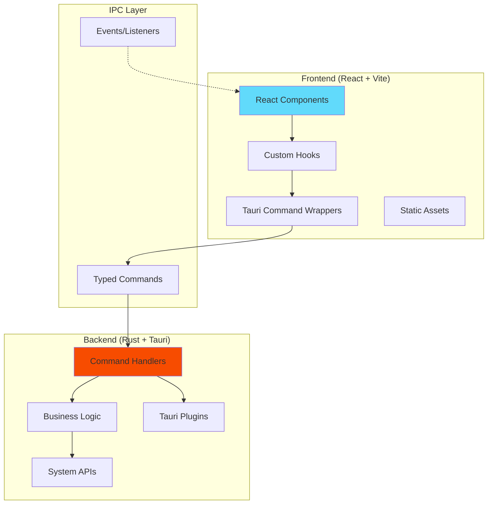
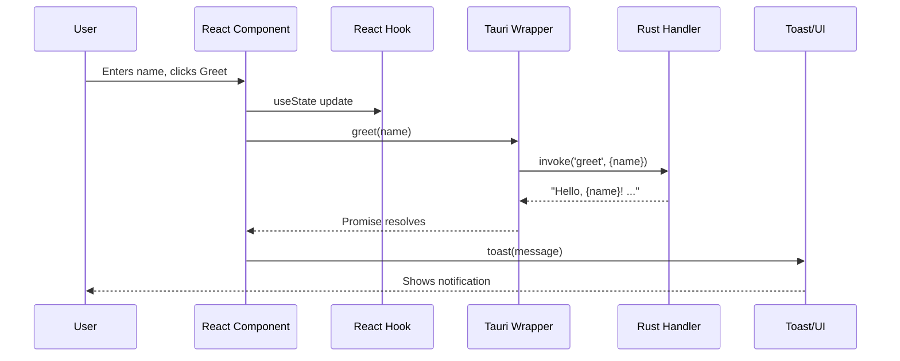
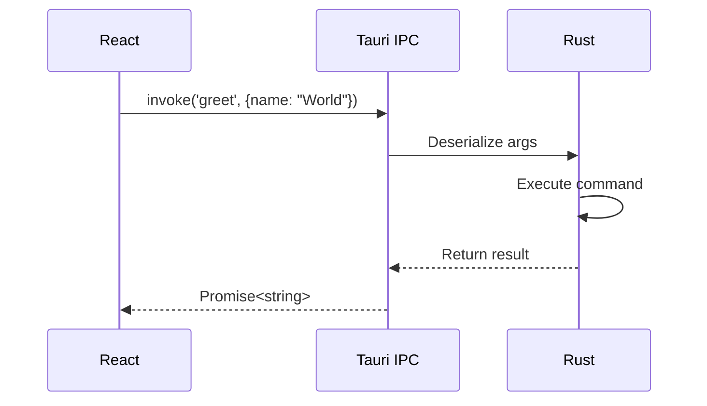
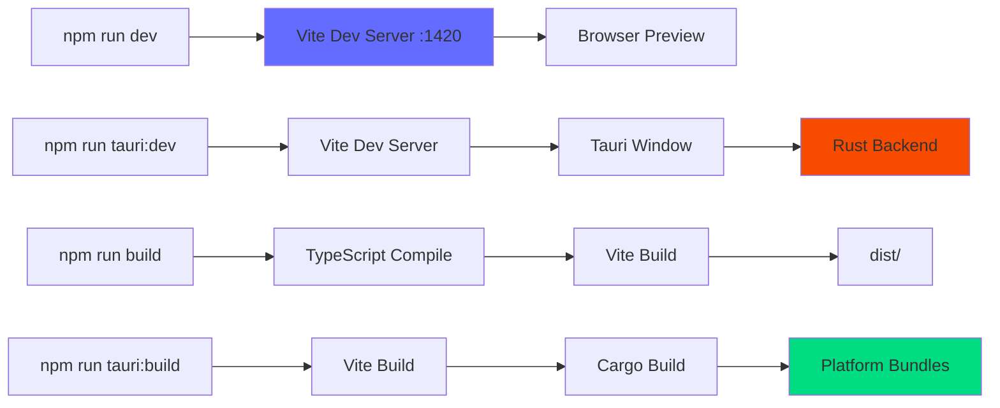
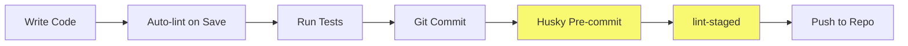

# Architecture

## Overview

This application follows a **hybrid architecture** with a Rust backend (Tauri) and React frontend, communicating via a typed IPC (Inter-Process Communication) layer. The architecture prioritizes type safety, modularity, and maintainability.

## High-Level Architecture



## Directory Structure

```
tauri2-react-starter/
├── src/                          # Frontend source code
│   ├── components/               # React components
│   │   └── ui/                   # shadcn/ui components (Button, Card, Input, etc.)
│   ├── lib/                      # Utility libraries
│   │   ├── tauri.ts              # Typed Tauri command wrappers
│   │   └── utils.ts              # General utilities (cn helper, etc.)
│   ├── assets/                   # Static assets (images, icons)
│   ├── App.tsx                   # Root application component
│   ├── main.tsx                  # React entry point
│   └── index.css                 # Global styles + Tailwind imports
│
├── src-tauri/                    # Backend source code
│   ├── src/
│   │   ├── main.rs               # Rust entry point
│   │   └── lib.rs                # Tauri command handlers
│   ├── capabilities/             # Permission definitions
│   │   └── default.json          # Default capability set
│   ├── icons/                    # Application icons (all platforms)
│   ├── Cargo.toml                # Rust dependencies
│   ├── tauri.conf.json           # Tauri configuration
│   └── build.rs                  # Build script
│
├── tests/                        # E2E tests (Playwright)
├── scripts/                      # Build/utility scripts
├── docs/                         # Project documentation
└── public/                       # Static public assets
```

## Frontend Architecture

### Component Hierarchy

```mermaid
graph TD
    Main[main.tsx - Entry Point]
    App[App.tsx - Root Component]
    UI[shadcn/ui Components]
    Card[Card Component]
    Input[Input Component]
    Button[Button Component]
    Toaster[Sonner Toaster]

    Main --> App
    Main --> Toaster
    App --> Card
    Card --> Input
    Card --> Button

    style Main fill:#282c34
    style App fill:#61dafb
    style UI fill:#38bdf8
```



### Data Flow



### Key Frontend Patterns

#### 1. Typed Command Wrappers (`src/lib/tauri.ts`)

Instead of calling `invoke()` directly, we use typed wrappers:

```typescript
// ❌ BAD: Direct invoke (no type safety)
const result = await invoke('greet', { name });

// ✅ GOOD: Typed wrapper
import { greet } from '@/lib/tauri';
const result = await greet(name); // Type-safe!
```

**Benefits:**
- Compile-time type checking
- Autocomplete support
- Single source of truth for command names
- Centralized error handling

#### 2. Component Organization

```
components/
└── ui/              # shadcn/ui base components (owned by project)
    ├── button.tsx   # Customizable, not from node_modules
    ├── card.tsx
    ├── input.tsx
    └── sonner.tsx
```

#### 3. Path Aliases

Use `@/` prefix for cleaner imports:

```typescript
import { Button } from '@/components/ui/button';
import { cn } from '@/lib/utils';
```

## Backend Architecture

### Rust Module Structure

```
src-tauri/src/
├── main.rs          # Entry point (calls lib::run())
└── lib.rs           # Command handlers and app setup
```

### Command Handler Pattern

Commands are defined with the `#[tauri::command]` macro:

```rust
#[tauri::command]
fn greet(name: &str) -> String {
    format!("Hello, {}! You've been greeted from Rust!", name)
}
```

Commands must be registered in the builder:

```rust
tauri::Builder::default()
    .plugin(tauri_plugin_opener::init())
    .invoke_handler(tauri::generate_handler![greet])
    .run(tauri::generate_context!())
    .expect("error while running tauri application");
```

### Security Model

Tauri uses a **capability-based security model**:

```
src-tauri/capabilities/default.json
```

- Define allowed commands per window
- Whitelist IPC methods
- Plugin permissions

## Communication Layer (IPC)

### Frontend → Backend (Commands)



### Backend → Frontend (Events)

For future event-driven features:

```typescript
// Frontend listens
import { listen } from '@tauri-apps/api/event';
await listen('update-available', (event) => {
  console.info('Update:', event.payload);
});
```

```rust
// Backend emits
app.emit_all("update-available", payload)?;
```

### Error Handling & Logging

Common Tauri error scenarios and how this template surfaces them:

- **Unknown command name**
  - Symptom: IPC error about an unknown command.
  - Cause: Command not registered in `src-tauri/src/lib.rs` or name mismatch in `src/lib/tauri.ts`.
  - Handling: The `invokeCmd` wrapper logs the error with `source: 'tauri-command'` and the calling UI shows a friendly toast (for example, "Failed to perform this action. Please try again.").

- **Capability denied**
  - Symptom: Errors related to missing permissions or capabilities.
  - Cause: Command not allowed by `src-tauri/capabilities/default.json`.
  - Handling: Fix by updating capabilities during development; at runtime, the failure is logged, and the UI surfaces a generic permission error.

- **Filesystem errors**
  - Symptom: "No such file or directory", "Permission denied", etc.
  - Cause: Backing OS errors when reading/writing files.
  - Handling: Rust commands should return `Result<T, E>` and map errors to strings; TypeScript catches the error, logs via `logError`, and notifies the user via a toast.

- **Serialization / deserialization issues**
  - Symptom: IPC errors about invalid payload shapes.
  - Cause: Mismatch between Rust command signatures and TypeScript arguments.
  - Handling: Logged in both Rust (via `log` crate and `tauri-plugin-log`) and TypeScript (via `logError`), then surfaced as a generic failure toast.

Logs are captured on the backend using `tauri-plugin-log` and can be inspected from the OS log directory. On the frontend, `src/lib/logger.ts` standardizes log structure and forwards production logs to the plugin.
 
## Build Pipeline




## Configuration Files

| File | Purpose |
|------|---------|
| `vite.config.ts` | Vite bundler config, Tauri dev server settings |
| `tsconfig.json` | TypeScript compiler options & path aliases |
| `tailwind.config.ts` | Tailwind CSS theme & plugin configuration |
| `eslint.config.ts` | Linting rules for TS/JS/JSON/Markdown |
| `playwright.config.ts` | E2E test configuration |
| `vitest.setup.ts` | Unit test setup (jsdom, globals) |
| `src-tauri/tauri.conf.json` | Tauri app config (window size, identifier, etc.) |
| `src-tauri/Cargo.toml` | Rust dependencies |
| `package.json` | npm scripts & JavaScript dependencies |

## State Management

### Current: Local Component State

The app currently uses React's `useState` for local state:

```typescript
const [name, setName] = useState<string>('');
```

### Future: Global State Options

When the app grows, consider:

- **Zustand** - Minimal, hook-based store
- **Jotai** - Atomic state management
- **TanStack Query** - Server state caching
- **Context API** - Built-in React context (for theme, auth, etc.)

## Styling Architecture

### Tailwind + CSS Variables

```css
/* index.css */
@import 'tailwindcss';

@theme {
  /* Custom theme variables */
}
```

### Component Variants (CVA)

shadcn/ui components use `class-variance-authority`:

```typescript
const buttonVariants = cva("base-classes", {
  variants: {
    variant: { default: "...", destructive: "..." },
    size: { default: "...", sm: "...", lg: "..." }
  }
});
```

## Testing Strategy

### Unit Tests (Vitest)
- **Location**: `src/**/*.test.tsx`
- **Environment**: jsdom
- **Coverage**: Configured but disabled by default
- **Command**: `npm run test:unit`

### E2E Tests (Playwright)
- **Location**: `tests/**/*.spec.ts`
- **Browser**: Chromium only
- **Command**: `npm run test:e2e`

### Linting & Formatting
- ESLint for code quality
- Prettier for formatting
- Stylelint for CSS
- Run all: `npm run lint`
- Auto-fix: `npm run fix`

## Performance Considerations

### React Compiler
- Automatic memoization
- No manual `useMemo`/`useCallback` needed

### Vite Optimizations
- HMR for instant feedback
- Code splitting
- Tree shaking

### Tauri Benefits
- Small binary size (~3-5MB)
- Native performance
- Low memory footprint

## Security Best Practices
 
1. **Command Whitelisting**: Only registered commands are accessible
2. **CSP**: Content Security Policy is configured in `src-tauri/tauri.conf.json` and enforced in built apps.
3. **Type Validation**: Rust validates all IPC arguments
4. **No Node.js**: No npm package vulnerabilities in production
5. **Capability System**: Fine-grained permissions per window
 
### Content Security Policy (CSP)
 
The default CSP is intentionally strict while remaining compatible with this template:
 
```text
default-src 'self';
script-src 'self';
style-src 'self' 'unsafe-inline';
img-src 'self' data:;
font-src 'self' data:;
connect-src 'self';
```
 
- Config location: `src-tauri/tauri.conf.json` under `app.security.csp`.
- Enforcement: Applies to built desktop apps; dev builds may be more permissive.
- Evolution: When you add remote APIs, CDNs, or embeds, update the relevant directive (for example, add your API host to `connect-src`) and keep the policy as narrow as possible.
 
See `TECH_DEBT.md` for broader security hardening guidance, including capabilities and IPC patterns.
 
## Extension Points


### Adding New Commands

1. Define command in `src-tauri/src/lib.rs`:
   ```rust
   #[tauri::command]
   fn my_command(arg: String) -> Result<String, String> {
       // implementation
   }
   ```

2. Register handler:
   ```rust
   .invoke_handler(tauri::generate_handler![greet, my_command])
   ```

3. Add typed wrapper in `src/lib/tauri.ts`:
   ```typescript
   export const commands = {
     greet: 'greet',
     myCommand: 'my_command',
   } as const;

   export async function myCommand(arg: string): Promise<string> {
     return invokeCmd<string>(commands.myCommand, { arg });
   }
   ```

4. Use in components:
   ```typescript
   import { myCommand } from '@/lib/tauri';
   const result = await myCommand('test');
   ```

### Adding New UI Components

Use shadcn/ui CLI:

```bash
npx shadcn@latest add [component-name]
```

Components are copied to `src/components/ui/` for customization.

## Development Workflow



Git hooks ensure code quality:
- Pre-commit: Runs lint-staged (ESLint, Prettier, Stylelint on changed files)
- Configured via Husky
